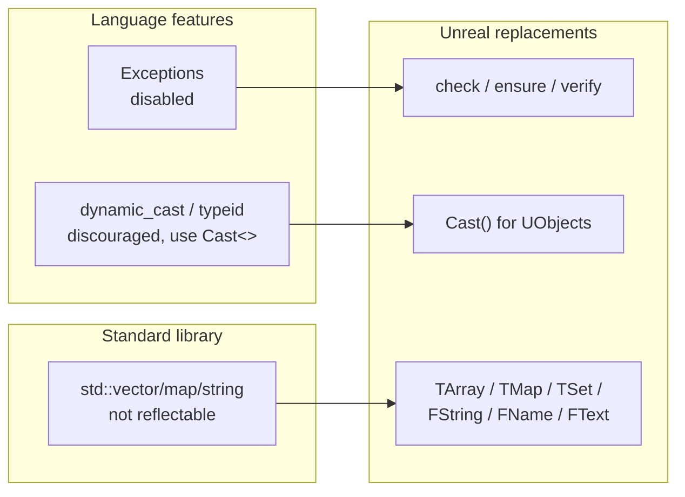

# Unreal C++ vs standard C++

Unreal C++ compiles with the same compiler you'd use for any other C++ project, but a meaningful slice
of the standard library and language features you'd reach for by habit are disabled, discouraged, or
shadowed by an Unreal-native equivalent. None of this is arbitrary — it traces back to control over
memory, cross-platform consistency, and the reflection system's requirements — but it means "idiomatic
C++" and "idiomatic Unreal C++" diverge in specific, learnable ways.

## Why this matters

Code written by habit from non-Unreal C++ — `throw` for error handling, `std::vector` in a class
meant to be `UPROPERTY`-reflected, `dynamic_cast` for a `UObject` hierarchy check — either fails to
compile, compiles but doesn't integrate with the engine (no reflection, no GC tracking), or works but
diverges from what every other Unreal codebase does. Knowing the specific list up front is faster than
discovering it one build error at a time.

## Mental model

Standard C++ and Unreal C++ overlap almost completely at the language level (both are just C++), and
diverge at three specific boundaries:



## The mechanics

### Exceptions: disabled, not just discouraged

Unreal does not use C++ exception handling; `throw`/`try`/`catch` is off across the engine, and
`check()`/`ensure()` fill the role exceptions would otherwise play — see
[Logging and assertions](./logging-and-assertions.md) for the difference between the two. This is a
build setting, not merely a style preference, so code that depends on exception propagation for
control flow needs to be redesigned, not just ported.

### RTTI: `Cast<T>()` replaces `dynamic_cast` for UObject types

`UObject`-derived hierarchies have their own reflection-based type information (`UClass`), and the
idiomatic way to safely downcast within that hierarchy is `Cast<T>()`, not `dynamic_cast<T*>()`:

```cpp title="Cast<> instead of dynamic_cast"
if (AEnemyCharacter* Enemy = Cast<AEnemyCharacter>(HitActor))
{
    Enemy->ApplyDamage(25.0f);
}
```

`Cast<T>()` uses the reflection system's own class hierarchy rather than compiler-generated RTTI, so
it works correctly even when standard RTTI is disabled or restricted for a given target, and it's
consistent with how the rest of the engine downcasts `UObject`s.

### STL containers: usable, but not reflectable and not the default idiom

`std::vector`, `std::map`, `std::string`, and friends compile and work in Unreal C++ — nothing
prevents including `<vector>` — but they cannot back a `UPROPERTY` (reflection only understands
Unreal's own container templates), and mixing them with Unreal APIs that expect `TArray`/`FString`
means constant, easy-to-forget conversion at every boundary. Epic's own current guidance is more
nuanced than "never use std": where the standard library genuinely does something better, prefer it —
but don't mix idioms within a single API surface, and don't expect an STL container to participate in
reflection, serialization, or GC tracking. See [Containers](./containers.md) and
[Strings and text](./strings-and-text.md) for the Unreal-native equivalents and when each applies.

### Move semantics: MoveTemp instead of std::move

Unreal's containers and `FString` support move construction/assignment, and the engine's own idiom for
an explicit move is `MoveTemp(x)` rather than `std::move(x)` — functionally the same operation, spelled
differently to fit the rest of the codebase's naming.

## Gotchas

:::danger Exception-based error handling from ported code silently changes behavior, or doesn't compile at all
Code assuming a `throw` will be caught somewhere up the call stack either fails to build under
Unreal's exception-disabled configuration, or — worse, if exceptions happen to be enabled for a
specific build configuration you're not targeting — behaves differently in Shipping than in the
configuration you tested. Redesign around `check`/`ensure`/return values instead of assuming parity.
:::

:::warning A UPROPERTY member cannot be a std:: container
`UPROPERTY() std::vector<int32> Values;` compiles as ordinary C++ but is invisible to the reflection
system — no editor exposure, no serialization, no GC tracking of any `UObject*` inside it. Use
`TArray` for anything that needs to be `UPROPERTY`.
:::

:::caution Don't mix TArray and std::vector idioms across one function's boundary
Converting back and forth between `TArray` and `std::vector` at every call into or out of a function is
a sign the function is on the wrong side of an idiom boundary — pick the container type the rest of
that subsystem uses and stay consistent through it.
:::

## See also

- [Logging and assertions](./logging-and-assertions.md) — what replaces exceptions in practice.
- [Containers](./containers.md) — the full `TArray`/`TMap`/`TSet` treatment referenced above.
- [Coding standard and naming](./coding-standard-and-naming.md) — Epic's current, more permissive
  guidance on when the standard library is the better choice.
- [Epic — Epic C++ Coding Standard for Unreal Engine: Use of standard libraries](https://dev.epicgames.com/documentation/unreal-engine/epic-cplusplus-coding-standard-for-unreal-engine)
