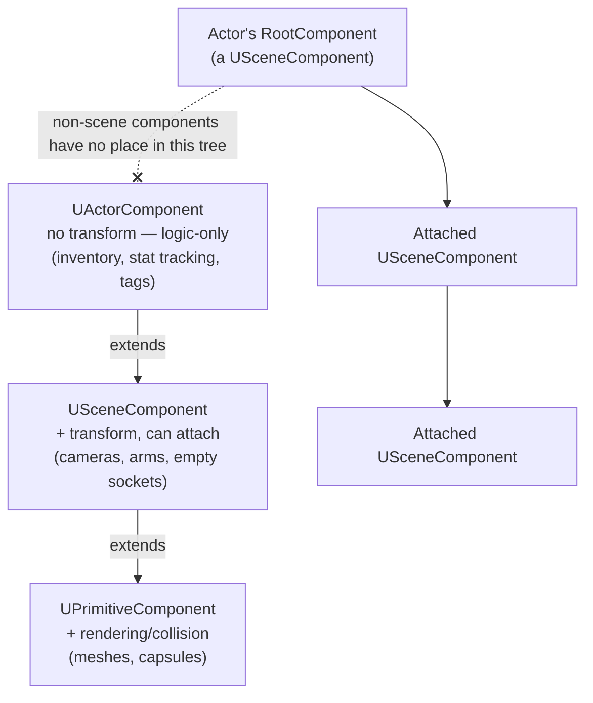

# Actor components and scene components

Unreal favors composition over inheritance for actor behavior: instead of a deep class hierarchy for
every combination of "has a mesh," "has physics," "has inventory," you build an `AActor` out of
components. That only works cleanly if you know which of the two component base classes you're deriving
from — because only one of them has a location.

## Why this matters

`UActorComponent` is the base for *any* reusable piece of actor behavior — including ones that have no
presence in 3D space at all, like an inventory or a stat-tracking component. `USceneComponent` extends
it with a transform and the ability to attach to other components. Reach for `USceneComponent` when you
don't need a transform and you've added an invisible offset/rotation nobody asked for; reach for
`UActorComponent` when you do need one and you've just signed up to hand-roll positioning that
`USceneComponent` already gives you for free.

## Mental model



Only `USceneComponent`s form the attachment hierarchy — a `USceneComponent` has exactly one parent (or
none) and any number of children, and attachment cycles aren't supported. A plain `UActorComponent`
lives in the actor's component list but never has a position, a parent, or children; it's pure logic
riding along with the actor.

## The mechanics

### A logic-only component

```cpp title="InventoryComponent.h"
UCLASS(ClassGroup = (Custom), meta = (BlueprintSpawnableComponent))
class MYGAME_API UInventoryComponent : public UActorComponent
{
    GENERATED_BODY()

public:
    UInventoryComponent();

    UFUNCTION(BlueprintCallable, Category = "Inventory")
    void AddItem(FName ItemId);

protected:
    virtual void BeginPlay() override;

    UPROPERTY(VisibleAnywhere, Category = "Inventory")
    TArray<FName> Items;
};
```

`UActorComponent` has its own `BeginPlay`/`TickComponent`/`EndPlay`, following the same registration
order relative to the owning actor's lifecycle described in
[Actor lifecycle](./actor-lifecycle.md) — components are registered and initialized before the owning
actor's `PostInitializeComponents` runs.

### A scene component and attachment

```cpp title="MyCharacter.cpp — attaching in the constructor"
AMyCharacter::AMyCharacter()
{
    SpringArm = CreateDefaultSubobject<USpringArmComponent>(TEXT("SpringArm"));
    SpringArm->SetupAttachment(GetMesh()); // constructor-time: SetupAttachment, not AttachToComponent
    SpringArm->TargetArmLength = 300.f;

    FollowCamera = CreateDefaultSubobject<UCameraComponent>(TEXT("FollowCamera"));
    FollowCamera->SetupAttachment(SpringArm, USpringArmComponent::SocketName);
}
```

`SetupAttachment` is for the constructor, before the component is registered — it just records the
intended parent. At runtime, once components are already registered, use `AttachToComponent` with an
`FAttachmentTransformRules` instead:

```cpp title="Runtime re-attachment"
void AMyCharacter::AttachWeaponToHand(USceneComponent* WeaponRoot)
{
    const FAttachmentTransformRules Rules(EAttachmentRule::SnapToTarget, /*bWeldSimulatedBodies*/ true);
    WeaponRoot->AttachToComponent(GetMesh(), Rules, TEXT("WeaponSocket"));
}
```

### Actors can attach to actors too

Attaching one actor to another (a held weapon actor to a character, for instance) is really attaching
one actor's root `USceneComponent` to a component on the other — `AActor::AttachToComponent` /
`AActor::AttachToActor` are convenience wrappers over the same component-level attachment rules.

## Gotchas

:::warning[Attachment cycles are not supported]
A `USceneComponent` can't end up as its own ancestor through a chain of attachments — the engine does
not detect or resolve this for you gracefully. Keep attachment hierarchies acyclic by construction; this
usually only becomes a risk when attachment targets are chosen dynamically at runtime.
:::

:::caution[SetupAttachment vs AttachToComponent is not interchangeable]
`SetupAttachment` only works before a component is registered (constructor time). Calling it later is a
no-op or an assertion depending on engine build; use `AttachToComponent` for anything happening after
`BeginPlay`. Getting this backwards is a common source of "my component just doesn't move with its
parent" bugs.
:::

## See also

- [Pawn and character](./pawn-and-character.md) — `ACharacter`'s fixed capsule/mesh/movement component
  setup as a worked example of this hierarchy.
- [Actor lifecycle](./actor-lifecycle.md) — exactly when components register relative to
  `PostInitializeComponents` and `BeginPlay`.
- [Framework overview](./framework-overview.md) — how components fit under Actor in the bigger picture.
- [Epic — Components in Unreal Engine](https://dev.epicgames.com/documentation/unreal-engine/components-in-unreal-engine)

