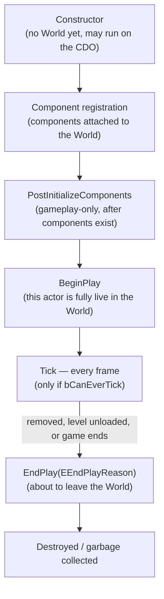

# Actor lifecycle

Every `AActor` — `GameMode`, `Pawn`, a static prop, your custom gameplay actor — goes through the same
sequence of construction, component initialization, `BeginPlay`, ticking, `EndPlay`, and destruction.
Getting the order of these wrong is one of the most common sources of "works sometimes, crashes other
times" bugs in Unreal: reach for a sibling actor one function too early and you get a null pointer that
only reproduces on some load orders.

## Why this matters

Unlike a plain C++ object where the constructor fully initializes everything before anyone can touch it,
an `AActor`'s constructor runs before it has a `UWorld`, before its components are registered, and
sometimes runs on a **class default object (CDO)** that never plays at all — the editor constructs a CDO
for every `UCLASS` to populate defaults panels and to serve as a template for spawned instances. Code
that assumes "the actor is fully set up" in the constructor breaks in ways that only show up in specific
contexts (cooking, editor tooling, PIE).

## Mental model



`PostInitializeComponents` and `BeginPlay` are easy to conflate because both run once, near the start of
an actor's life, and both are "gameplay is now safe" hooks. The difference is scope: `PostInitializeComponents`
fires right after this actor's own components finish initializing and is only called during actual
gameplay (not for every CDO), while `BeginPlay` is the point the engine considers the actor to have
entered play in the `UWorld` — the hook almost everyone reaches for first, and the right default choice
unless you specifically need to act before other actors' `BeginPlay` has run.

## The mechanics

### Spawn-time order

```cpp title="MyGameplayActor.h"
UCLASS()
class MYGAME_API AMyGameplayActor : public AActor
{
    GENERATED_BODY()

public:
    AMyGameplayActor();

protected:
    virtual void PostInitializeComponents() override;
    virtual void BeginPlay() override;
    virtual void Tick(float DeltaSeconds) override;
    virtual void EndPlay(const EEndPlayReason::Type EndPlayReason) override;

    UPROPERTY(VisibleAnywhere, Category = "Components")
    TObjectPtr<UStaticMeshComponent> Mesh;
};
```

```cpp title="MyGameplayActor.cpp"
AMyGameplayActor::AMyGameplayActor()
{
    PrimaryActorTick.bCanEverTick = true; // opt-in — leave false if you don't need per-frame work

    Mesh = CreateDefaultSubobject<UStaticMeshComponent>(TEXT("Mesh"));
    RootComponent = Mesh;
    // GetWorld() is unreliable here. Don't spawn other actors or read level state yet.
}

void AMyGameplayActor::PostInitializeComponents()
{
    Super::PostInitializeComponents();
    // This actor's own components exist and are initialized. Still don't assume
    // OTHER actors in the level have reached this point yet.
}

void AMyGameplayActor::BeginPlay()
{
    Super::BeginPlay();
    // Safe to look up other actors, subscribe to delegates, start timers.
}

void AMyGameplayActor::Tick(float DeltaSeconds)
{
    Super::Tick(DeltaSeconds);
}

void AMyGameplayActor::EndPlay(const EEndPlayReason::Type EndPlayReason)
{
    // Unsubscribe from delegates, stop timers, release non-UObject resources here.
    Super::EndPlay(EndPlayReason);
}
```

### EndPlay reasons matter

`EEndPlayReason::Type` tells you *why* the actor is leaving play — `Destroyed` (explicitly destroyed),
`LevelTransition` (the level is unloading), `EndPlayInEditor`, `RemovedFromWorld` (e.g. level streamed
out), and `Quit`. Cleanup that only makes sense for one of these (saving final state before a real
destroy, versus doing nothing during a level transition where the actor will simply cease to exist) should
branch on this parameter instead of treating every `EndPlay` call identically.

### Destruction and GC

Calling `Destroy()` on an actor unregisters its components and marks it pending kill; the actual memory
is reclaimed on the next garbage collection pass, following the same reachability rules as any other
`UObject` — see [Garbage collection](../02-cpp-in-unreal/garbage-collection.md). This is why `EndPlay`,
not the destructor, is where you do cleanup: the destructor's timing relative to GC is not something
gameplay code should rely on.

## Gotchas

:::warning BeginPlay order across actors is not guaranteed
Unreal does not promise that actor A's `BeginPlay` runs before actor B's, even if A is "supposed to" set
something up that B depends on. Don't write `BeginPlay` code that assumes another specific actor has
already initialized — use a delegate/event the dependent actor subscribes to, a deferred check, or move
the dependency to a point (like a `GameMode` callback) that's guaranteed to run after all relevant actors
exist.
:::

:::caution The constructor is not a safe place for world queries
`GetWorld()` can return null or a CDO's transient world in the constructor, and spawning other actors or
reading level data there is unsupported. Move anything that needs a real `UWorld` to
`PostInitializeComponents` or `BeginPlay`.
:::

:::note
The exact set of engine-internal steps between component registration and `PostInitializeComponents`
(and their interaction with level streaming or async loading) goes deeper than what's covered here — not
confirmed exhaustively against 5.7 in the sources consulted. Treat the five-stage model above as the
level of detail you need for gameplay code, and consult engine source for anything below that.
:::

## See also

- [Framework overview](./framework-overview.md) — how this lifecycle applies to GameMode, Pawn,
  Controller, and every other framework class.
- [Actor components](./actor-components.md) — component registration, the step that precedes
  `PostInitializeComponents`.
- [Garbage collection](../02-cpp-in-unreal/garbage-collection.md) — what actually happens after
  `Destroy()`.
- [World and levels](./world-and-levels.md) — level streaming as a trigger for `EndPlay`.
- [Epic — AActor API reference](https://dev.epicgames.com/documentation/unreal-engine/API/Runtime/Engine/AActor)

