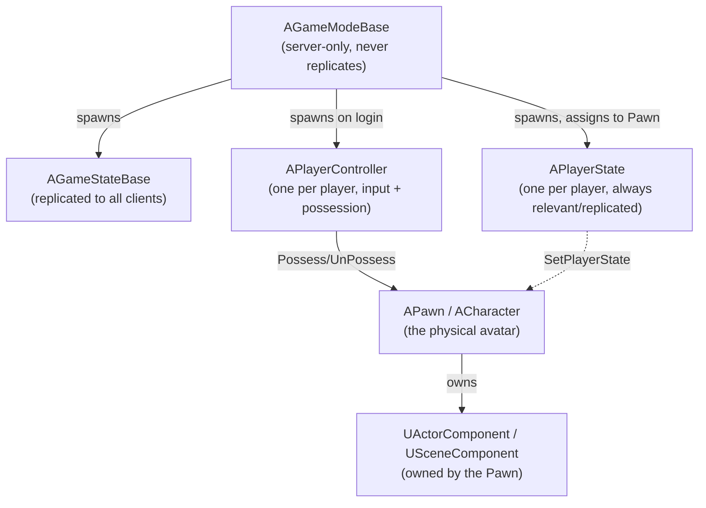

# Gameplay framework overview

Every gameplay tutorial throws `GameMode`, `PlayerController`, `Pawn`, and `PlayerState` at you in the
same paragraph, and it's easy to come away thinking they're interchangeable "player stuff" classes.
They're not — each one has a specific owner, a specific lifetime, and a specific replication story, and
mixing those up is how you end up with state that works in single-player and silently breaks the moment
a second client connects. This doc is the map; the rest of this folder is the territory.

## Why this matters

Unreal splits "a player" into four separate objects on purpose: something that enforces the rules
(`GameMode`), something that broadcasts shared state (`GameState`), something that represents a
connection and its input (`PlayerController`), something that persists player identity across pawn
death (`PlayerState`), and something that's physically in the world (`Pawn`/`Character`). If you don't
know which object a piece of data belongs on, you'll put it on the wrong one — and the wrong one is
usually the one that doesn't replicate to the client that needs it, or the one that gets destroyed and
recreated when you didn't expect it to be.

## Mental model: who spawns and owns whom



Read the arrows as ownership and lifetime, not just association. `AGameModeBase` is the root — it
exists only on the server (or the host of a listen server) and spawns everything else. `AGameStateBase`
and `APlayerState` are the two objects Epic's replication system treats as "always relevant," which is
why game-wide and player-wide data belongs there rather than on `GameMode`. A `PlayerController`
possesses a `Pawn`, but neither owns the other outright: a controller can `UnPossess()` one pawn and
`Possess()` another (spectating, vehicle swaps), and a pawn can go temporarily unpossessed without being
destroyed.

## The mechanics

### The five core classes

| Class | Lives where | Replicates to | Survives pawn death? | Covered in |
|---|---|---|---|---|
| `AGameModeBase` | Server only | Never | N/A (not per-player) | [Game mode and game state](./game-mode-and-game-state.md) |
| `AGameStateBase` | Server + all clients | All clients | N/A (per-match) | [Game mode and game state](./game-mode-and-game-state.md) |
| `APlayerController` | Server + owning client | Owning client only (mostly) | Yes | [Player controller and player state](./player-controller-and-player-state.md) |
| `APlayerState` | Server + all clients | All clients | Yes | [Player controller and player state](./player-controller-and-player-state.md) |
| `APawn` / `ACharacter` | Server + relevant clients | Clients that can see it | No — respawned | [Pawn and character](./pawn-and-character.md) |

### Where this sits in the bigger architecture

This folder assumes you've already read
[Engine architecture map](../00-overview/engine-architecture-map.md), which places the gameplay
framework as a layer above the engine's rendering/physics/animation/networking subsystems and below
your own game module. Everything below assumes that layering — a `Pawn` is a coordinator that owns
components which each talk to one of those subsystems; it does not talk to physics or rendering
directly.

### Underneath all of it: Actor and ActorComponent

Every class in the table above except the components is an `AActor` subclass, which means all of them
go through the same spawn/initialize/tick/destroy sequence described in
[Actor lifecycle](./actor-lifecycle.md). The pieces a `Pawn` is built from —
[actor components and scene components](./actor-components.md) — are not `AActor`s themselves; they're
attached to one. And all of this runs inside a `UWorld` loaded from one or more `ULevel`s, covered in
[World and levels](./world-and-levels.md), with a `UGameInstance` sitting above the world for anything
that needs to survive a level change — see [Game instance](./game-instance.md).

### Server authority in one sentence

Only the server (or the host acting as server in a listen server setup) runs `AGameModeBase` logic and
is authoritative over gameplay decisions; clients receive a filtered, replicated view of the world
through `AGameStateBase`, `APlayerState`, and whichever actors are relevant to them. Code that reads
`HasAuthority()` before mutating gameplay state is checking exactly this: "am I the server, or a client
looking at a replicated copy?"

```cpp title="A minimal look at where authority is checked"
void AMyPickupActor::OnOverlapBegin(AActor* OtherActor)
{
    if (!HasAuthority())
    {
        return; // clients don't decide pickup outcomes, they just see the replicated result
    }

    // server-only mutation of gameplay state happens here
}
```

## Gotchas

:::warning[Don't assume every player has a PlayerController on every machine]
A `APlayerController` only fully exists (with valid input, camera, and replicated properties) on the
server and on the one client it belongs to. On every *other* client, a remote player is represented by
their `Pawn` and `PlayerState`, not a usable `PlayerController`. Code that does
`Cast<APlayerController>(SomeActor)->DoSomething()` on a machine that isn't the owning client is a
common source of silent no-ops or crashes once you test with more than one client.
:::

:::caution["The player" is not one object]
New Unreal developers reach for `GameMode` to store per-player score because it's the first class they
learn. `GameMode` is server-only and un-replicated — put per-player, client-visible data on
`PlayerState` instead. See [Game mode and game state](./game-mode-and-game-state.md) for the concrete
failure mode.
:::

## See also

- [Engine architecture map](../00-overview/engine-architecture-map.md) — where this framework sits
  relative to rendering, physics, and the rest of the engine.
- [Game mode and game state](./game-mode-and-game-state.md) — the first split in this diagram, in
  depth.
- [Actor lifecycle](./actor-lifecycle.md) — the spawn/init/tick/destroy sequence every class here goes
  through.
- [Exposing C++ to Blueprint](../04-blueprint-interop/exposing-cpp-to-blueprint.md) — these classes are
  the ones you'll subclass in Blueprint most often.
- [Epic — Gameplay Framework overview](https://dev.epicgames.com/documentation/unreal-engine/gameplay-framework-in-unreal-engine)

