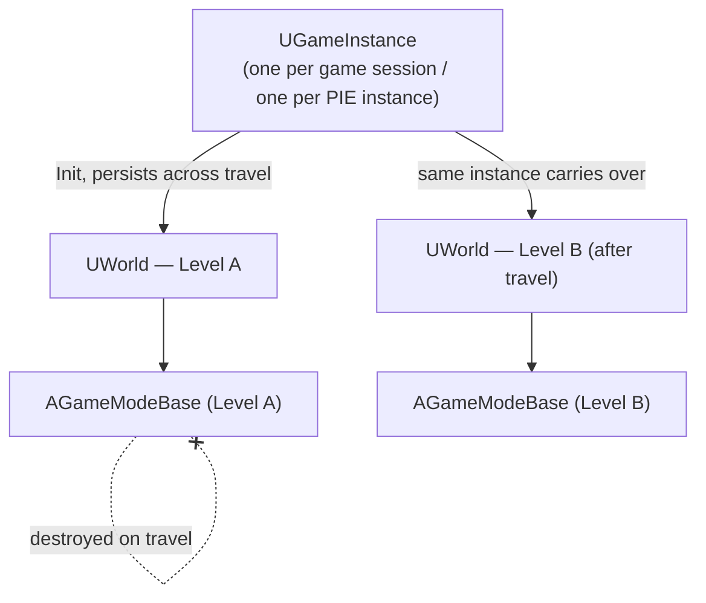

# Game instance

`GameMode` gets destroyed and recreated on every level load; `Pawn`s die and respawn; even
`PlayerController`s can be recreated across a hard travel. `UGameInstance` is the one framework object
in this folder that survives all of it — it exists for exactly the data and logic that has no business
being tied to whichever level happens to be loaded right now.

## Why this matters

Without `GameInstance`, "data that should survive a level change" (a loaded save file, matchmaking
state, a session token, cross-level UI like a persistent HUD widget) has nowhere clean to live —
everything else in the gameplay framework is scoped to a `UWorld`, and a `UWorld` is torn down and
rebuilt on every level transition. Reach for `GameMode` or a `Pawn` for this kind of data and it
vanishes the instant the player loads the next map.

## Mental model



A `UGameInstance` is spawned once when the game (or one PIE client) starts, and lives until that game
instance shuts down — one per standalone game process, and critically, one **separate** `UGameInstance`
per Play-In-Editor client, which is why data you expect to be process-wide doesn't automatically work
that way under multi-client PIE. See [World and levels](./world-and-levels.md) for how PIE ends up with
multiple `UWorld`s in the same process.

## The mechanics

### Declaring and installing a custom GameInstance

```cpp title="MyGameInstance.h"
UCLASS()
class MYGAME_API UMyGameInstance : public UGameInstance
{
    GENERATED_BODY()

public:
    virtual void Init() override;
    virtual void Shutdown() override;

    UPROPERTY(BlueprintReadOnly, Category = "Session")
    FString PendingMatchId;
};
```

```cpp title="MyGameInstance.cpp"
void UMyGameInstance::Init()
{
    Super::Init();
    // Runs once, before the first level loads — good place to load persistent
    // save data or kick off a login/matchmaking flow.
}

void UMyGameInstance::Shutdown()
{
    // Runs once, when the whole game session ends — the mirror image of Init().
    Super::Shutdown();
}
```

A custom `UGameInstance` subclass is wired up in Project Settings under Maps & Modes → Game Instance
Class, not through spawning — the engine instantiates it automatically at startup.

### Reaching it from gameplay code

```cpp title="Reading GameInstance data from an Actor"
if (UMyGameInstance* GI = GetGameInstance<UMyGameInstance>())
{
    UE_LOG(LogTemp, Log, TEXT("Pending match: %s"), *GI->PendingMatchId);
}
```

`AActor::GetGameInstance()` (templated as `GetGameInstance<T>()`) reaches the instance through the
actor's `UWorld`, which is why an actor can always find "its" `GameInstance` even though the actor
itself is destroyed and recreated across level travel while the instance is not.

### GameInstanceSubsystem: the preferred place for GameInstance-scoped managers

Rather than growing one `UGameInstance` subclass into a monolith, split cross-level managers into
`UGameInstanceSubsystem`s — each is automatically instantiated alongside the `GameInstance` and
retrieved with `GetSubsystem<T>()`, with the same "no manual registration" ergonomics as any other
subsystem. See [Subsystems](../02-cpp-in-unreal/subsystems.md) for the full pattern; it's the accessor
`subsystems.md` itself links forward to this page for.

## Gotchas

:::warning GameInstance is not GameMode
It's tempting to treat `GameInstance` as "the bigger GameMode," but they answer different questions:
`GameMode` is server-only, scoped to one `UWorld`, and re-created on every level load; `GameInstance`
exists on every machine (server and clients alike) and persists across level loads for the entire
session. Match-rule logic belongs on `GameMode`; cross-level session data belongs on `GameInstance`.
:::

:::caution PIE gives every client its own GameInstance
Data on `GameInstance` is not shared across multiple PIE clients in the same editor process — each PIE
client gets a fully separate `UGameInstance`. Code that assumes one `GameInstance` speaks for "the whole
test session" will behave differently in a two-client PIE test than in a real packaged multiplayer build
where each machine genuinely is separate.
:::

## See also

- [World and levels](./world-and-levels.md) — why a `UWorld`, unlike `GameInstance`, doesn't survive
  level travel.
- [Game mode and game state](./game-mode-and-game-state.md) — the per-level counterpart `GameInstance`
  is deliberately not.
- [Framework overview](./framework-overview.md) — where GameInstance sits above the rest of this
  folder's classes.
- [Subsystems](../02-cpp-in-unreal/subsystems.md) — `UGameInstanceSubsystem`, the preferred way to add
  GameInstance-scoped managers.
- [Epic — UGameInstance API reference](https://dev.epicgames.com/documentation/unreal-engine/API/Runtime/Engine/UGameInstance)
