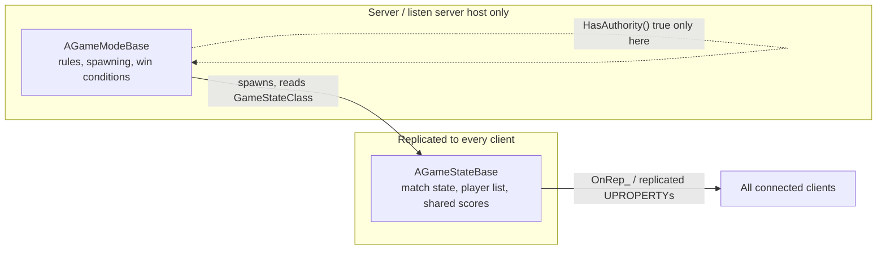

# Game mode and game state

`AGameModeBase` and `AGameStateBase` look like they should be one class — they're set up together, they
get spawned together, and tutorials often treat "the game mode" as shorthand for both. They're split
for a reason that only bites once you test with more than one client: `GameMode` never leaves the
server, and `GameState` is built specifically to be the part that does.

## Why this matters

`AGameModeBase` holds the rules — who can join, what pawn they spawn as, when the match starts and
ends. If that logic lived on a replicated actor, you'd be trusting clients to receive (and potentially
tamper with) win conditions and spawn logic. Instead, Epic makes `GameMode` exist **only on the
server**, and gives you a second class, `GameStateBase`, whose entire job is to hold the subset of that
information clients are allowed to see, and replicate it to them. Put game-wide data on the wrong one
and it either never reaches the client, or exposes server-only logic that should have stayed private.

## Mental model



`GameMode` is never sent over the network — there is no replicated copy of it on a client, and
`GetWorld()->GetAuthGameMode()` returns `nullptr` on a pure client. `GameState`, by contrast, is spawned
by `GameMode` at match start and is one of the actors the replication system treats as always relevant,
meaning every client keeps a synchronized copy of it for as long as they're connected.

## The mechanics

### AGameModeBase: server-only rules

`AGameModeBase` (and its subclass `AGameMode`, which adds a built-in match-state state machine) decides:

- Which `Pawn` class a connecting player spawns as (`GetDefaultPawnClassForController` /
  `DefaultPawnClass`).
- What happens on login and logout (`PostLogin`, `Logout`).
- Where players spawn (`AGameModeBase::ChoosePlayerStart`, driven by `APlayerStart` actors in the
  level — see [World and levels](./world-and-levels.md)).
- Match-level flow control — starting, restarting, ending the match.

```cpp title="MyGameMode.h"
UCLASS()
class MYGAME_API AMyGameMode : public AGameModeBase
{
    GENERATED_BODY()

public:
    AMyGameMode();

protected:
    virtual void PostLogin(APlayerController* NewPlayer) override;
};
```

```cpp title="MyGameMode.cpp"
AMyGameMode::AMyGameMode()
{
    DefaultPawnClass = AMyCharacter::StaticClass();
    PlayerStateClass = AMyPlayerState::StaticClass();
    GameStateClass = AMyGameState::StaticClass();
}

void AMyGameMode::PostLogin(APlayerController* NewPlayer)
{
    Super::PostLogin(NewPlayer);
    // Server-only: safe to make authoritative decisions about NewPlayer here.
}
```

### AGameStateBase / AGameState: replicated shared state

`AGameStateBase` exposes `PlayerArray`, a `TArray<TObjectPtr<APlayerState>>` maintained on both server
and clients, plus whatever custom `UPROPERTY(Replicated)` fields your subclass adds. `AGameState` (the
richer subclass) additionally provides a built-in match-state machine — `WaitingToStart`, `InProgress`,
`WaitingPostMatch`, `LeavingMap` — through `SetMatchState`/`GetMatchState`, with virtual
`HandleMatchHasStarted`/`HandleMatchHasEnded` hooks you override instead of hand-rolling an enum.

```cpp title="MyGameState.h"
UCLASS()
class MYGAME_API AMyGameState : public AGameState
{
    GENERATED_BODY()

public:
    UPROPERTY(ReplicatedUsing = OnRep_TeamScore, BlueprintReadOnly, Category = "Match")
    int32 TeamScore = 0;

    UFUNCTION()
    void OnRep_TeamScore();

protected:
    virtual void GetLifetimeReplicatedProps(TArray<FLifetimeProperty>& OutLifetimeProps) const override;
};
```

```cpp title="MyGameState.cpp"
void AMyGameState::GetLifetimeReplicatedProps(TArray<FLifetimeProperty>& OutLifetimeProps) const
{
    Super::GetLifetimeReplicatedProps(OutLifetimeProps);
    DOREPLIFETIME(AMyGameState, TeamScore);
}
```

### Reading GameMode and GameState from gameplay code

```cpp title="Correct places to read each"
// Server-only logic (e.g. deciding to end the match):
if (AMyGameMode* GM = GetWorld()->GetAuthGameMode<AMyGameMode>())
{
    GM->EndMatch();
}

// Safe on server AND client — reading shared state to update UI:
if (const AMyGameState* GS = GetWorld()->GetGameState<AMyGameState>())
{
    UpdateScoreboard(GS->TeamScore);
}
```

`GetAuthGameMode()` is a deliberate naming choice — it returns `nullptr` on a client, forcing you to
notice you're calling server-only code from a place that might run on both.

## Gotchas

:::warning GetAuthGameMode returns null on every pure client
Any code path that can run on a client must not assume `GetAuthGameMode()` succeeds. Gate
server-authoritative logic behind `HasAuthority()` on the actor performing it, not behind a null check
on the game mode alone — a listen server host has both, which can mask the bug in single-player testing.
:::

:::caution Don't put client-visible data on GameMode
Score, match phase, and the player list all need to reach clients, so they belong on `GameStateBase`
(or `PlayerState` if per-player). Storing them on `GameMode` compiles fine and works in a single-process
PIE session, then does nothing on remote clients the first time you test networked — `GameMode` simply
never gets there.
:::

## See also

- [Framework overview](./framework-overview.md) — where GameMode/GameState sit relative to the other
  framework classes.
- [Player controller and player state](./player-controller-and-player-state.md) — the per-player split
  that mirrors this server/replicated split.
- [World and levels](./world-and-levels.md) — `APlayerStart` and per-level GameMode overrides via World
  Settings.
- [Epic — Game Mode and Game State](https://dev.epicgames.com/documentation/unreal-engine/game-mode-and-game-state-in-unreal-engine)
