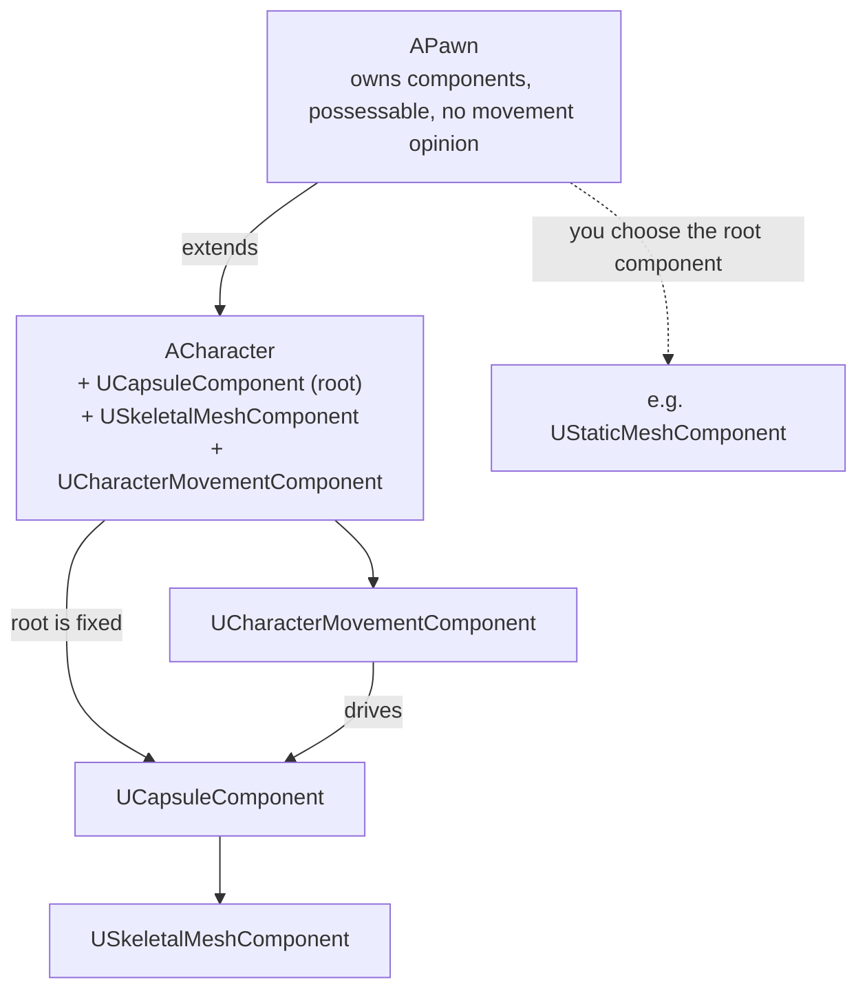

# Pawn and character

`ACharacter` is a subclass of `APawn`, and in practice most projects reach for `ACharacter` by default
without ever asking whether they need everything it brings. That's usually fine — but knowing exactly
what `ACharacter` adds on top of `APawn` tells you when to skip it, and it explains a whole class of
"why does moving my mesh not work like a normal actor" confusion once you understand the capsule and
movement component are load-bearing, not decorative.

## Why this matters

`APawn` is deliberately minimal: it's "a physical thing that can be possessed," with no assumptions
about how it moves or what shape it is. `ACharacter` bakes in a specific, opinionated answer — bipedal,
capsule-collision, walk/jump/crouch movement with built-in server/client prediction — that's the right
answer for most third- and first-person games and the wrong answer for vehicles, turrets, RTS units, or
anything that doesn't move like a person. Picking `ACharacter` for something that isn't a biped means
fighting its movement component instead of using it.

## Mental model



Every `APawn` is possessable by a `Controller` — see
[Player controller and player state](./player-controller-and-player-state.md) for that relationship —
and every `APawn` owns whatever components you add to it, same as any other `AActor`. `ACharacter`
narrows that generality: it fixes the root component to a capsule, adds a skeletal mesh as standard, and
wires a `UCharacterMovementComponent` (itself a `UPawnMovementComponent`) that owns walking, falling,
jumping, and crouching, including client-side prediction and server reconciliation for networked
movement.

## The mechanics

### What APawn gives you

- Possession hooks: `PossessedBy(AController*)`, `UnPossessed()`, `NotifyControllerChanged()`.
- `GetController()` / `GetPlayerState()` to reach the objects that possess it.
- No assumed root component, no assumed movement model — you decide both.

```cpp title="MyTurretPawn.h — a Pawn that is not a Character"
UCLASS()
class MYGAME_API AMyTurretPawn : public APawn
{
    GENERATED_BODY()

public:
    AMyTurretPawn();

protected:
    UPROPERTY(VisibleAnywhere, Category = "Components")
    TObjectPtr<UStaticMeshComponent> TurretMesh;
};
```

```cpp title="MyTurretPawn.cpp"
AMyTurretPawn::AMyTurretPawn()
{
    TurretMesh = CreateDefaultSubobject<UStaticMeshComponent>(TEXT("TurretMesh"));
    RootComponent = TurretMesh; // Pawn does not pick a root for you
    // No movement component: this Pawn rotates in place, it doesn't walk.
}
```

### What ACharacter adds

| Piece | Type | Role |
|---|---|---|
| Root component | `UCapsuleComponent` | Collision shape; fixed as root, not swappable without breaking movement |
| Visual mesh | `USkeletalMeshComponent` | Attached under the capsule; drives animation |
| Movement | `UCharacterMovementComponent` | A `UPawnMovementComponent` subclass; owns walk/fall/jump/crouch and networked movement prediction |

```cpp title="MyCharacter.h"
UCLASS()
class MYGAME_API AMyCharacter : public ACharacter
{
    GENERATED_BODY()

public:
    AMyCharacter();

protected:
    UPROPERTY(VisibleAnywhere, Category = "Components")
    TObjectPtr<class UCameraComponent> FollowCamera;
};
```

```cpp title="MyCharacter.cpp"
AMyCharacter::AMyCharacter()
{
    GetCapsuleComponent()->InitCapsuleSize(42.f, 96.f); // ACharacter already created the capsule as root

    FollowCamera = CreateDefaultSubobject<UCameraComponent>(TEXT("FollowCamera"));
    FollowCamera->SetupAttachment(GetMesh()); // GetMesh() is the ACharacter-provided skeletal mesh

    GetCharacterMovement()->JumpZVelocity = 600.f;
    GetCharacterMovement()->MaxWalkSpeed = 500.f;
}
```

`GetCapsuleComponent()`, `GetMesh()`, and `GetCharacterMovement()` are `ACharacter` accessors for the
three components it wires up in its constructor — you configure them, you don't usually recreate them.

### Consuming movement input

Movement input on a `Pawn` (or `Character`) flows through the movement component rather than directly
setting a location — `AddMovementInput` accumulates a world-space input vector that the movement
component consumes on its own tick, which is what makes prediction and networked reconciliation work:

```cpp title="Handling a movement input action"
void AMyCharacter::HandleMoveInput(const FInputActionValue& Value)
{
    const FVector2D Move = Value.Get<FVector2D>();
    AddMovementInput(GetActorForwardVector(), Move.Y);
    AddMovementInput(GetActorRightVector(), Move.X);
}
```

## Gotchas

:::warning Don't swap out ACharacter's root component
`UCharacterMovementComponent` assumes the actor's root is the capsule it was built against. Replacing
`RootComponent` with something else after construction (or reparenting the capsule under a new root)
breaks collision sweeps and movement in ways that are painful to debug — resize or reshape the existing
capsule instead of replacing it.
:::

:::caution Not everything that moves should be a Character
A vehicle, a turret, an RTS unit, or a spectator pawn doesn't want capsule collision or biped movement.
Deriving from `ACharacter` for these just means overriding or disabling most of what it provides. Start
from `APawn` and add only the movement component you actually need (or none, for something that doesn't
move at all).
:::

## See also

- [Framework overview](./framework-overview.md) — where Pawn/Character sit relative to Controller and
  PlayerState.
- [Player controller and player state](./player-controller-and-player-state.md) — what possesses a
  Pawn and how.
- [Actor components](./actor-components.md) — the component/attachment rules `ACharacter`'s capsule,
  mesh, and movement component all follow.
- [Epic — Pawn class reference](https://dev.epicgames.com/documentation/unreal-engine/API/Runtime/Engine/APawn)
