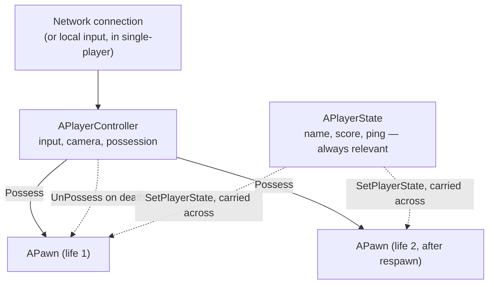

# Player controller and player state

`APlayerController` and `APlayerState` both represent "the player" in some sense, and both persist
across a `Pawn` being destroyed and respawned — which is exactly why they're easy to confuse. The
difference is what each one is *for*: one is a live connection that reads input and possesses a body,
the other is a data record that other clients are allowed to see.

## Why this matters

If you put a player's score on `PlayerController`, it works perfectly for that player and never appears
on anyone else's screen — a `PlayerController` other than your own is barely usable on a remote client.
If you put transient input state (which key is held right now) on `PlayerState`, you're replicating
noise to every client for no gameplay benefit. Knowing which of these two objects a piece of data
belongs on is the single most common early mistake in multiplayer Unreal code.

## Mental model



A `PlayerController` is created once per player for the whole session and survives pawn death by
design — it's the thing that *does* the possessing, so it has to outlive any one possessed body.
`PlayerState` survives for the same reason but for a different purpose: it's the record other clients
read to show a scoreboard, and a scoreboard entry shouldn't disappear because someone respawned.

## The mechanics

### APlayerController: input and possession

A `PlayerController` is non-physical — it has no mesh, no collision, no location that means anything on
its own. Its job is to translate player input into gameplay intent and to hold the *possession*
relationship with a `Pawn`.

```cpp title="MyPlayerController.h"
UCLASS()
class MYGAME_API AMyPlayerController : public APlayerController
{
    GENERATED_BODY()

protected:
    virtual void SetupInputComponent() override;
    virtual void OnPossess(APawn* InPawn) override;

    UPROPERTY(EditDefaultsOnly, Category = "Input")
    TObjectPtr<class UInputMappingContext> DefaultMappingContext;
};
```

```cpp title="MyPlayerController.cpp"
void AMyPlayerController::SetupInputComponent()
{
    Super::SetupInputComponent();
    // Bind Enhanced Input actions here — this runs once per controller, not per pawn.
}

void AMyPlayerController::OnPossess(APawn* InPawn)
{
    Super::OnPossess(InPawn); // this is what sets InPawn->Controller and calls Pawn::PossessedBy
}
```

Only the server and the one client that owns a given `PlayerController` have a fully usable copy of it.
On every other client, that same player is visible through their `Pawn` and `PlayerState`, not through a
meaningfully populated `PlayerController`.

### APlayerState: persistent, replicated player data

`PlayerState` is deliberately one of the actor types the engine treats as always relevant, so every
client keeps a synced copy of every connected player's `PlayerState` — that's what makes it the right
place for a scoreboard, not the `PlayerController`.

```cpp title="MyPlayerState.h"
UCLASS()
class MYGAME_API AMyPlayerState : public APlayerState
{
    GENERATED_BODY()

public:
    UPROPERTY(ReplicatedUsing = OnRep_Kills, BlueprintReadOnly, Category = "Stats")
    int32 Kills = 0;

    UFUNCTION()
    void OnRep_Kills();
};
```

A `Pawn` reaches its owner's `PlayerState` through `APawn::GetPlayerState()` (or the templated
`GetPlayerState<T>()`), and the association is made and replicated automatically —
`APawn::SetPlayerState()` is called when a controller possesses the pawn, and `OnRep_PlayerState()` fires
on clients when that reference replicates in.

```cpp title="Reading the possessing player's stats from a Pawn"
if (AMyPlayerState* MyPS = GetPlayerState<AMyPlayerState>())
{
    UpdateKillFeedFor(MyPS->Kills);
}
```

### Where PlayerState comes from

`GameMode` spawns a `PlayerState` for each connecting player (`PlayerStateClass` on your `GameMode`
subclass), exactly like it spawns the `PlayerController` — see
[Game mode and game state](./game-mode-and-game-state.md) for the spawning side.

## Gotchas

:::warning Per-life data does not belong on PlayerState
Health, ammo, and anything that should reset when a `Pawn` respawns belongs on the `Pawn`/`Character`
itself, not on `PlayerState` — `PlayerState` deliberately survives across respawns, so data placed there
will carry over between lives unless you explicitly reset it, which is rarely what you want.
:::

:::caution A remote client's PlayerController is not a reliable data source
Don't write gameplay logic that reads properties off another player's `APlayerController` — on a given
client, only the local player's controller (and the server) has a meaningfully populated one. If data
needs to be visible to everyone, it belongs on `PlayerState`, not `PlayerController`.
:::

## See also

- [Framework overview](./framework-overview.md) — how this pair fits with GameMode/GameState and Pawn.
- [Game mode and game state](./game-mode-and-game-state.md) — where `PlayerController` and `PlayerState`
  are spawned and configured.
- [Pawn and character](./pawn-and-character.md) — the object being possessed.
- [Actor lifecycle](./actor-lifecycle.md) — `OnPossess`/`OnRep_PlayerState` in the context of the full
  spawn/init sequence.
- [Epic — Gameplay Framework: Player Controllers and Player States](https://dev.epicgames.com/documentation/unreal-engine/gameplay-framework-in-unreal-engine)

