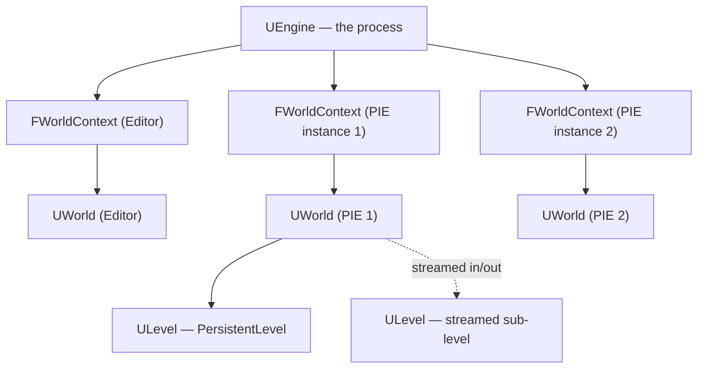

# World, levels, and world context

`GetWorld()` is one of the first functions every Unreal C++ developer learns, and one of the last ones
they truly understand. It's easy to treat "the world" as a singleton — there's one map open, so surely
there's one `UWorld` — until Play-In-Editor with multiple clients, or a dedicated server plus listen
server test, shows you there can be several `UWorld`s alive in the same process at once, each with its
own actors, its own `GameMode`, and its own `GameInstance` link.

## Why this matters

Code that caches a `UWorld*` (or anything reachable only through one) as a `static` or a global will
silently break the moment more than one world exists in the process — which happens far more often than
new developers expect, because the editor itself keeps an `Editor` world open at the same time as any
`PIE` world you launch to test. Knowing what a `UWorld` actually owns, and how an object figures out
*which* world it belongs to, is what keeps editor tooling, PIE, and packaged builds behaving the same
way.

## Mental model



Each `UWorld` owns exactly one `PersistentLevel`, plus zero or more streamed-in sub-`ULevel`s layered on
top of it. A `ULevel` is a container of actors, saved as a `.umap` file — the `PersistentLevel` is
always loaded for as long as the world exists; sub-levels stream in and out independently (through
`ULevelStreaming`) without tearing down the world itself. `FWorldContext` is the engine-level record that
ties a `UWorld` to a purpose — `EWorldType::Game`, `Editor`, `PIE`, `EditorPreview`, and a few others —
which is how the same process can host an editor world and one or more separate PIE worlds
simultaneously.

## The mechanics

### Getting the world from gameplay code

```cpp title="Reaching the World and spawning an Actor"
void AMySpawner::SpawnPickup()
{
    if (UWorld* World = GetWorld())
    {
        FActorSpawnParameters Params;
        Params.Owner = this;
        World->SpawnActor<AMyPickup>(PickupClass, GetActorTransform(), Params);
    }
}
```

`AActor::GetWorld()` and `UActorComponent::GetWorld()` resolve through the actor/component's outer
chain to the `UWorld` they were spawned into. Plain `UObject`s don't automatically know their world —
they need to be given one explicitly (a `WorldContextObject` parameter is the common pattern for
`UFUNCTION(BlueprintCallable, meta = (WorldContext = "WorldContextObject"))` library functions) or reach
it indirectly through an owning actor or subsystem.

### Levels and streaming

```cpp title="Streaming a sub-level in by name"
UGameplayStatics::LoadStreamLevel(this, FName("Sublevel_Cave"), /*bMakeVisibleAfterLoad*/ true,
    /*bShouldBlockOnLoad*/ false, FLatentActionInfo());
```

Streaming a level in or out doesn't affect the `PersistentLevel` or the `UWorld` itself — actors in the
streamed sub-level go through the same spawn/`BeginPlay`/`EndPlay` sequence described in
[Actor lifecycle](./actor-lifecycle.md) as the level streams, while actors in the persistent level and
other already-loaded sub-levels are untouched.

### Multiple worlds in one process

Play-In-Editor is the everyday case where this matters: launching PIE with two clients creates two
separate `UWorld`s (and two separate `UGameInstance`s — see [Game instance](./game-instance.md)) inside
the same editor process, alongside the `Editor` world that's still open in the background. Anything that
should be per-session must live on an object scoped to one of those worlds (an actor, a
`UWorldSubsystem`, a `UGameInstanceSubsystem`) rather than a raw `static`.

## Gotchas

:::warning[GetWorld() can return null outside of live gameplay]
Calling `GetWorld()` on a `UObject` that isn't part of a spawned actor hierarchy, or during CDO
construction, can return `nullptr`. Guard world-dependent code with a null check instead of assuming a
world is always available, especially in code paths that might run from editor tooling or asset
processing.
:::

:::caution[A static or global doesn't know which world it belongs to]
A `static UMyManager*` or file-scope global is shared across every `UWorld` in the process. In a
single-PIE-client test this is invisible; with two PIE clients (or a dedicated server plus a client in
the same process) it becomes cross-talk between sessions that shouldn't be able to see each other. Use a
`UWorldSubsystem` or `UGameInstanceSubsystem` for anything that needs to be "one per world" or "one per
session" — see [Subsystems](../02-cpp-in-unreal/subsystems.md).
:::

## See also

- [Actor lifecycle](./actor-lifecycle.md) — how level streaming triggers `BeginPlay`/`EndPlay` for
  actors in a sub-level.
- [Game instance](./game-instance.md) — the object that outlives any single `UWorld` across level
  travel.
- [Game mode and game state](./game-mode-and-game-state.md) — `GameMode` is itself scoped to one
  `UWorld` and re-spawned on every level load.
- [Subsystems](../02-cpp-in-unreal/subsystems.md) — `UWorldSubsystem` as the supported alternative to a
  world-scoped singleton.
- [Epic — Levels in Unreal Engine](https://dev.epicgames.com/documentation/unreal-engine/levels-in-unreal-engine)
