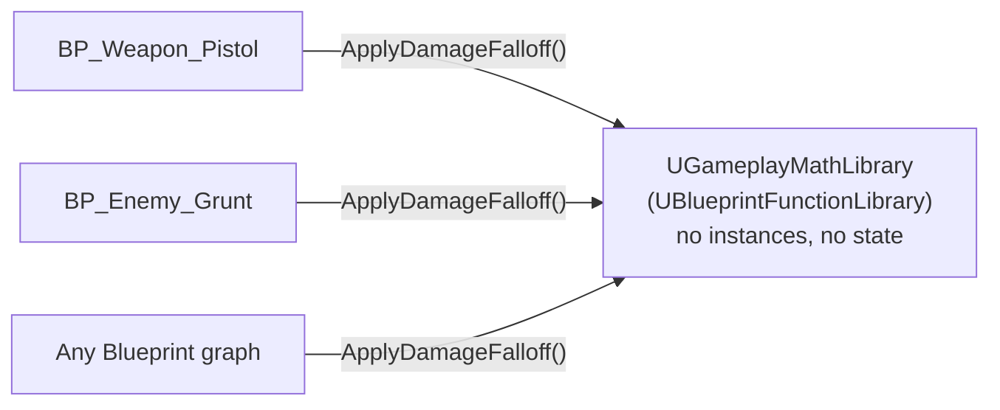

# Blueprint function libraries

Not every piece of logic belongs on an object. A damage falloff formula, a string-formatting helper, a
"is this actor on the same team as that one" query — none of these need an instance, a lifetime, or a
place in an inheritance hierarchy. `UBlueprintFunctionLibrary` is Unreal's answer to "where does this
go": a class that exists only to hold static functions and is never instantiated, placed, or spawned.
Skip it and this logic tends to end up copy-pasted across every Blueprint graph that needs it, or bolted
onto whichever actor happened to need it first.

## Why this matters

Without a function library, a shared stateless helper has nowhere natural to live. It gets pasted into
one Blueprint graph, then copy-pasted into the next one that needs it, and the two copies drift the
first time either gets fixed. Or it gets added as a method on some unrelated actor class, which now has
a dependency that has nothing to do with what the actor actually is. A function library gives stateless
logic a home that's reachable from *every* Blueprint graph in the project, with a single implementation
that a single bugfix reaches everywhere at once.

## Mental model: a namespace, not an object



Every caller reaches the same static function through the same class — there's no per-caller state,
no constructor, and nothing to new-up. In Blueprint, a function library's static functions simply
appear in the node search from any graph, without needing a reference to an instance of anything.

## The mechanics

A function library is a `UCLASS()` deriving from `UBlueprintFunctionLibrary`, containing only `static`
`UFUNCTION`s:

```cpp showLineNumbers title="GameplayMathLibrary.h"
UCLASS()
class MYGAME_API UGameplayMathLibrary : public UBlueprintFunctionLibrary
{
    GENERATED_BODY()

public:
    // BlueprintCallable: has meaningful "no side effects" semantics here, so BlueprintPure fits.
    UFUNCTION(BlueprintPure, Category = "Gameplay|Math")
    static float ApplyDamageFalloff(float BaseDamage, float Distance, float MaxRange);

    // Needs the current world to resolve a context-dependent query — takes a WorldContextObject.
    UFUNCTION(BlueprintCallable, Category = "Gameplay|Query", meta = (WorldContextObject = "WorldContextObject"))
    static bool AreOnSameTeam(const UObject* WorldContextObject, AActor* First, AActor* Second);
};
```

```cpp showLineNumbers title="GameplayMathLibrary.cpp"
float UGameplayMathLibrary::ApplyDamageFalloff(float BaseDamage, float Distance, float MaxRange)
{
    const float Falloff = FMath::Clamp(1.0f - (Distance / MaxRange), 0.0f, 1.0f);
    return BaseDamage * Falloff;
}
```

### BlueprintCallable vs BlueprintPure here

- **`BlueprintPure`** fits a function library well when the function is a genuine computation with no
  side effects — it shows up as a value node with no execution pin, the same way a math operator does.
- **`BlueprintCallable`** is still correct for anything with a side effect or a meaningful failure path
  (spawning something, mutating state, or a query worth branching on with an exec pin).

### Getting world context into a static function

A `static` function has no `this`, so it can't reach `GetWorld()` the way a member function can. The
`meta = (WorldContextObject = "ParamName")` specifier tells the Blueprint compiler which parameter to
use to resolve the world — and, as a side effect, hides that parameter from the graph when it can be
inferred from the calling node's own context (a `self` reference), which is why engine library
functions rarely show an explicit world-context pin.

### Namespacing with Category

The `|` separator in `Category = "Gameplay|Math"` creates a nested submenu in the Blueprint node
picker. This matters more for function libraries than for per-class functions, because every function
in a library is visible from every graph in the project — an unnamespaced, flat category list gets
noisy fast once a project has more than one or two libraries.

## Gotchas

:::warning[A function library cannot hold per-call state]
There is no instance, so there is nowhere to keep a cache, a counter, or a "last computed" value
between calls. If logic needs to remember something across calls, it belongs on a
[subsystem](../02-cpp-in-unreal/subsystems.md) or an actor/component, not a function library.
:::

:::caution[BlueprintPure functions still run their full body on every pull]
Marking a function `BlueprintPure` changes how it looks in the graph, not how often it executes. An
expensive `BlueprintPure` function wired into several places in a Tick-driven graph runs its full body
each time — there is no memoization. See [Blueprint performance](./blueprint-performance.md) for where
this actually costs frame time.
:::

:::warning[WorldContextObject is a convention, not automatic]
Forgetting the `meta = (WorldContextObject = "...")` specifier on a static function that needs
`GetWorld()` doesn't fail to compile — it just means the function has no way to resolve which world
it's operating in, and you'll pass a `UObject*` explicitly and call `Object->GetWorld()` inside instead.
:::

## See also

- [Exposing C++ to Blueprint](./exposing-cpp-to-blueprint.md) — the `BlueprintCallable`/`BlueprintPure`
  distinction in full.
- [C++ base, Blueprint derived](./cpp-base-blueprint-derived.md) — for logic that *does* need per-actor
  state and identity.
- [Subsystems](../02-cpp-in-unreal/subsystems.md) — where to put logic that needs to persist state
  across calls without living on an actor.
- [Blueprint performance](./blueprint-performance.md) — the cost model behind the `BlueprintPure` note
  above.
- [Epic — Blueprint Function Libraries](https://dev.epicgames.com/documentation/unreal-engine/API/Runtime/Engine/Kismet/UBlueprintFunctionLibrary)

