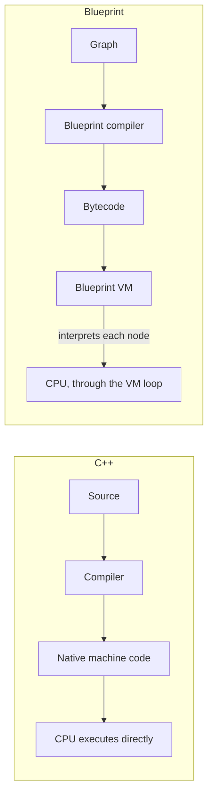

# Blueprint performance, honestly

"Blueprint is slow" is the kind of claim that's technically true and mostly useless. It's true in the
sense that a bytecode interpreter is always slower than compiled machine code for the same logic. It's
useless as guidance, because most Blueprint graphs never run often enough, or over enough data, for that
difference to matter to a frame budget. This page is the honest version: where the Blueprint VM's cost
is real and worth caring about, and where "just convert it to C++" is wasted engineering time spent on
something a profiler would have told you not to touch.

## Why this matters

Two failure modes are equally common. The first is shipping a Tick-driven Blueprint graph over hundreds
of actors and wondering why frame time is bad — that's a real cost, and it's the case this page exists
to explain. The second is an engineer converting a rarely-called UI event handler to C++ because
"Blueprint is slow," burning a day of work to save microseconds nobody would ever measure. Knowing which
case you're in requires understanding *why* Blueprint has overhead in the first place, not just that it
does.

## Mental model: an interpreter loop versus native code



A Blueprint graph compiles to bytecode for Unreal's own virtual machine, not to machine code. Every node
execution goes through that VM's dispatch loop — decode the instruction, marshal arguments, call the
underlying (often native) function, return through the VM. C++ skips all of that and runs as machine
code the CPU executes directly. The overhead is per-node-execution, not per-graph-that-exists: an idle
Blueprint costs nothing, and even a large graph that runs once on a button press costs a fraction of a
millisecond nobody will notice.

## The mechanics: where the cost actually shows up

The overhead compounds with **frequency × instance count**, not with graph complexity alone:

- **Per-frame logic (`Event Tick`) on many instances** — a Tick graph that's individually cheap becomes
  expensive multiplied across hundreds of actors, every frame. This is the single most common real
  Blueprint performance problem in shipped projects.
- **Tight loops over large data** — a `ForEachLoop` iterating thousands of elements pays the VM dispatch
  cost once per iteration; the equivalent C++ loop doesn't.
- **Deep call chains through interfaces or event dispatchers** — each hop through the VM adds dispatch
  overhead that a native virtual call doesn't pay.
- **Anything that would need multithreading** — Blueprint graphs execute on the game thread only; there
  is no Blueprint equivalent of offloading work to a task graph thread.

What is **not** a real problem in nearly all cases: occasional gameplay triggers (an interact, a pickup,
a UI button), one-shot initialization logic, and most designer-facing "when X happens, do Y" wiring. The
VM overhead on a graph that runs a handful of times per second, or per player action, is not where frame
budgets go.

## Reducing the real cost, in order

Before converting anything to C++:

1. **Profile with Unreal Insights first.** Guessing which Blueprint is expensive is exactly how you end
   up optimizing the wrong thing.
2. **Replace `Event Tick` with timers or delegates** where the logic doesn't genuinely need to run every
   frame — most gameplay logic doesn't.
3. **Move the specific hot path to C++**, not the whole system. A `BlueprintCallable` or
   `BlueprintNativeEvent` function that does the expensive part in C++, called from a Blueprint graph
   that still owns the high-level wiring, gets you the native speed where it matters without losing
   Blueprint's iteration speed everywhere else.

```cpp showLineNumbers title="Moving a per-frame check out of Tick"
// Instead of a Blueprint Event Tick checking a condition every frame across many actors,
// register a native timer that checks less often and only where it matters.
void AGuard::BeginPlay()
{
    Super::BeginPlay();
    GetWorldTimerManager().SetTimer(
        VisionCheckHandle, this, &AGuard::CheckPlayerVisibility, 0.2f, /*bLoop=*/true);
}
```

Dropping a per-actor check from every frame (roughly 60 times a second) to five times a second is
usually invisible to gameplay feel and removes the bulk of the cost — whether the check itself lives in
Blueprint or C++.

## Gotchas

:::warning[Blueprint Nativization does not exist in UE5]
Earlier engine versions offered "Blueprint Nativization," which converted Blueprint graphs to generated
C++ at cook time. It does not exist in UE5 — projects that used it still function, but nativization is
not an available optimization path going forward. If a performance problem is real, the fix is moving
the specific hot logic to hand-written C++, not flipping a nativization setting.
:::

:::caution[BlueprintPure functions are not free just because they lack an exec pin]
As covered in [Exposing C++ to Blueprint](./exposing-cpp-to-blueprint.md), a `BlueprintPure` function
re-runs its full body every time an input pin pulls it — there is no caching. Wiring an expensive pure
function into several places in a Tick graph multiplies its cost by every pull, silently.
:::

:::warning[Don't convert what you haven't measured]
Converting a rarely-called Blueprint function to C++ trades Blueprint's fast iteration (edit, compile,
play — no engine rebuild) for a real engineering cost, to save time that was never actually on the
critical path. Reserve conversion for logic a profiler has actually flagged.
:::

## See also

- [Exposing C++ to Blueprint](./exposing-cpp-to-blueprint.md) — the `BlueprintPure`/`BlueprintCallable`
  distinction referenced above.
- [C++ base, Blueprint derived](./cpp-base-blueprint-derived.md) — keeping hot logic in the C++ base
  while Blueprint subclasses stay content-only.
- [C++ versus Blueprint](../00-overview/cpp-vs-blueprint.md) — the broader policy this page's guidance
  supports.
- [Actor lifecycle](../03-gameplay-framework/actor-lifecycle.md) — where `Tick` fits among an actor's
  other lifecycle hooks, and why disabling it when unneeded matters.
- [Epic — Blueprint vs C++, performance concerns](https://dev.epicgames.com/documentation/unreal-engine/coding-in-unreal-engine-blueprint-vs-cplusplus)
