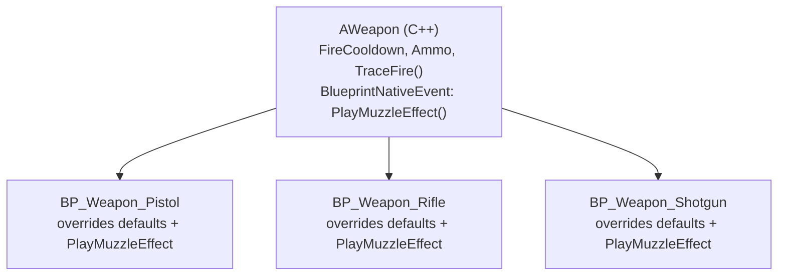

# C++ base class, Blueprint derived class

Almost every shipped Unreal project is built on the same shape: a small number of C++ classes that
define behaviour, and a much larger number of Blueprint classes that derive from them and differ only
in content — meshes, numbers, and small graph overrides. If you don't deliberately build toward this
shape, you end up with the opposite: either one bloated C++ class with branches for every variant, or
dozens of near-duplicate Blueprints with the same logic copy-pasted into each graph. Both are expensive
to maintain; this pattern is how you avoid them.

## Why this matters

A designer adding a new weapon, enemy, or pickup variant should not need an engineer, a recompile, or
an editor restart. They need a new *Blueprint* that inherits from an existing *C++* class and changes
only the parts that vary. The C++ base carries the logic once; every Blueprint subclass carries only
its own data. Without this split, adding content means editing shared C++ (slow, requires an engineer,
risks regressing every other variant) or duplicating a Blueprint graph (fast, but the duplicate now
drifts from the original the first time either one gets a bugfix).

## Mental model: one root, many leaves



The C++ class never lists its Blueprint subclasses — it doesn't know they exist, and it doesn't need
to. Each leaf only needs to know its one parent. This is what makes the pattern scale: adding
`BP_Weapon_Grenade_Launcher` next month touches zero existing files.

## The mechanics

### Creating the Blueprint subclass

In the editor, **Content Browser → Add → Blueprint Class**, then pick the C++ class as the parent
instead of a built-in engine class. The resulting Blueprint asset opens with the C++ class's
`UPROPERTY`/`UFUNCTION` surface already available: `EditDefaultsOnly`/`EditAnywhere` properties appear
in its Class Defaults, and `BlueprintImplementableEvent`/`BlueprintNativeEvent` functions appear as
overridable graph events.

### What the C++ base controls

- **`UCLASS(Blueprintable)`** — required for the class to be subclassable in the editor at all.
  `NotBlueprintable` blocks it; `Abstract` allows subclassing but blocks placing the base class itself
  in a level.
- **Which members are overridable** — only `BlueprintNativeEvent` and `BlueprintImplementableEvent`
  functions can be overridden in a Blueprint graph. A plain native `UFUNCTION(BlueprintCallable)` can
  be *called* from Blueprint but never *replaced* by it. See
  [Exposing C++ to Blueprint](./exposing-cpp-to-blueprint.md) for the full specifier set.
- **Which properties are per-subclass vs per-instance** — `EditDefaultsOnly` properties are set once
  per Blueprint subclass (every placed `BP_Weapon_Pistol` shares the same `FireCooldown` unless you
  deliberately widen it to `EditAnywhere`).

```cpp showLineNumbers title="AWeapon.h"
UCLASS(Abstract, Blueprintable)
class MYGAME_API AWeapon : public AActor
{
    GENERATED_BODY()

public:
    AWeapon();

    // Per-subclass tunable: BP_Weapon_Pistol and BP_Weapon_Rifle each set their own value.
    UPROPERTY(EditDefaultsOnly, BlueprintReadOnly, Category = "Weapon")
    float FireCooldownSeconds = 0.25f;

    UPROPERTY(EditDefaultsOnly, BlueprintReadOnly, Category = "Weapon")
    int32 MagazineSize = 12;

    // Native logic every weapon shares — Blueprint calls it, never replaces it.
    UFUNCTION(BlueprintCallable, Category = "Weapon")
    void Fire();

    // Native default trace behaviour, overridable per subclass for special cases (shotgun spread).
    UFUNCTION(BlueprintNativeEvent, Category = "Weapon")
    void TraceFire();
    virtual void TraceFire_Implementation();

    // No native body — every concrete weapon Blueprint supplies its own muzzle effect.
    UFUNCTION(BlueprintImplementableEvent, Category = "Weapon")
    void PlayMuzzleEffect();
};
```

`Abstract` here means `AWeapon` itself can never be placed in a level or spawned directly — only its
Blueprint subclasses can, which is usually what you want for a shared base that has no content of its
own.

### Reparenting

A Blueprint's parent class can be changed later via **Class Settings → Class Options → Parent Class**,
but this is a one-way door in practice: properties the old parent had and the new one doesn't are
silently discarded, and graph nodes calling removed functions break and require manual repair. Treat
the parent class as a decision made early, not something to change casually mid-project.

## Gotchas

:::warning[Changing a C++ default does not touch instances that already overrode it]
`EditDefaultsOnly` properties are copied into each Blueprint subclass's Class Default Object (CDO) the
first time they're touched in the editor. If a designer already set `BP_Weapon_Rifle`'s
`FireCooldownSeconds` explicitly, bumping the C++ default later does **not** change that Blueprint's
value — the Details panel shows a "reset to default" arrow next to any property that has diverged.
Auditing which subclasses have drifted from the current C++ default is a manual editor task, not
something the compiler catches.
:::

:::caution[Construction order: native constructor, then CDO, then Blueprint defaults]
The C++ constructor runs first and sets the values you wrote in the `.cpp`. The Blueprint's Class
Default Object then applies any values the Blueprint editor overrode. If you need a value that a
Blueprint subclass can never override, don't rely on `EditDefaultsOnly` — compute it in C++ without
exposing it for edit, or enforce it in `PostInitProperties()`.
:::

:::warning[Abstract does not mean "cannot be subclassed"]
`UCLASS(Abstract)` blocks placing or spawning the class itself; it says nothing about Blueprint
subclassing, which is controlled independently by `Blueprintable`/`NotBlueprintable`. Combining
`Abstract, Blueprintable` — a base only Blueprint subclasses can instantiate — is the normal shape for
this pattern, not a contradiction.
:::

## See also

- [Exposing C++ to Blueprint](./exposing-cpp-to-blueprint.md) — the specifier reference this pattern
  depends on.
- [Blueprint function libraries](./blueprint-function-libraries.md) — for stateless helpers that don't
  belong on any one class hierarchy.
- [Data-driven design](./data-driven-design.md) — when subclassing per variant stops scaling and a data
  asset per variant is the better fit.
- [C++ versus Blueprint](../00-overview/cpp-vs-blueprint.md) — the split this pattern implements.
- [Epic — Creating C++ classes for use with Blueprints](https://dev.epicgames.com/documentation/unreal-engine/coding-in-unreal-engine-blueprint-vs-cplusplus)

