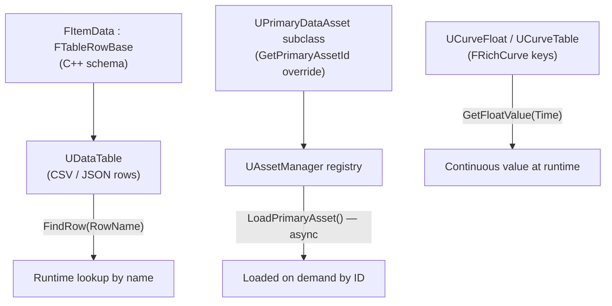

# Data-driven design with DataTable, DataAsset, and curves

Subclassing gets you far — see [C++ base, Blueprint derived](./cpp-base-blueprint-derived.md) — but it
breaks down once content scales into the hundreds: nobody wants a Blueprint asset per weapon stat block
when a spreadsheet row would do, and nobody wants a recompile to change a damage-over-distance curve. UE
gives you three data-oriented tools for exactly this: `UDataTable` for rows of a fixed schema,
`UDataAsset`/`UPrimaryDataAsset` for asset-shaped configuration, and curve assets for continuous tunable
values. Picking the wrong one costs you either flexibility or performance later.

## Why this matters

Data-driven design is what lets a designer add the fortieth enemy type or item without touching a
Blueprint graph at all — they edit a spreadsheet row, a data asset's fields, or drag a curve key. It
also gives you one place to balance a system instead of hunting through however many Blueprint
subclasses reference the value. Skip it and every tunable ends up hardcoded per-subclass, which means
balancing a hundred items means opening a hundred assets.

## Mental model: three shapes of data



- **`UDataTable`** is a table: one C++ struct defines the columns, rows are imported from CSV/JSON, and
  you look a row up by name at runtime. Good for large sets of small, uniform records — item stats,
  level-up tables, loot tables.
- **`UDataAsset`** is a single configuration object — an asset you reference directly, not looked up by
  name. Good for one-off configuration blocks (a game mode's ruleset, a difficulty preset).
- **`UPrimaryDataAsset`** is a `UDataAsset` that registers itself with the `UAssetManager` under a type
  and ID, so it can be discovered and asynchronously loaded without a hard reference — good for large
  per-item asset sets (every weapon's full definition, including its meshes) that you don't want all
  loaded in memory at once.
- **Curves** (`UCurveFloat`, `UCurveTable`) hold a continuous function of one input — damage falloff
  over distance, an easing curve for a UI animation — editable as keyframes in the Curve Editor instead
  of as code.

## The mechanics

### DataTable: rows of a fixed schema

Define the row shape in C++ as a `USTRUCT` deriving from `FTableRowBase`, then create a `UDataTable`
asset in the editor and pick that struct as its row type. Rows are added by importing a CSV or JSON
file, or by hand in the Data Table editor.

```cpp showLineNumbers title="FLevelUpData.h"
USTRUCT(BlueprintType)
struct FLevelUpData : public FTableRowBase
{
    GENERATED_BODY()

    UPROPERTY(EditAnywhere, BlueprintReadWrite, Category = "LevelUp")
    int32 XPToLevel = 0;

    UPROPERTY(EditAnywhere, BlueprintReadWrite, Category = "LevelUp")
    int32 AdditionalHP = 0;
};
```

```cpp showLineNumbers title="Looking up a row"
if (const FLevelUpData* Row = LevelUpTable->FindRow<FLevelUpData>(RowName, TEXT("LevelUp lookup")))
{
    ApplyLevelUp(Row->XPToLevel, Row->AdditionalHP);
}
```

`FindRow` takes a context string purely for error logging — it's not part of the lookup key — and
returns `nullptr` if the row name doesn't exist, so every call site needs the null check.

### DataAsset and PrimaryDataAsset

A plain `UDataAsset` is referenced the normal way — a `UPROPERTY(EditAnywhere) UMyConfigAsset*` field
pointing at one specific asset. A `UPrimaryDataAsset` instead makes itself discoverable by ID:

```cpp showLineNumbers title="UWeaponDataAsset.h"
UCLASS(BlueprintType)
class MYGAME_API UWeaponDataAsset : public UPrimaryDataAsset
{
    GENERATED_BODY()

public:
    UPROPERTY(EditDefaultsOnly, BlueprintReadOnly, Category = "Weapon")
    TSoftObjectPtr<USkeletalMesh> WeaponMesh;

    UPROPERTY(EditDefaultsOnly, BlueprintReadOnly, Category = "Weapon")
    float BaseDamage = 10.0f;

    virtual FPrimaryAssetId GetPrimaryAssetId() const override
    {
        return FPrimaryAssetId(TEXT("Weapon"), GetFName());
    }
};
```

With the asset type registered in the project's Asset Manager settings, `UAssetManager::Get()` can
enumerate every `UWeaponDataAsset` in the project by type and asynchronously load one by
`FPrimaryAssetId` — without any C++ code holding a hard reference to it, and without every weapon
definition being loaded in memory just because one of them is.

### Curves

`UCurveFloat` holds a single `FRichCurve` you author as keyframes in the Curve Editor; read it back at
runtime with `GetFloatValue(Time)`. `UCurveTable` holds several named curves in one asset, looked up by
row name the same way a `UDataTable` looks up rows. Both let a designer reshape a falloff, an easing
function, or a difficulty ramp by dragging keys, with zero recompiles.

```cpp showLineNumbers title="Reading a curve"
UPROPERTY(EditDefaultsOnly, Category = "Balance")
TObjectPtr<UCurveFloat> DamageFalloffCurve;

float GetFalloffMultiplier(float Distance) const
{
    return DamageFalloffCurve ? DamageFalloffCurve->GetFloatValue(Distance) : 1.0f;
}
```

## Gotchas

:::warning Do not cache a FindRow pointer beyond its local scope
`FindRow<T>()` returns a pointer into the table's own row storage. If the table gets reimported or
reloaded — routine during content iteration — anything holding onto that pointer is now dangling. Look
the row up again each time you need it; don't stash it in a member variable.
:::

:::caution An unregistered PrimaryDataAsset type won't cook or async-load
`UPrimaryDataAsset` subclasses only participate in `UAssetManager` discovery and async loading if their
asset type is registered in the project's Primary Asset rules (Project Settings → Asset Manager, backed
by `DefaultGame.ini`). Skip that step and `LoadPrimaryAsset` calls silently find nothing, and the assets
may not even be included in a packaged build.
:::

:::warning DataTable row names must be valid, unique FNames
The leftmost column of an imported CSV/JSON becomes the row name and doubles as the lookup key. Blank,
duplicate, or renamed row names break every `FindRow` call site that references the old name, with no
compiler warning — only a runtime `nullptr`.
:::

## See also

- [C++ base, Blueprint derived](./cpp-base-blueprint-derived.md) — subclassing, the alternative this
  page's tools replace once content volume grows.
- [Blueprint function libraries](./blueprint-function-libraries.md) — where lookup/query helpers around
  these tables and assets typically live.
- [UObject and the reflection system](../02-cpp-in-unreal/uobject-and-reflection.md) — how `USTRUCT`
  and `UPROPERTY` make the row schema reflectable in the first place.
- [Epic — Data-Driven Gameplay Elements](https://dev.epicgames.com/documentation/unreal-engine/data-driven-gameplay-elements-in-unreal-engine)
