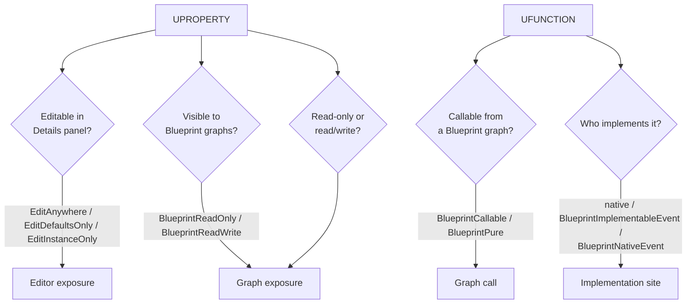

# Exposing C++ to Blueprint

Every specifier you attach to a `UPROPERTY` or `UFUNCTION` is a decision about who gets to see and
change that member: nobody, a designer in the Details panel, a Blueprint graph reading it, or a
Blueprint graph reading *and* writing it. Get the specifier wrong and the failure is silent — the
member compiles fine and simply doesn't show up where you expected it to, which is a much slower bug
to track down than a compile error. This page is the reference you come back to when picking
specifiers, so [C++ versus Blueprint](../00-overview/cpp-vs-blueprint.md) doesn't have to re-derive it.

## Why this matters

`UPROPERTY` and `UFUNCTION` specifiers are how you draw the boundary between "C++ owns this" and
"Blueprint can touch this." Too few specifiers and designers file tickets for values an engineer has
to expose one at a time; too many and you've handed content authors write access to state that C++
logic assumes it controls exclusively. The specifier set is small enough to memorize, but the
combinations are easy to get subtly wrong — this page exists to make the right combination a lookup,
not a guess.

## Mental model: exposure is layered, not binary

A member isn't just "exposed" or "not exposed." Three independent questions apply to a property, and
two to a function:



A property can be editor-visible without being Blueprint-visible (a designer-tunable value a graph
never needs to read), or Blueprint-readable without being editor-editable (a runtime-computed value
designers should see but never hand-set). Treat each axis separately instead of reaching for one
specifier combo by habit.

## The mechanics

### UPROPERTY: the editor-exposure family

| Specifier | Editable where | Typical use |
|---|---|---|
| `EditAnywhere` | Details panel, on the class default *and* every placed instance | Per-instance tunables (a trigger's radius) |
| `EditDefaultsOnly` | Details panel, only on the class default (Blueprint editor / CDO) | Values that should be consistent per-subclass, not per-instance |
| `EditInstanceOnly` | Details panel, only on placed instances, not the class default | Values that only make sense once placed in a level |
| `VisibleAnywhere` / `VisibleDefaultsOnly` / `VisibleInstanceOnly` | Shown, greyed out | Runtime or computed state a designer should see, never set |

### UPROPERTY: the Blueprint-exposure family

| Specifier | Effect |
|---|---|
| `BlueprintReadOnly` | Graphs can read the value with a getter node; no setter node is generated |
| `BlueprintReadWrite` | Graphs get both a getter and a setter node |
| `BlueprintGetter` / `BlueprintSetter` | Route Blueprint read/write through a named C++ function instead of direct field access, for validation or side effects |

These two families combine freely: `UPROPERTY(EditAnywhere, BlueprintReadWrite, Category = "Combat")`
is both editor- and Blueprint-writable; `UPROPERTY(VisibleAnywhere, BlueprintReadOnly)` is visible
everywhere but writable nowhere outside C++.

### UFUNCTION: calling from Blueprint

| Specifier | Effect |
|---|---|
| `BlueprintCallable` | Appears as a callable node in Blueprint graphs; can have side effects, gets an execution pin |
| `BlueprintPure` | Callable, but no execution pin — for functions with no side effects, used like a value node |
| `BlueprintAuthorityOnly` | Blueprint call is a no-op on clients without authority (server-only gameplay logic) |

### UFUNCTION: who implements it

This is the axis that trips people up, because all three options look similar in the header but mean
completely different things:

| Specifier | Native (C++) implementation? | Blueprint can override? |
|---|---|---|
| Plain `BlueprintCallable` (no event specifier) | Required, in the `.cpp` | No — Blueprint only calls it |
| `BlueprintImplementableEvent` | None — no C++ body at all | Required — pure hook for Blueprint |
| `BlueprintNativeEvent` | Required, as `FunctionName_Implementation` | Optional — Blueprint may override; if it doesn't, the native `_Implementation` runs |

```cpp showLineNumbers title="AInteractableActor.h"
UCLASS(Blueprintable)
class MYGAME_API AInteractableActor : public AActor
{
    GENERATED_BODY()

public:
    // Editor + Blueprint read/write: a designer tunable, readable and settable from graphs.
    UPROPERTY(EditAnywhere, BlueprintReadWrite, Category = "Interaction")
    float InteractionRadius = 150.f;

    // Runtime state: visible for debugging, never hand-edited.
    UPROPERTY(VisibleAnywhere, BlueprintReadOnly, Category = "Interaction")
    bool bIsOnCooldown = false;

    // Callable with a native body; Blueprint cannot replace this logic, only invoke it.
    UFUNCTION(BlueprintCallable, Category = "Interaction")
    void Interact(AActor* Instigator);

    // No native body at all — every Blueprint subclass must implement this in its graph.
    UFUNCTION(BlueprintImplementableEvent, Category = "Interaction")
    void OnInteracted(AActor* Instigator);

    // Native default provided; a Blueprint subclass MAY override it, but doesn't have to.
    UFUNCTION(BlueprintNativeEvent, Category = "Interaction")
    void PlayInteractionFeedback();
    virtual void PlayInteractionFeedback_Implementation();

    // No side effects, no exec pin — reads like a value node in the graph.
    UFUNCTION(BlueprintPure, Category = "Interaction")
    bool CanInteract() const;
};
```

```cpp showLineNumbers title="AInteractableActor.cpp"
void AInteractableActor::Interact(AActor* Instigator)
{
    if (!CanInteract())
    {
        return;
    }
    bIsOnCooldown = true;
    PlayInteractionFeedback();   // dispatches to Blueprint's override if it has one
    OnInteracted(Instigator);    // always dispatches to Blueprint — there is no native body
}

void AInteractableActor::PlayInteractionFeedback_Implementation()
{
    // Default native behaviour, used when no Blueprint subclass overrides it.
}
```

## Gotchas

:::warning Never call FunctionName_Implementation directly for its own dispatch
Calling `PlayInteractionFeedback_Implementation()` instead of `PlayInteractionFeedback()` from other
C++ code skips the check for a Blueprint override entirely. Always call the plain `UFUNCTION` name —
the generated code decides whether to run the Blueprint override or fall through to
`_Implementation`.
:::

:::caution BlueprintImplementableEvent has no native fallback
If no Blueprint subclass implements a `BlueprintImplementableEvent`, calling it is simply a no-op —
there is no compile error and no runtime warning. If a function needs a sane default behaviour, use
`BlueprintNativeEvent` instead.
:::

:::warning BlueprintPure functions are not cached
A `BlueprintPure` function re-runs every time an input pin is pulled, including once per frame if wired
into a Tick-driven graph. "Pure" describes side-effect-free semantics, not memoization — an expensive
`BlueprintPure` function is a real performance cost. See
[Blueprint performance](./blueprint-performance.md).
:::

## See also

- [C++ versus Blueprint](../00-overview/cpp-vs-blueprint.md) — the policy this cookbook implements.
- [UObject and the reflection system](../02-cpp-in-unreal/uobject-and-reflection.md) — how UHT turns
  these macros into runtime metadata in the first place.
- [C++ base, Blueprint derived](./cpp-base-blueprint-derived.md) — the pattern that consumes these
  specifiers in practice.
- [Blueprint function libraries](./blueprint-function-libraries.md) — exposing static, stateless
  functions instead of per-instance members.
- [Epic — UFunctions in Unreal Engine](https://dev.epicgames.com/documentation/unreal-engine/ufunctions-in-unreal-engine)

