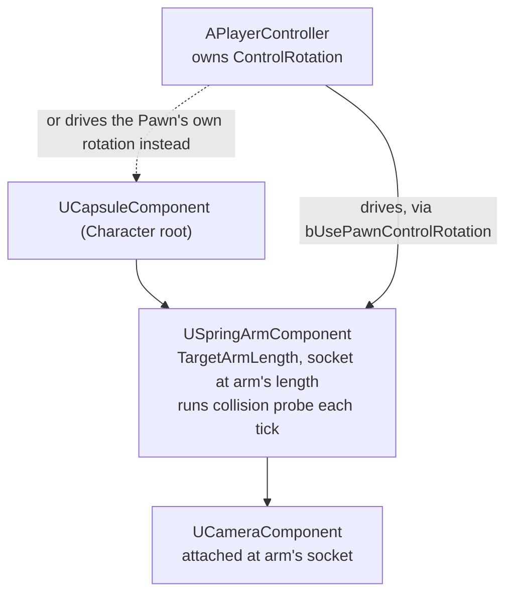

# Camera and spring arm

Attach a `UCameraComponent` straight to a character's mesh and two problems show up immediately: the
camera clips through walls whenever the character backs into one, and rotating the character to face
its movement direction spins the camera with it, which feels wrong for almost every third-person game.
`USpringArmComponent` exists to solve both, and understanding what it owns versus what the
`PlayerController` owns is what stops you from fighting rotation later.

## Why this matters

A third-person camera has two jobs that pull in different directions: it needs to follow the character
(attached, so it doesn't lag behind on teleports or fast movement) and it needs to avoid clipping
through geometry when the follow distance would put it inside a wall (which attachment alone doesn't
solve — attachment just moves the camera with its parent, blindly). `USpringArmComponent` is a single
component that does both: it's an attachable scene component that also runs a collision probe between
its socket and its target length every tick, pulling the camera closer when something's in the way.
Skipping it means writing that collision-avoidance logic yourself, badly, on every project.

## Mental model



Control rotation — where the player is looking — lives on the `PlayerController`
(`GetControlRotation()`), not on the pawn and not on the spring arm. The spring arm only *reads* control
rotation, and only if you tell it to via `bUsePawnControlRotation`. Whether the character's body turns
to face the camera, or only the camera swivels while the body keeps walking in its movement direction,
is a decision you make per-component: `UCharacterMovementComponent::bOrientRotationToMovement` versus
`bUsePawnControlRotation` on the spring arm are two independent switches that are frequently confused
for the same setting.

## The mechanics

### Building the rig

`USpringArmComponent` attaches to the capsule (or whatever the pawn's root is); `UCameraComponent`
attaches to the spring arm's socket, not to the capsule directly:

```cpp title="MyCharacter.h"
UCLASS()
class MYGAME_API AMyCharacter : public ACharacter
{
    GENERATED_BODY()

public:
    AMyCharacter();

protected:
    UPROPERTY(VisibleAnywhere, Category = "Camera")
    TObjectPtr<class USpringArmComponent> CameraBoom;

    UPROPERTY(VisibleAnywhere, Category = "Camera")
    TObjectPtr<class UCameraComponent> FollowCamera;
};
```

```cpp title="MyCharacter.cpp"
#include "GameFramework/SpringArmComponent.h"
#include "Camera/CameraComponent.h"

AMyCharacter::AMyCharacter()
{
    CameraBoom = CreateDefaultSubobject<USpringArmComponent>(TEXT("CameraBoom"));
    CameraBoom->SetupAttachment(GetCapsuleComponent());
    CameraBoom->TargetArmLength = 400.f;
    CameraBoom->bUsePawnControlRotation = true;   // arm reads the controller's ControlRotation
    CameraBoom->bDoCollisionTest = true;           // probe for blocking geometry each tick
    CameraBoom->bEnableCameraLag = true;
    CameraBoom->CameraLagSpeed = 10.f;

    FollowCamera = CreateDefaultSubobject<UCameraComponent>(TEXT("FollowCamera"));
    FollowCamera->SetupAttachment(CameraBoom, USpringArmComponent::SocketName);
    FollowCamera->bUsePawnControlRotation = false; // the arm already applied rotation; don't double it

    // The body itself should not spin to face the camera in this setup —
    // only the boom/camera follow the controller's look direction.
    bUseControllerRotationYaw = false;
    GetCharacterMovement()->bOrientRotationToMovement = true;
}
```

### Where control rotation lives

`APlayerController` owns `ControlRotation` and updates it from look input (mouse delta, right stick).
Three independent flags decide who reads it and how:

| Flag | Owner | Effect |
|---|---|---|
| `APawn::bUseControllerRotationYaw` (`Pitch`/`Roll` variants also exist) | Pawn | If true, the pawn's actor rotation is driven directly from `ControlRotation` — the body turns to face where you look. |
| `USpringArmComponent::bUsePawnControlRotation` | Spring arm | If true, the arm's *own* world rotation follows `ControlRotation`, independent of whether the pawn's actor rotation does. |
| `UCharacterMovementComponent::bOrientRotationToMovement` | Movement component | If true, the character's actor rotation turns to face its velocity instead of the controller — the classic "camera-relative movement, body faces where it's walking" setup. |

For a camera-relative third-person controller (body faces movement, camera independently follows look),
you want `bUseControllerRotationYaw = false`, `bOrientRotationToMovement = true`, and
`CameraBoom->bUsePawnControlRotation = true`. Mixing this up — leaving `bUseControllerRotationYaw` true
*and* `bOrientRotationToMovement` true — produces a body that visibly fights itself, snapping between
two rotation targets.

### Collision probing and lag

`bDoCollisionTest` makes the spring arm sphere-trace from its attach socket toward the target length
each tick; if it hits something, the camera socket is pulled in to the hit distance instead of the full
`TargetArmLength`, and it eases back out once the obstruction clears. `ProbeSize` and `ProbeChannel`
control the trace shape and collision channel used for that test — see
[Collision channels and responses](../06-collision-and-physics/collision-channels-and-responses.md) for
how to give the camera its own channel instead of reusing `ECC_Camera` blindly against every static
mesh in the level.

`bEnableCameraLag` (position) and `bEnableCameraRotationLag` (rotation) smooth the arm's motion instead
of snapping it instantly to the target transform, at the cost of the camera visibly trailing during
fast rotation or movement — tune `CameraLagSpeed` / `CameraRotationLagSpeed` down for a snappier feel,
not by disabling lag and adding your own `FInterpTo` on top.

## Traps

:::warning[Don't set bUsePawnControlRotation on both the pawn and the spring arm]
If the pawn turns to face `ControlRotation` (`bUseControllerRotationYaw = true`) *and* the spring arm
also reads `ControlRotation`, the camera rotation gets applied twice relative to the world — once via
the pawn's own actor rotation, once via the arm reading the same rotation again. Pick exactly one thing
that reads `ControlRotation` directly: either the pawn body, or the spring arm, not both.
:::

:::caution[Camera attached directly to the mesh skips collision probing entirely]
Attaching `UCameraComponent` to the skeletal mesh or capsule instead of a spring arm's socket means no
collision test runs — nothing pulls the camera out of the wall it just clipped into. If you see a
project doing this "for simplicity," the simplicity is the bug.
:::

:::note
Exact default values for `ProbeSize` and `ProbeChannel` were not confirmed against 5.7 in the sources
consulted — verify against your engine version before relying on the stock defaults for a shipping
camera.
:::

## See also

- [Enhanced Input](./enhanced-input.md) — where look input comes from before it becomes
  `ControlRotation`.
- [Pawn and character](../03-gameplay-framework/pawn-and-character.md) — the capsule the spring arm
  attaches to.
- [Player controller and player state](../03-gameplay-framework/player-controller-and-player-state.md) —
  where `ControlRotation` is actually owned and updated.
- [Character movement component](./character-movement-component.md) —
  `bOrientRotationToMovement` and the other rotation-relevant tunables.
- [Epic — Camera and spring arm setup](https://dev.epicgames.com/documentation/unreal-engine/BlueprintAPI/SpringArm)

