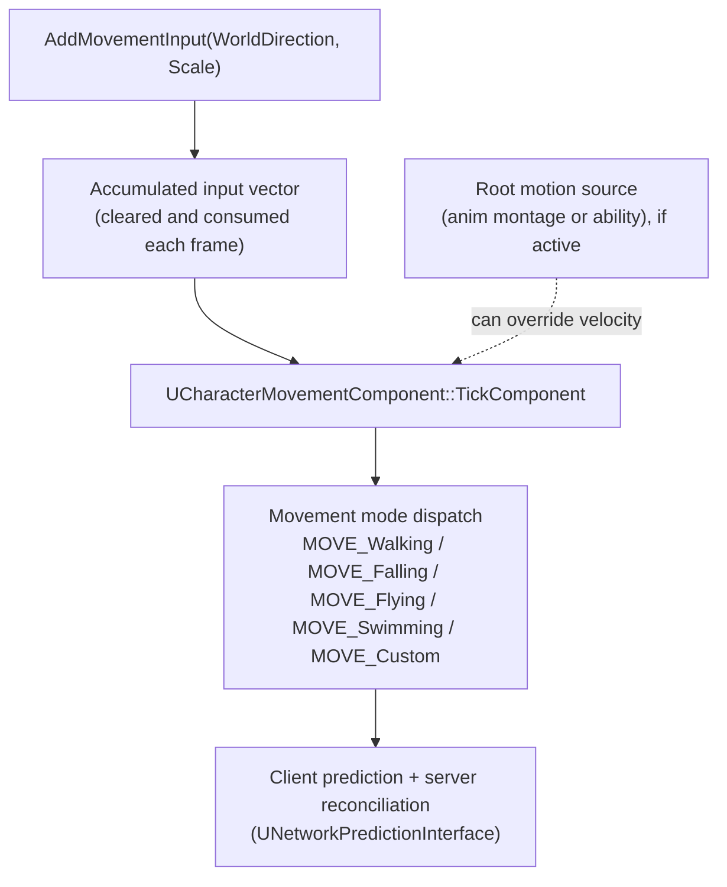

# Character movement component

`UCharacterMovementComponent` is the single biggest reason `ACharacter` is worth using over a bare
`APawn`: it's a full walk/fall/fly/swim simulation with built-in client prediction and server
reconciliation, already wired up before you write a line of gameplay code. The mistake nearly every
project makes at least once is reaching past it — setting `Actor->SetActorLocation()` directly, or
disabling its tick to hand-roll movement — which throws away the prediction it does for free and
usually reintroduces the exact desync bugs it exists to prevent.

## Why this matters

Movement is the one system every multiplayer game needs to feel instant for the local player while
staying authoritative on the server, and getting that wrong shows up immediately as either input lag
(waiting for server round-trips before you move) or rubber-banding (client and server disagreeing and
snapping). `UCharacterMovementComponent` already solves this: it runs the same movement simulation on
client and server, replays unacknowledged moves on top of server corrections, and only corrects the
client when the two genuinely diverge. Bypassing it to move an actor "more simply" means rebuilding
this — usually without realizing that's what you signed up for.

## Mental model



`AddMovementInput` doesn't move anything itself — it accumulates a world-space vector that the
component reads and clears on its own tick. The component then dispatches to one of its movement modes,
each of which is really a different physics simulation (walking applies floor-following and step-up
logic; falling applies gravity and air control; flying and swimming remove the floor constraint
entirely). Root motion, when an animation or ability system is driving it, can override the velocity the
mode would otherwise compute. All of this happens inside a component that already implements
`UNetworkPredictionInterface`, meaning every mode you use — including ones you add yourself — gets
replayed and corrected across the network without you writing networking code, provided you don't
route around the component to move the actor by other means.

## The mechanics

### Movement modes

`EMovementMode` is the top-level state; `GetMovementMode()` / `SetMovementMode()` read and change it:

| Mode | What it means |
|---|---|
| `MOVE_None` | No movement simulation; the pawn does not move under its own power. |
| `MOVE_Walking` | On a walkable surface; floor detection, step-up, slope handling all apply. |
| `MOVE_Falling` | Airborne; gravity and limited air control apply, transitions to `MOVE_Walking` on landing. |
| `MOVE_Flying` | No gravity, no floor constraint; movement responds directly to input in 3D. |
| `MOVE_Swimming` | Buoyancy-aware movement inside a physics volume flagged as water. |
| `MOVE_Custom` | Delegates to your own logic in `PhysCustom` — see
  [Custom movement modes](./custom-movement-modes.md). |

Each mode maps to a `Phys*` function (`PhysWalking`, `PhysFalling`, `PhysFlying`, `PhysSwimming`,
`PhysCustom`) that `TickComponent` dispatches to every frame based on the current mode.

### Key tunables

```cpp title="MyCharacter.cpp — common tunables set in the constructor"
UCharacterMovementComponent* Move = GetCharacterMovement();

Move->MaxWalkSpeed = 500.f;
Move->MaxAcceleration = 2048.f;
Move->BrakingDecelerationWalking = 2048.f;
Move->GroundFriction = 8.f;

Move->JumpZVelocity = 600.f;
Move->AirControl = 0.2f;           // fraction of normal control while falling
Move->GravityScale = 1.0f;

Move->bOrientRotationToMovement = true;
Move->RotationRate = FRotator(0.f, 540.f, 0.f);

Move->NavAgentProps.bCanCrouch = true;
```

`MaxWalkSpeed`, `MaxAcceleration`, and the braking/friction values together define how movement feels —
snappy versus sluggish acceleration, how quickly the character stops. `JumpZVelocity` and `AirControl`
govern jump height and how much a player can steer mid-air. `bOrientRotationToMovement` plus
`RotationRate` decide whether (and how fast) the character's body turns to face its velocity, which
interacts directly with the rotation flags covered in
[Camera and spring arm](./camera-and-spring-arm.md).

### Root motion versus component-driven motion

Two different things can produce a character's final position each frame:

- **Component-driven motion**: the movement component computes velocity from input, gravity, and
  friction, and integrates position itself. This is the default for anything not playing a
  root-motion animation.
- **Root motion**: an `UAnimMontage` (or a system built on top of one) encodes displacement directly
  into the animation, and the movement component extracts and applies that displacement instead of
  computing its own velocity for the duration of the montage — used for things like a fixed-distance
  dodge roll or an attack that has to move the character a precise amount in sync with the animation.

Root motion still flows through the movement component rather than bypassing it, which is what keeps a
root-motion dodge roll just as network-predicted as ordinary walking. See
[Anim instance in C++](../07-animation/anim-instance-in-cpp.md) and
[Montages and notifies](../07-animation/montages-and-notifies.md) for the animation side of this.

### Already network-prediction-aware

`UCharacterMovementComponent` implements `UNetworkPredictionInterface`. In practice this means: the
owning client runs the movement simulation immediately (prediction) and saves each move; the server
runs the authoritative simulation and periodically sends the client its own resulting state; the client
compares that state against its saved predicted moves and, if they diverge, snaps to the server's state
and replays its more recent unacknowledged input on top (reconciliation). None of this is something you
opt into — it's running as soon as you use the component on a replicated pawn. It's also precisely why
fighting it (teleporting the actor directly, ticking movement on the server only, disabling its
`SetMovementMode` transitions) tends to produce visible desync: you've moved the actor outside the
system that keeps client and server in agreement.

## Traps

:::warning Never move the actor directly to implement movement
`SetActorLocation()` or `AddActorWorldOffset()` called on a `Character` with an active movement
component fights the component's own position each tick and breaks prediction — the server-authoritative
value the component computed gets silently overwritten or immediately corrected back. If you need
movement outside the built-in modes, add a custom mode (see
[Custom movement modes](./custom-movement-modes.md)) rather than moving the actor around the component.
:::

:::caution MaxAcceleration of 0 does not mean "can't move"
Setting `MaxAcceleration` to zero (to lock movement, for example) also removes the deceleration curve's
reference value in some modes, producing instant-stop or no-stop behavior that looks like a bug rather
than a deliberate lock. Prefer `DisableMovement()` / restoring a saved `MaxWalkSpeed` of `0` explicitly,
or gating input in your input handler, over zeroing acceleration.
:::

:::note
Precise default numeric values (`MaxAcceleration`, `BrakingDecelerationWalking`, etc.) vary by engine
version and project template; the values above are illustrative starting points, not confirmed 5.7
defaults — check `UCharacterMovementComponent.h` in your installed engine version for the current
defaults.
:::

## See also

- [Pawn and character](../03-gameplay-framework/pawn-and-character.md) — where the movement component
  is constructed and how `AddMovementInput` reaches it.
- [Custom movement modes](./custom-movement-modes.md) — extending the component with `MOVE_Custom`.
- [Camera and spring arm](./camera-and-spring-arm.md) — `bOrientRotationToMovement` versus the
  camera's own rotation.
- [Anim instance in C++](../07-animation/anim-instance-in-cpp.md) — reading movement state for
  animation blending.
- [Epic — UCharacterMovementComponent API reference](https://dev.epicgames.com/documentation/unreal-engine/API/Runtime/Engine/GameFramework/UCharacterMovementComponent)
