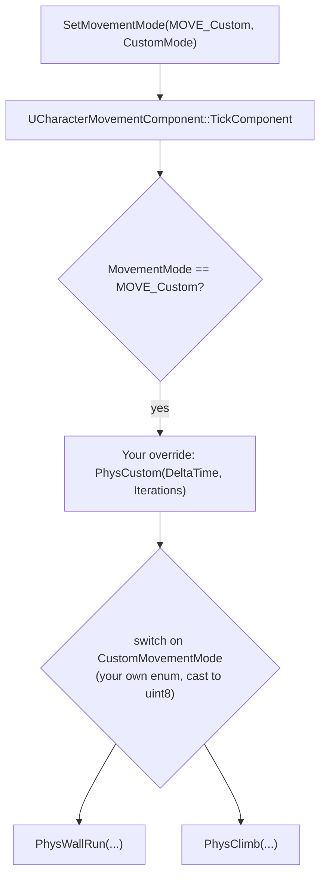

# Custom movement modes

Wall-running, climbing, grappling, and swimming-that-isn't-`MOVE_Swimming` all eventually lead you to
`MOVE_Custom` — the escape hatch `UCharacterMovementComponent` provides for movement it doesn't already
model. It's a real extension point, not a hack, but it hands you a bare function pointer and none of
the built-in modes' plumbing, so a naive implementation moves correctly for the local player and then
falls apart the moment a second client or the server gets involved.

## Why this matters

The built-in modes (`MOVE_Walking`, `MOVE_Falling`, `MOVE_Flying`, `MOVE_Swimming`) cover normal
locomotion, but plenty of gameplay needs a movement style the engine doesn't ship: sticking to a wall
while running along it, climbing a ladder with vertical-only input, being dragged toward a grapple
point. `MOVE_Custom` lets you write that simulation yourself inside the same component that already
does replication, prediction, and mode-transition bookkeeping for everything else — so your wall-run
gets client prediction "for free" only if you actually plug into the pieces the component expects,
which is where most homemade implementations quietly stop working under real network conditions.

## Mental model



`MOVE_Custom` is one value of `EMovementMode`, but it's meant to hold many custom behaviors, not one.
`UCharacterMovementComponent::CustomMovementMode` (a `uint8`) is your own sub-selector inside custom
mode — you define your own enum, cast its values to `uint8`, and switch on `CustomMovementMode` inside
your `PhysCustom` override to dispatch to per-behavior functions (`PhysWallRun`, `PhysClimb`, whatever
you need). This is the same shape the engine uses internally for its own `Phys*` functions — you're
adding one more branch to a dispatch that already exists, not inventing a new system.

## The mechanics

### Subclassing the component

You don't extend `MOVE_Custom` on the stock `UCharacterMovementComponent` — you subclass it, override
`PhysCustom`, and point your `ACharacter`-derived class at the subclass via the constructor's
component-class override:

```cpp title="MyCustomMovementComponent.h"
UCLASS()
class MYGAME_API UMyCustomMovementComponent : public UCharacterMovementComponent
{
    GENERATED_BODY()

public:
    // Your own sub-modes, cast to uint8 when calling SetMovementMode(MOVE_Custom, ...).
    enum class ECustomMovementMode : uint8
    {
        CMOVE_WallRun = 0,
        CMOVE_Climb   = 1,
    };

protected:
    virtual void PhysCustom(float DeltaTime, int32 Iterations) override;

    void PhysWallRun(float DeltaTime, int32 Iterations);
    void PhysClimb(float DeltaTime, int32 Iterations);
};
```

```cpp title="MyCustomMovementComponent.cpp"
void UMyCustomMovementComponent::PhysCustom(float DeltaTime, int32 Iterations)
{
    switch (static_cast<ECustomMovementMode>(CustomMovementMode))
    {
        case ECustomMovementMode::CMOVE_WallRun:
            PhysWallRun(DeltaTime, Iterations);
            break;
        case ECustomMovementMode::CMOVE_Climb:
            PhysClimb(DeltaTime, Iterations);
            break;
        default:
            Super::PhysCustom(DeltaTime, Iterations);
            break;
    }
}
```

The `ACharacter` must be told to use your subclass instead of the stock component — this has to happen
via the special constructor syntax, not `CreateDefaultSubobject` after the fact, because the base
`ACharacter` constructor already creates the movement component using a fixed name:

```cpp title="MyCharacter.h — using the custom movement component"
UCLASS()
class MYGAME_API AMyCharacter : public ACharacter
{
    GENERATED_BODY()

public:
    AMyCharacter(const FObjectInitializer& ObjectInitializer);
};
```

```cpp title="MyCharacter.cpp"
AMyCharacter::AMyCharacter(const FObjectInitializer& ObjectInitializer)
    : Super(ObjectInitializer.SetDefaultSubobjectClass<UMyCustomMovementComponent>(
          ACharacter::CharacterMovementComponentName))
{
}
```

### Entering and leaving the mode

Enter with `SetMovementMode(MOVE_Custom, static_cast<uint8>(ECustomMovementMode::CMOVE_WallRun))`;
leave by setting a different mode, typically back to `MOVE_Falling` so gravity resumes normally:

```cpp title="Entering wall-run from gameplay code"
UMyCustomMovementComponent* CustomMove =
    Cast<UMyCustomMovementComponent>(GetCharacterMovement());

if (CustomMove && CanStartWallRun())
{
    CustomMove->SetMovementMode(MOVE_Custom,
        static_cast<uint8>(UMyCustomMovementComponent::ECustomMovementMode::CMOVE_WallRun));
}
```

```cpp title="PhysWallRun — minimal shape of a custom Phys* function"
void UMyCustomMovementComponent::PhysWallRun(float DeltaTime, int32 Iterations)
{
    if (DeltaTime < MIN_TICK_TIME)
    {
        return;
    }

    // 1. Validate the mode is still possible (wall still present, still in range) —
    //    fall back to PhysFalling-equivalent exit if not.
    // 2. Compute Velocity for this sub-step from wall-relative input.
    // 3. Move the updated component via the same primitives the engine's own Phys*
    //    functions use (SafeMoveUpdatedComponent / sweep + slide), not SetActorLocation.
    // 4. Handle iteration/substep bookkeeping the same way PhysWalking does for large DeltaTime.
}
```

## Traps

:::warning Custom modes are not automatically replicated correctly if you skip the network move data
The client-authoritative prediction that makes ordinary walking network-transparent depends on the
component serializing enough information about each move to replay it. A custom mode that reads extra
state your `PhysCustom` needs (say, which wall you're attached to) but never puts that state into the
network move data will predict fine standalone and desync as soon as a server correction happens,
because the server has no way to know which wall the client thinks it's running on. Extending
`FCharacterNetworkMoveData` (and the corresponding `FCharacterNetworkMoveDataContainer`) to carry that
extra state is the supported path — skipping it is the most common way homemade custom modes break
under real network conditions.
:::

:::caution Don't set CustomMovementMode without also setting MovementMode
`CustomMovementMode` is only consulted while `MovementMode == MOVE_Custom`. Setting the sub-mode alone
and forgetting `SetMovementMode(MOVE_Custom, ...)` leaves the character in whatever mode it was already
in — `PhysCustom` is never called, and the bug looks like "wall-run doesn't start" with no error
anywhere.
:::

:::caution Exiting custom mode has to hand off state cleanly
Leaving wall-run and falling straight into `MOVE_Falling` mid-air needs `Velocity` left in a sane state
for the fall simulation to continue from — a custom mode that zeroes velocity on exit or leaves stale
values produces a visible pop. Treat mode transitions as a handoff of physical state, not just a mode
enum flip.
:::

:::note
The exact shape of a production-quality `PhysCustom` implementation (substep integration, floor
detection reuse, interaction with `SafeMoveUpdatedComponent`) is deliberately left as a sketch above —
verify the current signatures and helper functions (`SafeMoveUpdatedComponent`, `ComputeFloorDist`, and
similar) against `CharacterMovementComponent.h`/`.cpp` in your installed 5.7 engine source before
building on it; the pattern is stable but internals shift between engine versions.
:::

## See also

- [Character movement component](./character-movement-component.md) — the modes and tunables you're
  extending, and why fighting the component causes desync.
- [Enhanced Input](./enhanced-input.md) — triggering a mode change from a bound input action.
- [Subsystems](../02-cpp-in-unreal/subsystems.md) and
  [Actor components](../03-gameplay-framework/actor-components.md) — general component composition
  rules that also apply to a movement component subclass.
- [Epic — UCharacterMovementComponent API reference](https://dev.epicgames.com/documentation/unreal-engine/API/Runtime/Engine/GameFramework/UCharacterMovementComponent)
- [Epic — FCharacterNetworkMoveData reference](https://dev.epicgames.com/documentation/unreal-engine/API/Runtime/Engine/FCharacterNetworkMoveData)
