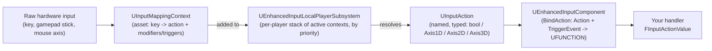

# Enhanced Input

Enhanced Input replaced the old `InputComponent` axis/action mapping system as UE5's standard input
model, and it changes more than the API surface: input is now data assets you compose at runtime
instead of hard strings baked into `DefaultInput.ini`. Wire it up wrong and you get the classic
symptom — a bound action that silently never fires because no mapping context was ever added to the
subsystem, with no error, no warning, nothing in the log.

## Why this matters

The legacy system (`BindAxis("MoveForward", ...)`, `BindAction("Jump", IE_Pressed, ...)`) is deprecated
in UE5 and should not be used in new projects — mention it only so you can recognize it in old
codebases and migrate off it. It hard-codes one raw input per action, has no per-context priority, and
gives you no way to reason about "what is bound right now" beyond grepping `.ini` files. Enhanced Input
fixes all three: actions are decoupled from raw keys, contexts can be swapped or layered at runtime
(walking vs. driving vs. menu), and modifiers/triggers move analog processing (dead zones, negation,
hold-to-fire) out of your gameplay code and into data you can tune without recompiling.

## Mental model



An `UInputAction` is a named, abstract signal — "Move", "Jump", "Look" — with a value type
(`bool`, `Axis1D`, `Axis2D`, or `Axis3D`) but no opinion about which physical input drives it. An
`UInputMappingContext` (IMC) is the thing that says "on this platform, in this game mode, WASD and the
left stick drive Move." The `UEnhancedInputLocalPlayerSubsystem` holds a prioritized stack of active
IMCs per local player; you add and remove contexts at runtime (enter a vehicle, add `IMC_Driving`; exit
it, remove it) rather than writing branching logic inside one giant input handler. Your gameplay code
only ever binds against the `UInputAction`, never against a raw key, which is what makes rebinding and
per-context overrides possible without touching C++.

## The mechanics

### Input Actions

An `UInputAction` asset just declares a value type and a few flags (e.g. whether it should trigger
while paused, or consume input so lower-priority contexts don't also see it). You create these as
assets in the editor and reference them from C++ via `TObjectPtr<UInputAction>` properties, or hard
reference them with `ConstructorHelpers`/asset paths if you need a default.

### Input Mapping Contexts

An `UInputMappingContext` (IMC) maps individual keys to actions and attaches **Modifiers** and
**Triggers** per mapping:

- **Modifiers** transform the raw value before it reaches your action — `Negate` (invert an axis so `S`
  produces `-1` on the same "MoveForward" action `W` produces `+1` on), `DeadZone`, `Swizzle Input Axis
  Values`, `Smooth`. This is how one `UInputAction` (`IA_Move`, `Axis2D`) absorbs W/A/S/D as four
  separate key mappings without four separate actions.
- **Triggers** decide *when* the action fires and what `ETriggerEvent` it reports — `Pressed`,
  `Released`, `Hold`, `Down`, `Tap`. Without an explicit trigger, an action defaults to firing
  continuously while its input is non-zero (`Triggered`), which matters for anything analog like
  movement.

### Adding a context at runtime

You get the subsystem off the local player, not off the world:

```cpp title="MyCharacter.cpp — activating the default mapping context"
#include "EnhancedInputSubsystems.h"

void AMyCharacter::BeginPlay()
{
    Super::BeginPlay();

    if (APlayerController* PC = Cast<APlayerController>(GetController()))
    {
        if (ULocalPlayer* LocalPlayer = PC->GetLocalPlayer())
        {
            if (UEnhancedInputLocalPlayerSubsystem* Subsystem =
                    LocalPlayer->GetSubsystem<UEnhancedInputLocalPlayerSubsystem>())
            {
                Subsystem->AddMappingContext(DefaultMappingContext, /*Priority=*/0);
            }
        }
    }
}
```

`AddMappingContext` takes a priority; higher priority contexts resolve their mappings first, and an
action bound in a higher-priority context can consume the input so a lower-priority context (e.g. a
generic "UI" context left active underneath) never sees it.

### Binding actions on the component

Binding happens on `UEnhancedInputComponent`, not the base `UInputComponent` — you cast (or configure
the project to default to it, see the caution below) before binding:

```cpp title="MyCharacter.h"
UCLASS()
class MYGAME_API AMyCharacter : public ACharacter
{
    GENERATED_BODY()

public:
    AMyCharacter();

protected:
    virtual void SetupPlayerInputComponent(UInputComponent* PlayerInputComponent) override;

    UPROPERTY(EditDefaultsOnly, Category = "Input")
    TObjectPtr<class UInputMappingContext> DefaultMappingContext;

    UPROPERTY(EditDefaultsOnly, Category = "Input")
    TObjectPtr<class UInputAction> MoveAction;

    UPROPERTY(EditDefaultsOnly, Category = "Input")
    TObjectPtr<class UInputAction> JumpAction;

    void HandleMove(const struct FInputActionValue& Value);
};
```

```cpp title="MyCharacter.cpp"
#include "EnhancedInputComponent.h"
#include "InputActionValue.h"

void AMyCharacter::SetupPlayerInputComponent(UInputComponent* PlayerInputComponent)
{
    Super::SetupPlayerInputComponent(PlayerInputComponent);

    if (UEnhancedInputComponent* EIC = Cast<UEnhancedInputComponent>(PlayerInputComponent))
    {
        EIC->BindAction(MoveAction, ETriggerEvent::Triggered, this, &AMyCharacter::HandleMove);
        EIC->BindAction(JumpAction, ETriggerEvent::Started, this, &ACharacter::Jump);
        EIC->BindAction(JumpAction, ETriggerEvent::Completed, this, &ACharacter::StopJumping);
    }
}

void AMyCharacter::HandleMove(const FInputActionValue& Value)
{
    const FVector2D MoveInput = Value.Get<FVector2D>();

    if (Controller)
    {
        const FRotator YawRotation(0.f, Controller->GetControlRotation().Yaw, 0.f);
        AddMovementInput(FRotationMatrix(YawRotation).GetUnitAxis(EAxis::X), MoveInput.Y);
        AddMovementInput(FRotationMatrix(YawRotation).GetUnitAxis(EAxis::Y), MoveInput.X);
    }
}
```

`FInputActionValue::Get<T>()` reads the action's value as whatever type you ask for — `bool`,
`float`, `FVector2D`, or `FVector` — but you must ask for the type that matches the action's declared
`EInputActionValueType`, or you get truncated/zeroed data rather than a compile error.

## Traps

:::warning[Binding on the wrong TriggerEvent]
`ETriggerEvent::Triggered` fires every tick the input is active and non-zero — correct for movement,
wrong for a one-shot action like jump or a menu toggle, which should bind `Started` (edge, fires once
on press). Binding a toggle to `Triggered` makes it fire repeatedly for as long as the key is held.
:::

:::caution[No mapping context means no input, silently]
An `UInputAction` with a live binding but no `UInputMappingContext` added to the subsystem produces no
input, no warning, no error — the bind succeeds, the action asset exists, nothing happens. This is the
single most common "my input doesn't work" bug in Enhanced Input projects; check
`AddMappingContext` was actually called for the player before you go looking anywhere else.
:::

:::note
Whether your project's default `PlayerController`/pawn base classes already default `InputComponent`'s
class to `UEnhancedInputComponent` (via `PlayerController::InputComponent` construction) depends on
project template and plugin setup — verify against your project rather than assuming the `Cast` above
will always succeed.
:::

## See also

- [Camera and spring arm](./camera-and-spring-arm.md) — consuming look input to drive control rotation.
- [Pawn and character](../03-gameplay-framework/pawn-and-character.md) — `AddMovementInput` and how it
  reaches the movement component.
- [Subsystems](../02-cpp-in-unreal/subsystems.md) — the `ULocalPlayerSubsystem` family that
  `UEnhancedInputLocalPlayerSubsystem` belongs to.
- [Epic — Enhanced Input in Unreal Engine](https://dev.epicgames.com/documentation/unreal-engine/enhanced-input-in-unreal-engine)
- [Epic — UEnhancedInputComponent API reference](https://dev.epicgames.com/documentation/unreal-engine/API/Plugins/EnhancedInput/UEnhancedInputComponent)

