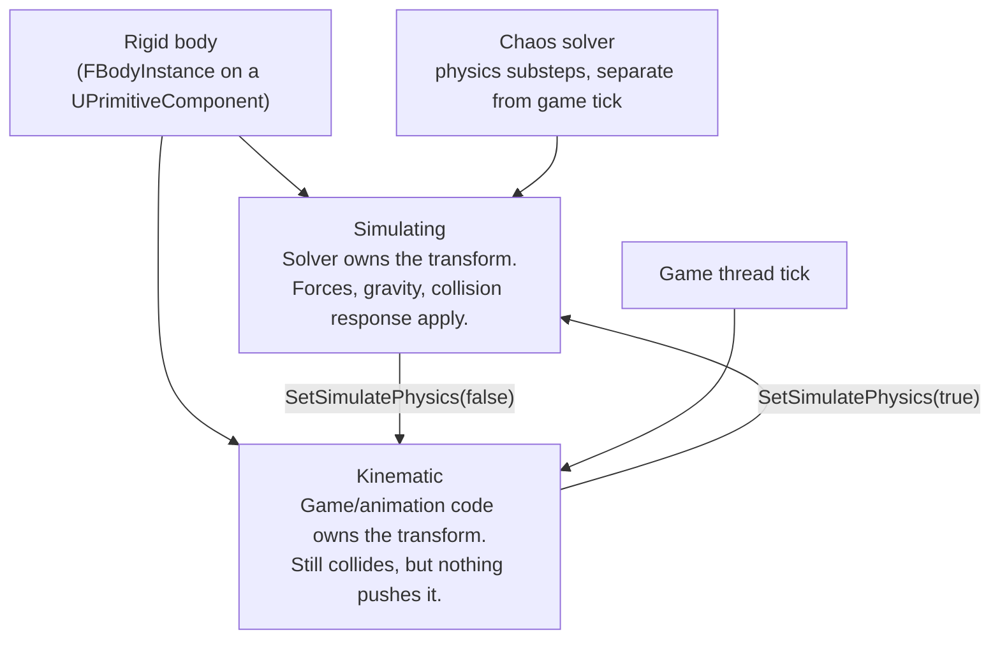

# Chaos physics basics

Chaos is Unreal 5's physics and destruction engine, replacing PhysX. Most gameplay code never calls into
it directly — you flip `Simulate Physics` on a component and Chaos takes over that body's transform — but
that handoff is exactly where confusion starts: once a body simulates, code that sets `SetActorLocation`
or reads `GetActorLocation` on the next tick is fighting a simulation running on its own schedule, not
reading a value you last wrote.

## Why this matters

Physics bodies aren't actors with a physics flag bolted on; once `Simulate Physics` is true, the rigid
body's transform is owned by the solver, and the actor's transform is a mirror of it, not the other way
around. Getting the simulating/kinematic distinction wrong is the source of "my code moved the object but
it snapped back" bugs, and getting simple-vs-complex collision geometry wrong is the source of "this ragdoll
tunnels through the floor" bugs. Both are one-line fixes once you know which knob controls which behavior.

## Mental model



A rigid body is always in one of two states. **Simulating**: the Chaos solver integrates forces (gravity,
impulses, constraints, collision response) and writes the resulting transform back onto the component —
your code reads that transform, it doesn't set it. **Kinematic**: the opposite — your code (or an
animation) drives the transform every tick, and the body still participates in collision (other
simulating bodies bounce off it) but nothing simulated pushes *it*. A skeletal mesh's bones can even be a
mix — some simulating, most kinematic — which is exactly how partial ragdolls work.

## Simulating vs. kinematic

```cpp title="Toggling simulation on a component"
void AMyCrate::EnableRagdollLikeDrop()
{
    CrateMesh->SetSimulatePhysics(true);
    CrateMesh->SetEnableGravity(true);
}

void AMyCrate::FreezeInPlace()
{
    // Kinematic: still collides, but game code (or a Timeline) now owns the transform.
    CrateMesh->SetSimulatePhysics(false);
}
```

`CollisionEnabled` and `SimulatePhysics` are independent switches: a body can be `QueryOnly` and never
simulate (a trigger volume), `PhysicsOnly` and invisible to traces (background debris that still collides
with the floor), or `QueryAndPhysics` for the common case of something both traceable and pushable.

## Mass, damping, and the physics tick

Mass is computed from the body's simple collision volume and density by default, or set explicitly with
`SetMassOverrideInKg`. Linear and angular damping (`LinearDamping`, `AngularDamping` on the body instance)
act as continuous drag, independent of friction, and are what stops a simulating body from sliding or
spinning forever on a frictionless-feeling surface. All of this integrates on the Chaos solver's own
schedule, not directly on the game thread's `Tick`:

```cpp title="Configuring a simulating body in a constructor"
Boulder = CreateDefaultSubobject<UStaticMeshComponent>(TEXT("Boulder"));
Boulder->SetSimulatePhysics(true);
Boulder->SetMassOverrideInKg(NAME_None, 350.f, /*bOverrideMass=*/true);
Boulder->SetLinearDamping(0.05f);
Boulder->SetAngularDamping(0.1f);
Boulder->SetCollisionObjectType(ECC_PhysicsBody);
```

Chaos runs its own fixed-rate solver steps and can **substep** — advancing the simulation in several
smaller fixed increments within a single frame — to keep fast-moving or stiff constraint setups (like
ragdoll joints) numerically stable even when the game's frame rate dips. This solver work happens
asynchronously from — and is only synchronized back onto — the game thread at a defined sync point each
frame, which is why physics-driven transforms should be read after that sync, not assumed to be
up-to-date mid-tick.

:::note
The exact solver/game-thread synchronization points and the project settings that expose substepping
counts were not confirmed against 5.7 in the sources consulted — verify the specific CVars and Project
Settings entries against your engine version before depending on them.
:::

## Simple vs. complex collision geometry, for simulation

The same simple-vs-complex split from traces applies to physics simulation, with a sharper consequence:
Chaos rigid-body simulation uses **simple collision** (the authored boxes/spheres/convex hulls) for
essentially all runtime simulation — complex, per-triangle collision is dramatically more expensive to
resolve contacts against and is not the geometry you want a simulating body colliding with at scale. A
mesh with no simple collision authored, set to simulate, either fails to generate a usable body or falls
back to an expensive per-poly shape depending on its `Collision Complexity` setting — either way, author
simple collision (convex decomposition for anything simulating) instead of relying on the fallback.

## Where physics runs relative to the game thread

Chaos solving happens off the game thread, on physics worker threads, with results synchronized back at a
defined point in the frame. Gameplay code that reads a simulating body's transform mid-tick is reading the
last synchronized result, not a live value being computed concurrently — you don't need to worry about
tearing, but you should know that `SetActorLocation` on a simulating root component fights the solver:
your write is likely to be overwritten by the next synchronized solver result unless you also update the
body's kinematic target or drop it out of simulation first.

:::warning Don't SetActorLocation on a simulating body
Calling `SetActorLocation` / `SetActorTransform` on an actor whose root component is simulating physics
sets the transform for one frame, then the next solver sync overwrites it with the simulated result. To
move a physics body from code, either flip it kinematic first, or apply forces/impulses
(`AddImpulse`, `AddForce`) and let the solver do the moving.
:::

:::caution Author simple collision before you flip SimulatePhysics
A static mesh imported without simple collision (or with `Collision Complexity` left on a complex-only
setting) either can't simulate at all or does so against expensive per-triangle geometry. Set up convex
or primitive simple collision in the mesh editor for anything you intend to simulate, not just anything
you intend to trace against.
:::

## See also

- [Collision channels and responses](./collision-channels-and-responses.md) — `CollisionEnabled` and
  object type, which gate whether a body simulates or is queried at all.
- [Traces and overlaps](./traces-and-overlaps.md) — simple vs. complex collision from the query side.
- [Physics constraints and simulation](./physics-constraints-and-simulation.md) — joints, physics assets,
  and ragdolls built on top of simulating bodies.
- [Epic — Physics in Unreal Engine](https://dev.epicgames.com/documentation/unreal-engine/physics-in-unreal-engine)
