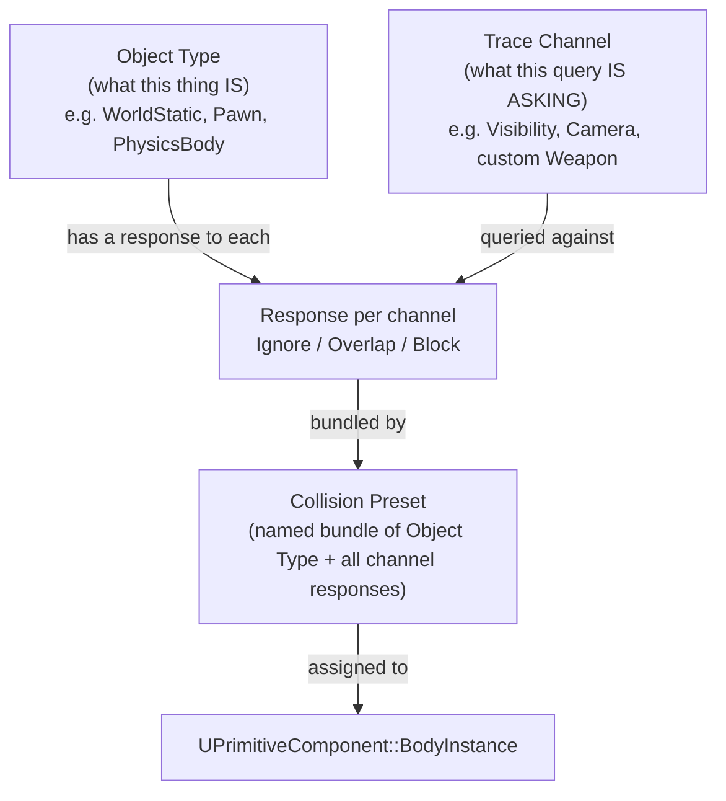

# Collision channels and responses

Every "why does my trace hit nothing" or "why does my character walk through a wall" bug traces back to
the same three-part system: what a shape *is* (object type), what it's *being asked* (trace channel), and
how the two react to each other (response). Get any one of those three wrong and the query silently
returns no hit — there's no error, no warning, just an empty `FHitResult`.

## Why this matters

Collision in Unreal isn't a single on/off switch. A `UPrimitiveComponent` can be visible to a physics
sweep but invisible to a gameplay trace, or vice versa, because traces and physics both go through the
same response matrix but ask it different questions. Projects that skip understanding this end up either
disabling collision entirely to "fix" a bug (breaking something else) or duplicating channels ad hoc until
the collision matrix is unreadable. The response matrix is configuration, not code — it lives in
`DefaultEngine.ini` and the collision preset editor, and getting it right is a project-setup skill, not a
scripting one.

## Mental model



Every collidable component has exactly one **object type** (what kind of thing it is) and a **response
container** that says, for every registered channel, whether it should `Ignore`, `Overlap`, or `Block` a
query on that channel. A **trace channel** is just a named lane you query against — `ECC_Visibility`,
`ECC_Camera`, or a custom channel you add yourself. A **collision preset** (`Custom...`, `BlockAll`,
`Pawn`, `PhysicsActor`, `Trigger`, etc.) is a saved combination of object type plus per-channel responses
that you assign to a component instead of hand-tuning every row.

## Object types vs. trace channels

These are two different enums and projects new to Unreal conflate them constantly:

- **Object type channels** (`ECollisionChannel` values like `ECC_WorldStatic`, `ECC_WorldDynamic`,
  `ECC_Pawn`, `ECC_PhysicsBody`) describe *what a component is*. A component has exactly one object type.
- **Trace channels** (`ECC_Visibility`, `ECC_Camera`, and any custom channel you add) describe *what a
  query is asking*. A trace or sweep is issued against one trace channel, or against a set of object
  types — those are two different query families (`...ByChannel` vs. `...ByObjectType` functions), and a
  component's response to a trace channel and its response to being targeted by object type are configured
  independently.

`ECollisionEnabled::Type` controls whether a body participates in queries, physics simulation, both,
neither, or the newer probe-only variants at all, before the response matrix is even consulted:

| Value | Meaning |
|---|---|
| `NoCollision` | No representation in the physics engine at all. |
| `QueryOnly` | Answers spatial queries (raycasts, sweeps, overlaps) but never simulates physics. |
| `PhysicsOnly` | Simulates physics (rigid body, constraints) but is invisible to queries. |
| `QueryAndPhysics` | Both — the common case for anything a character can stand on and a trace can hit. |
| `ProbeOnly` / `QueryAndProbe` | Physics-simulation probing variants, layered on top of the query/physics split. |

A component set to `QueryOnly` will never generate a physics collision even if its object type and
responses say `Block` — the `CollisionEnabled` gate is checked first.

## The response matrix: Ignore / Overlap / Block

For every (object type, channel) pair, the response is one of three `ECollisionResponse` values:

- **Ignore** — the query passes straight through as if the component isn't there.
- **Overlap** — the query registers a hit/overlap event but doesn't stop movement or the trace.
- **Block** — the query stops there; for a sweep or physics body this means a hard collision, for a
  multi-trace it's the last (closest) blocking result in the array.

Both sides of an interaction matter. Two physics-simulating bodies only push each other apart if *both*
of their responses to each other's object type are `Block`. A character walks through a mesh set to
`Overlap` on the `Pawn` channel even though its own collision is otherwise `Block`, because the
`Overlap`/`Block` decision is evaluated per pair, not globally.

## Collision presets

Rather than tune object type and every channel response by hand on each component, you assign a **preset**
in the component's Details panel (`Collision Presets` dropdown) or in code via
`BodyInstance.SetCollisionProfileName(TEXT("Custom Preset Name"))`. Built-in presets include `BlockAll`,
`OverlapAll`, `NoCollision`, `Pawn`, `PhysicsActor`, `Trigger`, and `Spectator`, plus any presets your
project's `DefaultEngine.ini` defines. Picking `Custom...` unlocks per-channel overrides on that one
component without creating a reusable named preset.

```cpp title="Assigning a preset and object type in a constructor"
UStaticMeshComponent* Wall = CreateDefaultSubobject<UStaticMeshComponent>(TEXT("Wall"));
Wall->SetCollisionProfileName(TEXT("BlockAll"));
Wall->SetCollisionObjectType(ECC_WorldStatic);
Wall->SetCollisionResponseToChannel(ECC_Camera, ECR_Ignore); // camera clips through walls near the player
```

## Custom channels in DefaultEngine.ini

Custom trace channels and custom presets aren't code — they're config, written to
`Config/DefaultEngine.ini` (normally through **Project Settings → Collision**, which writes this for you).
A hand-authored channel and preset looks like this:

```ini title="Config/DefaultEngine.ini"
[/Script/Engine.CollisionProfile]
+DefaultChannelResponses=(Channel=ECC_GameTraceChannel1,Name="Weapon",DefaultResponse=ECR_Block,bTraceType=True,bStaticObject=False)
+DefaultChannelResponses=(Channel=ECC_GameTraceChannel2,Name="Interactable",DefaultResponse=ECR_Ignore,bTraceType=True,bStaticObject=False)

+Profiles=(Name="InteractableActor",CollisionEnabled=QueryOnly,ObjectTypeName=WorldDynamic,DefaultResponse=ECR_Ignore,CustomResponses=((Channel="Interactable",Response=ECR_Block)),HelpMessage="Highlightable world objects")
```

`ECC_GameTraceChannel1..18` are the raw slots the engine reserves for custom channels — the `Name=` field
is what shows up in the editor dropdown, and every project sharing a `.uproject` must agree on which
`GameTraceChannelN` maps to which name, because that mapping is per-project, not per-component. A
`Profiles` entry that redefines an existing name (like `Trigger`) overrides the engine default rather than
creating a duplicate.

:::warning[The most common "my trace hits nothing" bug]
A trace against a custom channel returns no hit for one of three reasons, in order of likelihood: the
target's `CollisionEnabled` is `NoCollision` or `PhysicsOnly` (no query participation at all), the
target's response to that specific channel is `Ignore` rather than `Block`/`Overlap`, or you traced with
`...ByObjectType` against a channel that only exists as a *trace* channel (object type traces don't care
about per-channel responses at all — they only look at the component's object type). Check
`CollisionEnabled` first; it silences everything downstream of it.
:::

:::caution[Presets vs. per-component overrides drift silently]
Editing a component's response in the Details panel while a named preset is assigned switches that
component to `Custom...` without warning — it stops tracking future edits to the shared preset. If you
meant to change the preset for every actor using it, edit `DefaultEngine.ini` (or Project Settings), not
the instance.
:::

## See also

- [Traces and overlaps](./traces-and-overlaps.md) — how these responses are actually queried at runtime.
- [Chaos physics basics](./chaos-physics-basics.md) — how `CollisionEnabled` and object type feed the
  physics simulation, not just queries.
- [Epic — Collision reference guide](https://dev.epicgames.com/documentation/unreal-engine/collision-reference-in-unreal-engine)
- [Epic — Traces with raycasts](https://dev.epicgames.com/documentation/unreal-engine/traces-with-raycasts-in-unreal-engine)

