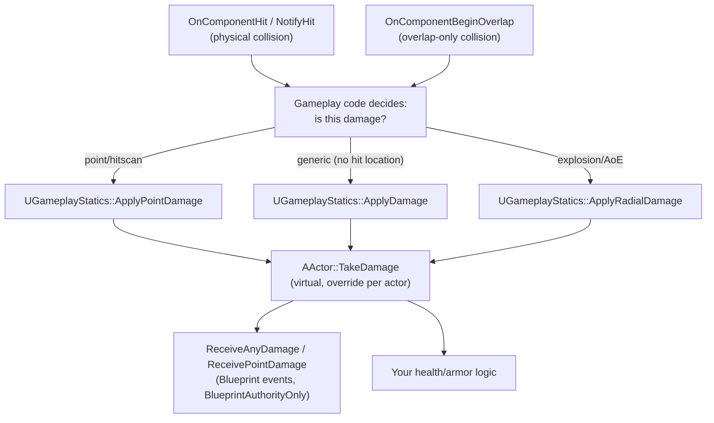

# Damage and hit handling

Collision and physics tell you *that* something touched, but they don't know what "damage" means — that's
a separate, thin gameplay-layer API (`ApplyDamage`/`TakeDamage`) that sits on top of hit and overlap
events. The two most common bugs here aren't in the damage math, they're wiring bugs (an event never
bound, or bound on the wrong side) and authority bugs (a client deciding damage happened, which the server
then never hears about).

## Why this matters

`AActor::TakeDamage` is a single, generic entry point every damageable actor can override once, instead of
every projectile, explosion, and melee attack inventing its own health-reduction call. Routing damage
through `UGameplayStatics::ApplyDamage`/`ApplyPointDamage`/`ApplyRadialDamage` instead of calling
`TakeDamage` directly, or setting health from a hit event, keeps that entry point singular and gives you
one place to add damage multipliers, armor, or logging later. Skipping this and wiring health reduction
directly into `OnComponentHit` is exactly the kind of thing that works in single-player and silently
desyncs in multiplayer.

## Mental model



Collision events (`OnComponentHit` for blocking physical collisions, `OnComponentBeginOverlap` for
overlap-only components) are just notifications that something touched something — they carry no concept
of damage. Gameplay code decides, at that notification, whether to call one of the three
`UGameplayStatics::ApplyDamage*` functions, which route to the target actor's `TakeDamage`, which is the
one function every damageable actor overrides.

## Hit and overlap events

`OnComponentHit` fires for a component with `Simulation Generates Hit Events` enabled (or non-simulating
blocking collision) when it physically collides with something — you bind it, typically in `BeginPlay`:

```cpp title="Binding OnComponentHit"
void AProjectile::BeginPlay()
{
    Super::BeginPlay();
    CollisionComp->OnComponentHit.AddDynamic(this, &AProjectile::HandleHit);
}

void AProjectile::HandleHit(UPrimitiveComponent* HitComp, AActor* OtherActor,
    UPrimitiveComponent* OtherComp, FVector NormalImpulse, const FHitResult& Hit)
{
    if (OtherActor && OtherActor != this && OtherActor != GetOwner())
    {
        UGameplayStatics::ApplyPointDamage(OtherActor, BaseDamage, Hit.ImpactNormal * -1.f,
            Hit, GetInstigatorController(), this, DamageTypeClass);
        Destroy();
    }
}
```

`AActor::NotifyHit` is the actor-level counterpart — it's called on both actors involved in a blocking
collision even without binding a delegate, which is where you'd override hit handling on the actor itself
rather than per-component.

`OnComponentBeginOverlap` fires instead of `OnComponentHit` for components whose collision response is
`Overlap` rather than `Block` on the relevant channel — a trigger volume, a pickup, or an area-of-effect
zone:

```cpp title="Binding OnComponentBeginOverlap"
void AHazardVolume::BeginPlay()
{
    Super::BeginPlay();
    HazardBox->OnComponentBeginOverlap.AddDynamic(this, &AHazardVolume::HandleOverlap);
}

void AHazardVolume::HandleOverlap(UPrimitiveComponent* OverlappedComp, AActor* OtherActor,
    UPrimitiveComponent* OtherComp, int32 OtherBodyIndex, bool bFromSweep, const FHitResult& SweepResult)
{
    if (OtherActor)
    {
        UGameplayStatics::ApplyDamage(OtherActor, DamagePerTick, nullptr, this, DamageTypeClass);
    }
}
```

## Applying damage

`UGameplayStatics` exposes three damage entry points, each `BlueprintAuthorityOnly` — they early-out (or
assert, depending on build) if called without network authority:

| Function | Use for | Key parameters |
|---|---|---|
| `ApplyDamage` | Generic damage with no location/direction | `DamagedActor`, `BaseDamage`, `EventInstigator`, `DamageCauser`, `DamageTypeClass` |
| `ApplyPointDamage` | Hitscan/projectile hits with a specific impact point | adds `HitFromDirection` (`FVector`) and `HitInfo` (`FHitResult`) |
| `ApplyRadialDamage` | Explosions/AoE, damage falls off with distance from origin | `Origin`, `DamageRadius`, plus an `IgnoreActors` array |

```cpp title="Radial damage from an explosion"
UGameplayStatics::ApplyRadialDamage(
    this, /*BaseDamage=*/150.f, GetActorLocation(), /*DamageRadius=*/600.f,
    UExplosionDamageType::StaticClass(), /*IgnoreActors=*/{ }, this, GetInstigatorController(),
    /*bDoFullDamage=*/false, ECC_Visibility);
```

`UDamageType` is a lightweight, mostly-data class (`UCLASS()` subclass, usually with no logic) that tags
*what kind* of damage this is — fire, fall damage, explosive — so `TakeDamage` overrides and armor/
resistance systems can branch on `DamageEvent.DamageTypeClass` without the caller needing to know the
target's resistances.

## AActor::TakeDamage and authority

`AActor::TakeDamage(float DamageAmount, FDamageEvent const& DamageEvent, AController* EventInstigator,
AActor* DamageCauser)` is the single virtual entry point every `ApplyDamage*` call routes through. Override
it to apply your health reduction, then call `Super::TakeDamage(...)` to preserve the default behavior
(firing the Blueprint-visible `ReceiveAnyDamage`/`ReceivePointDamage`/`ReceiveRadialDamage` events, which
are themselves `BlueprintAuthorityOnly`):

```cpp title="Overriding TakeDamage on a damageable actor"
float AMyCharacter::TakeDamage(float DamageAmount, FDamageEvent const& DamageEvent,
    AController* EventInstigator, AActor* DamageCauser)
{
    const float ActualDamage = Super::TakeDamage(DamageAmount, DamageEvent, EventInstigator, DamageCauser);

    Health = FMath::Clamp(Health - ActualDamage, 0.f, MaxHealth);
    if (Health <= 0.f)
    {
        HandleDeath(EventInstigator, DamageCauser);
    }
    return ActualDamage;
}
```

**Authority rule**: damage is a server-authoritative decision. `ApplyDamage`/`ApplyPointDamage`/
`ApplyRadialDamage` are all marked authority-only for a reason — a client deciding "I hit them" and
reducing a replicated health value locally is both exploitable and guaranteed to desync from the server's
view. The client fires the hit/overlap event and the trace, but the call into `ApplyDamage*` (and
therefore `TakeDamage`) belongs on the server: gate it with `HasAuthority()`, or better, make sure the
triggering code (a weapon fire event processed via an RPC, an overlap on a server-only actor) only runs
server-side in the first place.

```cpp title="Guarding a client-triggered hit"
void AProjectile::HandleHit(UPrimitiveComponent* HitComp, AActor* OtherActor,
    UPrimitiveComponent* OtherComp, FVector NormalImpulse, const FHitResult& Hit)
{
    if (!HasAuthority() || !OtherActor)
    {
        return;
    }
    UGameplayStatics::ApplyPointDamage(OtherActor, BaseDamage, Hit.ImpactNormal * -1.f,
        Hit, GetInstigatorController(), this, DamageTypeClass);
}
```

:::warning Binding OnComponentHit does nothing without Simulation Generates Hit Events
A non-simulating component with `Block` collision only fires `OnComponentHit` if
`Simulation Generates Hit Events` is enabled on it (or its owning body). Binding the delegate and never
seeing it fire almost always traces back to this flag, not the delegate binding.
:::

:::caution Client-side ApplyDamage is a silent no-op, not a visible failure
Because `ApplyDamage`/`ApplyPointDamage`/`ApplyRadialDamage` are `BlueprintAuthorityOnly`, calling them on
a client without authority doesn't damage anything and doesn't warn you — the call simply doesn't apply.
If damage "isn't working" only in networked play, check `HasAuthority()` at the call site before anything
else.
:::

## See also

- [Traces and overlaps](./traces-and-overlaps.md) — producing the `FHitResult` that feeds
  `ApplyPointDamage`.
- [Collision channels and responses](./collision-channels-and-responses.md) — why a component fires
  `OnComponentHit` vs. `OnComponentBeginOverlap` in the first place.
- [Chaos physics basics](./chaos-physics-basics.md) — `Simulation Generates Hit Events` and simulating
  bodies as a source of hit events.
- [Epic — Using the OnHit event](https://dev.epicgames.com/documentation/unreal-engine/using-the-onhit-event)
- [Epic — Damage in Unreal Engine](https://dev.epicgames.com/documentation/unreal-engine/damage-in-unreal-engine)

