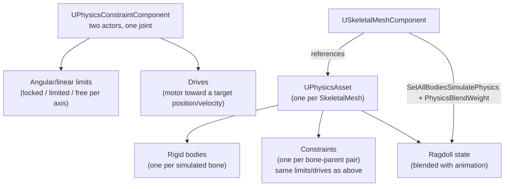

# Physics constraints and simulation

A single simulating rigid body falls, bounces, and rolls, but it can't hinge, swing on a chain, or hold a
skeleton together as a ragdoll — that needs a **constraint**, a joint that limits or drives how two bodies
move relative to each other. Ragdolls specifically layer a whole tree of these constraints (one per bone)
onto a **physics asset**, and blending a ragdoll in and out of animation is a separate, commonly
misunderstood step from turning simulation on.

## Why this matters

`UPhysicsConstraintComponent` is the general-purpose joint for two-actor setups (a door on a hinge, a
rope-like chain, a breakable pin), while a **physics asset** is the specialized version of the same idea
purpose-built for a skeletal mesh — one rigid body per relevant bone, one constraint per parent/child bone
pair, all authored together in the Physics Asset Editor. Confusing the two leads to hand-wiring dozens of
`UPhysicsConstraintComponent` instances to reinvent what a physics asset already does for skeletal
meshes, or the opposite: trying to ragdoll a non-skeletal actor, which physics assets don't support at
all.

## Mental model



`UPhysicsConstraintComponent` and a physics asset's per-bone joints share the same underlying constraint
model (limits and drives) — the physics asset is just that model applied once per bone, generated and
tuned visually in the Physics Asset Editor instead of placed as an actor component.

## UPhysicsConstraintComponent: limits and drives

A `UPhysicsConstraintComponent` connects two bodies (`ConstraintActor1`/`ConstraintActor2`, or components
via `SetConstrainedComponents`) and constrains their relative motion along linear (X/Y/Z) and angular
(swing1, swing2, twist) axes. Each axis is independently `Locked` (no motion), `Limited` (motion allowed
up to an angle/distance), or `Free`.

```cpp title="A hinge-style door constraint"
UPhysicsConstraintComponent* DoorHinge = CreateDefaultSubobject<UPhysicsConstraintComponent>(TEXT("DoorHinge"));
DoorHinge->SetupAttachment(FrameMesh);

DoorHinge->SetLinearXLimit(ELinearConstraintMotion::LCM_Locked, 0.f);
DoorHinge->SetLinearYLimit(ELinearConstraintMotion::LCM_Locked, 0.f);
DoorHinge->SetLinearZLimit(ELinearConstraintMotion::LCM_Locked, 0.f);
DoorHinge->SetAngularSwing1Limit(EAngularConstraintMotion::ACM_Limited, 0.f);
DoorHinge->SetAngularSwing2Limit(EAngularConstraintMotion::ACM_Limited, 0.f);
DoorHinge->SetAngularTwistLimit(EAngularConstraintMotion::ACM_Limited, 100.f); // door swings on twist axis
```

A **drive** turns the joint into a motor: instead of (or in addition to) limiting motion, it actively
pushes toward a target position, rotation, or velocity, with configurable strength/damping.

```cpp title="Driving a constraint toward an open position"
DoorHinge->SetAngularDriveMode(EAngularDriveMode::TwistAndSwing);
DoorHinge->SetAngularDriveParams(/*Spring=*/500.f, /*Damping=*/50.f, /*ForceLimit=*/0.f);
DoorHinge->SetAngularOrientationTarget(FRotator(0.f, 90.f, 0.f));
```

Internally, updating a constraint's limits and drives from Unreal-side properties onto the underlying
solver joint goes through `FConstraintInstance::Update_AssumesLocked`, which is why constraint property
changes at runtime need to go through the component's setter functions rather than mutating the profile
struct directly — the setters are what push the change down to the physics engine.

## Physics assets for skeletal meshes

A `UPhysicsAsset` is authored per skeletal mesh (in the Physics Asset Editor) and holds a set of rigid
bodies and constraints that together model that mesh's ragdoll — it is not limited to humanoid ragdolls,
the same body-and-constraint model works for any skeletal simulation. Each `USkeletalMeshComponent`
references one physics asset, which is what lets you toggle ragdoll physics on or off for every instance
of that mesh without re-authoring anything per instance.

## Ragdoll and blend-weight setup

Turning a character into a ragdoll is two independent steps that are easy to conflate:

1. **Enable simulation** on the bodies in the physics asset — usually all of them, for a full ragdoll:
   `Mesh->SetAllBodiesSimulatePhysics(true)`, `Mesh->SetSimulatePhysics(true)`.
2. **Set the physics blend weight** — how much the simulated pose overrides the animated pose, via
   `USkeletalMeshComponent::SetPhysicsBlendWeight(float)`, or a `Physics Blend Weight` set on individual
   bodies for partial ragdolls. A weight of `1.0` is fully simulated; `0.0` is fully animation-driven; a
   physics asset can mix these per body so, for example, only the arms ragdoll while the spine stays
   animated.

```cpp title="Full ragdoll on death"
void AMyCharacter::EnterRagdoll()
{
    GetMesh()->SetCollisionProfileName(TEXT("Ragdoll"));
    GetMesh()->SetAllBodiesSimulatePhysics(true);
    GetMesh()->SetSimulatePhysics(true);
    GetMesh()->SetPhysicsBlendWeight(1.f);

    GetCharacterMovement()->SetMovementMode(MOVE_None);
    GetCharacterMovement()->StopMovementImmediately();
}
```

Blending *back* out of ragdoll (getting up, or transitioning into a get-up montage) means ramping the
blend weight from `1.0` back toward `0.0` over time — usually driven by a timeline or animation notify —
rather than snapping it, which is what avoids the character's mesh popping instantly back to an animated
pose from wherever the ragdoll settled.

:::warning[SetSimulatePhysics(true) on the mesh isn't enough by itself]
Calling `SetSimulatePhysics(true)` on a `USkeletalMeshComponent` alone doesn't ragdoll every bone — you
also need `SetAllBodiesSimulatePhysics(true)` (or per-body control) to actually enable simulation on the
individual bodies the physics asset defines, and `SetCollisionProfileName(TEXT("Ragdoll"))` so the bodies
collide with the world instead of just each other.
:::

:::caution[CharacterMovementComponent fights a simulating capsule]
`UCharacterMovementComponent` expects to own the capsule's transform. Entering ragdoll without first
setting movement mode to `MOVE_None` (or disabling the movement component) means the movement component
keeps trying to correct the capsule back to where it thinks the character should be, fighting the physics
simulation. Disable movement before simulating, and re-enable it only after the character is fully back to
an animated pose.
:::

## See also

- [Chaos physics basics](./chaos-physics-basics.md) — simulating vs. kinematic bodies, mass, and damping
  that constraints and ragdolls both build on.
- [Collision channels and responses](./collision-channels-and-responses.md) — the `Ragdoll` collision
  preset and per-body collision responses referenced above.
- [Skeletons and skeletal meshes](../07-animation/skeletons-and-skeletal-meshes.md) — the bone hierarchy a
  physics asset's bodies attach to.
- [Epic — Physics Asset reference](https://dev.epicgames.com/documentation/unreal-engine/API/Runtime/Engine/UPhysicsAsset)

