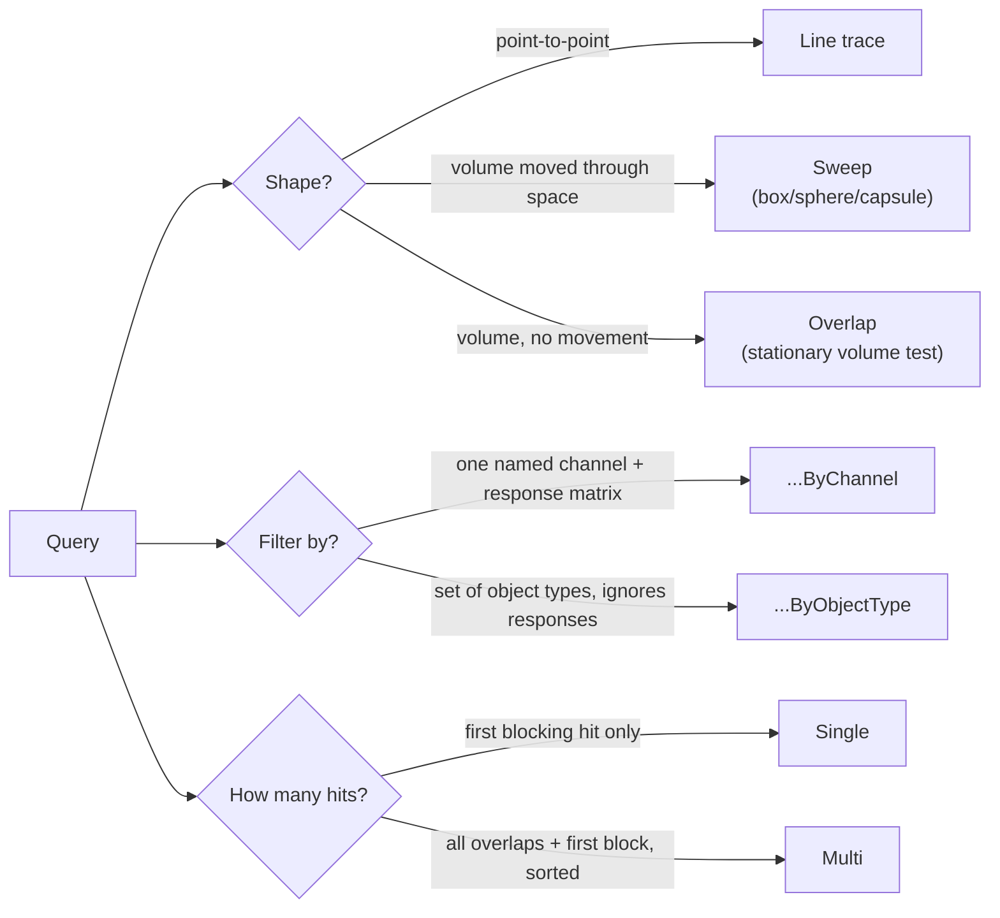

# Traces and overlaps

Line traces, sweeps, and overlaps are how gameplay code asks the world a question — "what's in front of
me," "can this fit here," "what's inside this radius" — without touching the physics simulation. Pick the
wrong query shape or the wrong channel and you get a silent empty result, not an error, which is why
knowing the vocabulary here (Single vs. Multi, ByChannel vs. ByObjectType, simple vs. complex) matters
more than memorizing signatures.

## Why this matters

Nearly every interactive system — weapon hitscan, melee reach checks, footstep surface detection,
interaction prompts, AI line-of-sight — is built on a trace or overlap query, not on collision events
firing on their own. These are also the single biggest self-inflicted performance cost in gameplay code
when done carelessly: a per-tick complex-geometry sweep against every actor in a level is a different cost
profile than an object-type overlap against a broad-phase-culled subset, and picking the wrong one doesn't
crash anything, it just quietly eats frame budget.

## Mental model



Three independent choices compose every query: **shape** (line, sweep, or overlap), **filter** (a single
trace channel evaluated against the response matrix, or a set of object types evaluated only by type,
ignoring per-channel responses), and **cardinality** (`Single` stops at the first blocking hit; `Multi`
collects every overlapping hit plus the first blocking hit, sorted by distance with the blocking hit
last). `UWorld` exposes the full cross product of these as separate functions rather than one function
with flags, so the name tells you exactly what you're getting:
`LineTraceSingleByChannel`, `SweepMultiByObjectType`, `OverlapMultiByObjectType`, and so on.

## Line traces

A line trace samples a single ray from `Start` to `End`. `LineTraceSingleByChannel` returns the first
blocking hit only; `LineTraceMultiByChannel` returns every overlap plus the first blocking hit, with
results sorted so the blocking hit (if any) is the last array element.

```cpp title="Hitscan weapon trace"
bool AMyWeapon::TraceHitscan(FHitResult& OutHit) const
{
    const FVector Start = GetMuzzleLocation();
    const FVector End = Start + GetMuzzleForward() * MaxRange;

    FCollisionQueryParams Params(SCENE_QUERY_STAT(WeaponTrace), /*bTraceComplex=*/true);
    Params.AddIgnoredActor(GetOwner());

    return GetWorld()->LineTraceSingleByChannel(
        OutHit, Start, End, ECC_GameTraceChannel1 /* "Weapon" */, Params);
}
```

## Sweeps

A sweep moves a shape (`FCollisionShape::MakeBox`, `MakeSphere`, or `MakeCapsule`) from `Start` to `End`
and reports what it would touch along the way — this is what character movement uses internally to stop
you at a wall instead of a single ray, which would miss geometry the capsule's corners would have clipped.

```cpp title="Sweeping a capsule to check if a dash destination is clear"
bool AMyCharacter::IsDashPathClear(const FVector& Destination) const
{
    TArray<FHitResult> Hits;
    const FCollisionShape Capsule = FCollisionShape::MakeCapsule(34.f, 88.f);

    FCollisionQueryParams Params;
    Params.AddIgnoredActor(this);

    const bool bBlocked = GetWorld()->SweepMultiByChannel(
        Hits, GetActorLocation(), Destination, GetActorQuat(),
        ECC_Pawn, Capsule, Params);

    return !bBlocked;
}
```

## Overlaps

An overlap tests a stationary shape against the world with no start/end movement — "what's inside this
sphere right now." `OverlapMultiByObjectType` is the common form for gameplay checks like "what pawns are
in this radius," because it filters by object type rather than needing every candidate to share a trace
channel response:

```cpp title="Radial overlap for an area-of-effect ability"
TArray<FOverlapResult> Overlaps;
FCollisionObjectQueryParams ObjectParams;
ObjectParams.AddObjectTypesToQuery(ECC_Pawn);

FCollisionShape Sphere = FCollisionShape::MakeSphere(500.f);
GetWorld()->OverlapMultiByObjectType(
    Overlaps, GetActorLocation(), FQuat::Identity, ObjectParams, Sphere);

for (const FOverlapResult& Overlap : Overlaps)
{
    if (AActor* HitActor = Overlap.GetActor())
    {
        UGameplayStatics::ApplyRadialDamage(this, 40.f, GetActorLocation(), 500.f,
            nullptr, {GetOwner()}, GetOwner(), GetInstigatorController());
    }
}
```

## FCollisionQueryParams and FHitResult

`FCollisionQueryParams` shapes the query itself, not the response matrix:

| Member | Effect |
|---|---|
| `bTraceComplex` | Trace against per-poly complex collision instead of the simplified collision shapes. |
| `AddIgnoredActor(Actor)` / `AddIgnoredComponent(Comp)` | Excludes specific actors/components from results — always ignore the owner on a self-fired trace. |
| `bReturnPhysicalMaterial` | Populates `FHitResult::PhysMaterial`, needed for surface-based effects (footstep sounds, decals). |
| `bReturnFaceIndex` | Populates the hit triangle index, for per-poly lookups against complex collision. |

`FHitResult` is the payload a trace fills in:

| Field | Meaning |
|---|---|
| `bBlockingHit` | Whether this hit stopped the trace/sweep. |
| `Location` / `ImpactPoint` | `Location` is where the swept *shape* ended up touching; `ImpactPoint` is the actual surface contact point — they differ for sweeps, not for line traces. |
| `ImpactNormal` | Surface normal at the impact point — what you reflect a bounce or align a decal against. |
| `Distance` | Distance from trace start to the hit. |
| `GetActor()` / `GetComponent()` | The hit actor/component, or `nullptr` if nothing was hit. |
| `PhysMaterial` | Only populated if `bReturnPhysicalMaterial` was set. |

## Complex vs. simple collision, and relative cost

Static and skeletal meshes carry two collision representations. **Simple collision** is the small set of
boxes/spheres/capsules/convex hulls you author in the mesh editor — cheap, used by default for physics and
most traces. **Complex collision** is the per-triangle render mesh itself — expensive, exact, and only
used when a query explicitly asks for it (`bTraceComplex = true`) or the mesh's collision settings force
`Use Complex Collision as Simple`. Cost, cheapest to most expensive: object-type overlap against a small
candidate set, channel-filtered overlap, simple-collision line trace, simple-collision sweep,
complex-collision line trace, complex-collision sweep. Reach for complex traces only when you need
per-triangle accuracy (aim-down-sights hit detection against foliage, precise melee against a detailed
mesh) — everything else should trace against simple collision.

:::warning[Multi variants still stop enumerating after the first block]
`...Multi...` functions return every *overlapping* hit plus the first blocking hit — they do not continue
past a blocking hit to find more blocks behind it. If you need "everything along this entire line
regardless of blocking," you're describing a different query (typically several `Single` traces
re-issued past each hit point), not a `Multi` call.
:::

:::caution[ByObjectType ignores the response matrix entirely]
`...ByObjectType` queries filter purely on the target's object type — they never consult
`ECollisionResponse` at all, so a component set to `Ignore` a trace channel can still be returned by an
object-type query against its type. Don't mix the two mental models: if you configured a custom
`Ignore`/`Block` response expecting it to affect an object-type overlap, it won't.
:::

## See also

- [Collision channels and responses](./collision-channels-and-responses.md) — the object type / channel
  / response vocabulary these queries filter against.
- [Chaos physics basics](./chaos-physics-basics.md) — simple vs. complex collision as it applies to
  simulated bodies, not just queries.
- [Damage and hit handling](./damage-and-hit-handling.md) — turning an `FHitResult` into applied damage.
- [Epic — Traces with raycasts](https://dev.epicgames.com/documentation/unreal-engine/traces-with-raycasts-in-unreal-engine)

