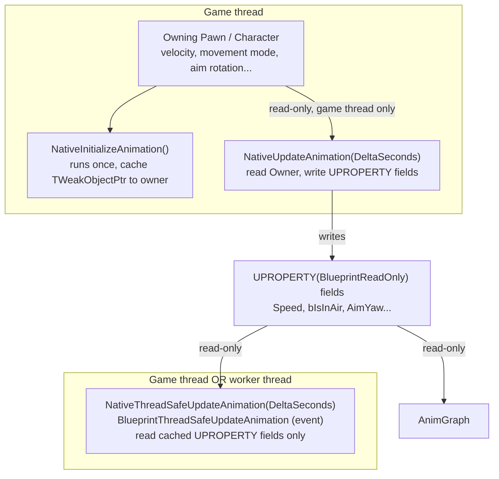

# Subclassing UAnimInstance in C++

Every AnimBP is backed by a `UAnimInstance`, and pushing gameplay-state gathering into a C++ subclass of
it is the standard way to keep an AnimGraph fast, thread-safe, and reusable across multiple Blueprint
AnimBPs. Get the property-access pattern here wrong and the failure isn't a compile error — it's an
intermittent crash or a garbled pose that only shows up under worker-thread animation updates, which
makes it one of the nastier bugs to chase down after the fact.

## Why this matters

An AnimGraph node is not allowed to safely call into arbitrary gameplay code, because with multithreaded
animation update enabled it may evaluate on a worker thread while the owning actor is being modified on
the game thread at the same time. The fix isn't "don't use multithreading" — it's "never let the
AnimGraph or the thread-safe update path touch a gameplay object directly." Instead, gameplay state gets
read once on the game thread and cached into plain data on the anim instance, which both the AnimGraph and
any thread-safe C++ code then read as if it were just a local variable.

## Mental model



`NativeUpdateAnimation` is the only one of these that is guaranteed to run on the game thread, so it's
the only place that should dereference the owning pawn. `NativeThreadSafeUpdateAnimation` and its
Blueprint-exposed counterpart `BlueprintThreadSafeUpdateAnimation` may run on a worker thread when
`bUseMultiThreadedAnimationUpdate` is enabled on the anim class — treat them as if they always do, even
while testing on a build where they happen not to.

## The mechanics

### The three update hooks

- **`NativeInitializeAnimation()`** — called once when the anim instance is initialized (roughly:
  whenever the owning `USkeletalMeshComponent` gets a new anim instance, most often on `BeginPlay`).
  This is where you cache the owning pawn/character and any component pointers you'll need every frame,
  so `NativeUpdateAnimation` isn't repeating `GetOwningActor()` casts on every tick.
- **`NativeUpdateAnimation(float DeltaSeconds)`** — the game-thread update hook. Read whatever gameplay
  state the AnimGraph needs this frame and write it into `UPROPERTY` fields on the anim instance. Always
  call `Super::NativeUpdateAnimation(DeltaSeconds)` first if you override it in a derived class, so a
  C++ base class's own update logic still runs.
- **`NativeThreadSafeUpdateAnimation(float DeltaSeconds)`** (and the Blueprint event
  `BlueprintThreadSafeUpdateAnimation`) — an update hook explicitly designed to be safe under
  multithreaded animation update. It runs after the regular update and may run on a worker thread; only
  touch data already cached on the anim instance itself, never the owning actor, its components, or any
  other `UObject` reached through a raw pointer that the game thread might simultaneously mutate.

### The property-access pattern

The pattern is always the same shape: gather on the game thread, cache as data, consume anywhere.

```cpp title="MyAnimInstance.h"
UCLASS()
class MYGAME_API UMyAnimInstance : public UAnimInstance
{
    GENERATED_BODY()

public:
    // Read by the AnimGraph and by BlueprintThreadSafeUpdateAnimation — never written outside
    // NativeUpdateAnimation, so it's safe to read from a worker thread.
    UPROPERTY(BlueprintReadOnly, Category = "Animation", Meta = (AllowPrivateAccess = "true"))
    float Speed = 0.f;

    UPROPERTY(BlueprintReadOnly, Category = "Animation", Meta = (AllowPrivateAccess = "true"))
    float Direction = 0.f;

    UPROPERTY(BlueprintReadOnly, Category = "Animation", Meta = (AllowPrivateAccess = "true"))
    bool bIsInAir = false;

    UPROPERTY(BlueprintReadOnly, Category = "Animation", Meta = (AllowPrivateAccess = "true"))
    bool bIsAccelerating = false;

protected:
    virtual void NativeInitializeAnimation() override;
    virtual void NativeUpdateAnimation(float DeltaSeconds) override;
    virtual void NativeThreadSafeUpdateAnimation(float DeltaSeconds) override;

private:
    // Weak, not a hard reference: the anim instance must not keep the owning character alive,
    // and TWeakObjectPtr lets you safely check validity if the owner is ever destroyed.
    UPROPERTY(Transient)
    TWeakObjectPtr<class AMyCharacter> OwningCharacter;
};
```

```cpp title="MyAnimInstance.cpp"
void UMyAnimInstance::NativeInitializeAnimation()
{
    Super::NativeInitializeAnimation();

    // TryGetPawnOwner() is only meaningful once, here — cache it rather than re-resolving every tick.
    OwningCharacter = Cast<AMyCharacter>(TryGetPawnOwner());
}

void UMyAnimInstance::NativeUpdateAnimation(float DeltaSeconds)
{
    Super::NativeUpdateAnimation(DeltaSeconds);

    const AMyCharacter* Character = OwningCharacter.Get();
    if (!Character)
    {
        return;
    }

    // All gameplay reads happen here, on the game thread, and only here.
    const UCharacterMovementComponent* MoveComp = Character->GetCharacterMovement();
    const FVector Velocity = Character->GetVelocity();

    Speed = Velocity.Size2D();
    bIsAccelerating = MoveComp->GetCurrentAcceleration().SizeSquared2D() > 0.f;
    bIsInAir = MoveComp->IsFalling();
    Direction = CalculateDirection(Velocity, Character->GetActorRotation());
}

void UMyAnimInstance::NativeThreadSafeUpdateAnimation(float DeltaSeconds)
{
    Super::NativeThreadSafeUpdateAnimation(DeltaSeconds);

    // Safe: reads only the UPROPERTY fields NativeUpdateAnimation already wrote this frame.
    // Never call OwningCharacter.Get() or touch any gameplay UObject here.
}
```

### Why TWeakObjectPtr, not a raw pointer or a hard UPROPERTY reference

The anim instance is owned by the `USkeletalMeshComponent`, not by the pawn, so its lifetime doesn't
match the pawn's. A hard `UPROPERTY()` reference would keep the pawn alive as long as the anim instance
holds it (fighting garbage collection unnecessarily — see
[Garbage collection](../02-cpp-in-unreal/garbage-collection.md)); a raw pointer gives you no way to
detect the pawn being destroyed out from under you. `TWeakObjectPtr` gives you a cheap validity check
(`.Get()` returns null once the target is gone) without holding a reference that affects lifetime — see
[Smart pointers and ownership](../02-cpp-in-unreal/smart-pointers-and-ownership.md) for the broader
pattern.

:::warning[Never dereference the owning pawn from a thread-safe update or the AnimGraph]
`NativeThreadSafeUpdateAnimation`, `BlueprintThreadSafeUpdateAnimation`, and every AnimGraph node run
under the assumption that they might be on a worker thread. Calling a `UFUNCTION` on the owning pawn, its
movement component, or any other live gameplay object from one of these is a data race the moment
`bUseMultiThreadedAnimationUpdate` is on — the crash may not reproduce every run, which makes it easy to
ship and hard to bisect later.
:::

:::caution[Always call the Super implementation]
Skipping `Super::NativeUpdateAnimation()` / `Super::NativeInitializeAnimation()` /
`Super::NativeThreadSafeUpdateAnimation()` in an override silently drops whatever the parent class (or,
further up, `UAnimInstance` itself) does in that hook — including Blueprint-exposed logic in a derived
AnimBP that expects the C++ base's update to have already run this frame.
:::

:::note
Not confirmed against 5.7 in the sources consulted for the exact class/module of
`bUseMultiThreadedAnimationUpdate`'s interaction with Control Rig nodes specifically — verify against
your engine version if you mix Control Rig into a multithreaded AnimGraph.
:::

## See also

- [Animation Blueprints](./animation-blueprints.md) — the EventGraph/AnimGraph split and the two-phase
  update these hooks plug into.
- [Smart pointers and ownership](../02-cpp-in-unreal/smart-pointers-and-ownership.md) — why
  `TWeakObjectPtr` is the right handle for a cross-object reference like this one.
- [Delegates and events](../02-cpp-in-unreal/delegates-and-events.md) — an alternative to polling gameplay
  state every update, for state that changes rarely.
- [Epic — UAnimInstance API reference](https://dev.epicgames.com/documentation/unreal-engine/API/Runtime/Engine/Animation/UAnimInstance)
- [Epic — Animation Blueprints](https://dev.epicgames.com/documentation/unreal-engine/animation-blueprints-in-unreal-engine)

