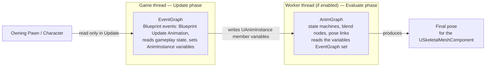

# Animation Blueprints and the AnimGraph

An Animation Blueprint looks like one graph in the editor but is actually two graphs with different jobs,
different threading rules, and different failure modes when you mix them up. Treating the AnimGraph like
the EventGraph — or vice versa — is the single most common reason an AnimBP either doesn't update or
tanks your frame time.

## Why this matters

Every `USkeletalMeshComponent` that animates is driven by an instance of `UAnimInstance` (the runtime
object an Animation Blueprint compiles into), and that instance runs a fixed two-phase pipeline every
frame: gather gameplay state, then produce a pose from it. The EventGraph and AnimGraph map directly onto
those two phases. If you don't know which phase you're editing, you'll write code that either runs too
often (recomputing something every evaluation instead of once per update) or not thread-safely (touching
gameplay objects from a graph that may run off the game thread).

## Mental model



The **EventGraph** runs on the game thread and behaves like any other Blueprint event graph: it responds
to events (`Event Blueprint Update Animation` chief among them), reads whatever gameplay state it needs —
speed, whether the character is in the air, aim pitch — and stores the results into the AnimBP's own
variables. The **AnimGraph** is not an event graph at all; it's a data-flow graph of pose-producing
nodes (state machines, blend spaces, layered blends) connected by pose links, and it only ever reads the
variables the EventGraph already wrote. It doesn't call gameplay code and shouldn't need to.

## The mechanics

### The anim instance behind every AnimBP

Compiling an Animation Blueprint produces a `UAnimInstance`-derived class; the AnimBP asset is the
Blueprint wrapper, the anim instance is the object that actually runs at runtime, one per
`USkeletalMeshComponent` that has an anim class assigned. Every C++ hook you'd add by subclassing
`UAnimInstance` directly (see [AnimInstance in C++](./anim-instance-in-cpp.md)) exists on that same
object whether the rest of the logic lives in Blueprint, C++, or both — a project commonly puts gameplay
plumbing in a C++ base class and leaves the AnimGraph itself in the Blueprint that derives from it, the
same split described in
[C++ base, Blueprint derived](../04-blueprint-interop/cpp-base-blueprint-derived.md).

### The two-phase update, in engine terms

1. **Update** — runs on the game thread unless the anim class opts into multithreading
   (`bUseMultiThreadedAnimationUpdate` on `UAnimBlueprint`, which pushes native update, the blend tree,
   montages, and asset players onto a worker thread). This is where `Event Blueprint Update Animation`
   fires and where `NativeUpdateAnimation` / `NativeThreadSafeUpdateAnimation` run in C++.
2. **Evaluate** — walks the AnimGraph's pose links to produce the actual bone pose for this frame. With
   multithreading enabled this runs off the game thread, which is why AnimGraph nodes must not reach out
   to arbitrary `UObject`s — they consume only the plain data the update phase already cached.

### Pose links

A pose link (`FPoseLink`) is the AnimGraph's wire type — it carries a full skeletal pose from one node's
output to another node's input, the same way an exec pin carries control flow in the EventGraph. State
machines, blend nodes, and layered blends are all just nodes with one or more pose link inputs and one
pose link output; see
[State machines and blend spaces](./state-machines-and-blend-spaces.md) for how those are composed.

```cpp title="MyAnimInstance.h — the C++ side a Blueprint AnimBP derives from"
UCLASS()
class MYGAME_API UMyAnimInstance : public UAnimInstance
{
    GENERATED_BODY()

public:
    UPROPERTY(BlueprintReadOnly, Category = "Animation", Meta = (AllowPrivateAccess = "true"))
    float Speed = 0.f;

    UPROPERTY(BlueprintReadOnly, Category = "Animation", Meta = (AllowPrivateAccess = "true"))
    bool bIsInAir = false;

protected:
    virtual void NativeUpdateAnimation(float DeltaSeconds) override;

private:
    TWeakObjectPtr<class ACharacter> OwningCharacter;
};
```

The AnimGraph in the derived Blueprint reads `Speed` and `bIsInAir` as ordinary variables — it never
needs to know they were populated in C++ rather than an EventGraph node.

:::warning Don't call gameplay-object functions from the AnimGraph
The AnimGraph is designed to be evaluated off the game thread. A custom AnimGraph node (or a
`BlueprintThreadSafeUpdateAnimation` call, see [AnimInstance in C++](./anim-instance-in-cpp.md)) that
dereferences the owning actor, calls a `UFUNCTION` on a component, or touches anything not already cached
on the anim instance is a race condition waiting for a bad frame — cache the value during Update instead.
:::

:::caution EventGraph work runs every tick, gate it
`Event Blueprint Update Animation` fires every tick the anim instance updates — the same frequency as
`Tick` on an actor. Expensive lookups (trace calls, deep property chains) here scale with every animated
character on screen; get the gameplay state pushed to the anim instance instead of pulled by it wherever
you can (see [AnimInstance in C++](./anim-instance-in-cpp.md) for the caching pattern).
:::

## See also

- [AnimInstance in C++](./anim-instance-in-cpp.md) — the C++ hooks behind `NativeUpdateAnimation` and
  the thread-safe update path.
- [State machines and blend spaces](./state-machines-and-blend-spaces.md) — the pose-producing nodes an
  AnimGraph is built from.
- [C++ base, Blueprint derived](../04-blueprint-interop/cpp-base-blueprint-derived.md) — the pattern for
  splitting an anim instance between a C++ base and a Blueprint AnimBP.
- [Epic — Animation Blueprints](https://dev.epicgames.com/documentation/unreal-engine/animation-blueprints-in-unreal-engine)
- [Epic — UAnimBlueprint API reference](https://dev.epicgames.com/documentation/unreal-engine/API/Runtime/Engine/Animation/UAnimBlueprint)

