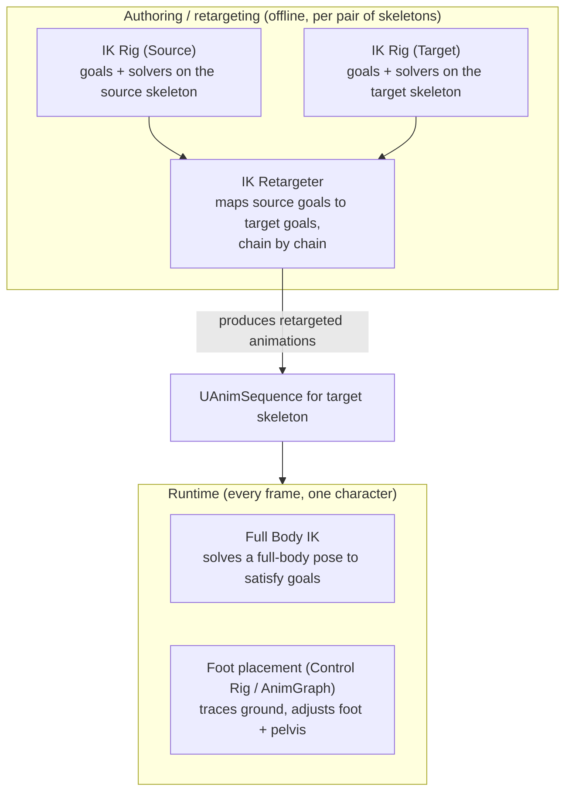

# IK Rig, IK Retargeter, and Full Body IK

Motion Matching aside, most of the "make the feet actually touch the ground" and "reuse this animation
set on a different skeleton" problems in modern UE projects run through three related systems: IK Rig,
IK Retargeter, and Full Body IK. They solve different problems that look similar from a distance —
knowing which one you need keeps you from bolting a foot-IK solution onto what's actually a retargeting
problem, or vice versa.

## Why this matters

An animation authored against one skeleton doesn't automatically look right on a differently-proportioned
one, even when both share a skeleton hierarchy shape (see
[Skeletons and skeletal meshes](./skeletons-and-skeletal-meshes.md)) — a taller character's feet will
slide or float if you just replay a shorter character's walk cycle unmodified. And even a perfectly
retargeted animation authored on flat ground will visibly break on uneven terrain unless something
corrects the feet at runtime. IK Rig and IK Retargeter solve the first problem; Full Body IK (and the
foot-placement patterns built on Control Rig) solve the second.

## Mental model



An **IK Rig** is authored once per skeleton: it defines goals (named targets, like "left foot" or
"right hand") and the solver(s) that drive them, independent of any specific animation. An **IK
Retargeter** sits between two IK Rigs — a source and a target — and maps corresponding chains (arm to
arm, leg to leg) so that an animation authored for the source skeleton produces a plausible equivalent
pose on the target skeleton, accounting for proportion differences. **Full Body IK** (FBIK) is a runtime
solver, used both inside the retargeter (to fix up a retargeted pose) and directly in an AnimGraph or
Control Rig, that adjusts a whole-body pose to satisfy a set of goal constraints — used for things like
"keep both feet planted at these exact traced positions" without breaking the rest of the pose.

## The mechanics

### IK Rig: goals and solvers, authored per skeleton

An IK Rig asset lives independently of any single animation — it's a reusable definition of "here are the
end-effectors this skeleton cares about (hands, feet, head) and here's how to solve for them." Because
it's tied to a skeleton rather than an animation, the same IK Rig serves every animation played on that
skeleton, and it's the reusable unit that both the retargeter and runtime FBIK nodes reference.

### IK Retargeter: chain-by-chain mapping

The retargeter takes a source IK Rig and a target IK Rig and maps their chains (a chain being an ordered
run of bones between two goals, like shoulder-to-hand) so that source-skeleton motion translates to
target-skeleton motion accounting for limb length and proportion differences — a source character's
stride doesn't just get copied vertex-for-vertex onto a target with much shorter legs; the retargeter
scales and adjusts so the target's feet actually reach where the motion intends. Because retargeting is
chain-based rather than bone-by-bone, it's markedly more forgiving of differently-proportioned skeletons
than expecting both characters to literally share one `USkeleton`.

Recent engine versions extended foot handling specifically: retargeting can define an explicit foot plane
and toe chain for better ground contact, and batch retargeting operations can be scripted to preserve
additive-animation flags, which matters if your animation set mixes additive and non-additive clips.

### Full Body IK

FBIK solves for a full-body pose given a set of goals and constraints, rather than solving each limb
chain independently the way a simpler two-bone IK solver would — this matters when moving one goal (say,
planting a foot on a step) should also plausibly affect the pelvis and spine, not just the leg. FBIK
exposes iteration and goal-chain-depth settings that trade solve quality for cost; conceptually, treat it
as a per-frame constraint solver you're paying a real CPU cost for, not a free correction pass.

### The control-rig-driven foot-placement pattern

At a conceptual level, runtime foot placement composes a few pieces: a ground trace per foot (to find
where the foot should actually contact), an IK node (often FBIK, or a dedicated foot-placement node) to
move the foot and adjust the pelvis toward that traced position, and interpolation/plant settings so the
foot doesn't pop when the trace result changes between frames. This is typically authored either as an
AnimGraph skeletal control node placed after the main pose, or inside a Control Rig referenced from the
AnimGraph — either way, it runs as a late correction pass over an already-animated pose rather than
replacing the animation itself.

```cpp title="Reading an FBIK goal setting from C++ — conceptual shape, not a copy-paste API"
// Full Body IK goal configuration is typically authored in the IK Rig editor and consumed via
// the IK Rig / Control Rig runtime API rather than hand-written per frame; this illustrates the
// shape of querying a goal's current settings, not a complete working call site.
FIKRigFBIKGoalSettings GoalSettings = IKRigController->GetGoalSettings(TEXT("Goal_LeftFoot"));
```

:::note
Not confirmed against 5.7 in the sources consulted for the complete `FAnimNode_FootPlacement` field-by-field
behavior — verify the specific pelvis/interpolation settings against your engine version before tuning a
production foot-placement rig from this description alone.
:::

:::warning IK Retargeter output still needs a sanity pass
Automatic chain mapping handles most proportion differences well, but extreme proportion mismatches
(a quadruped target retargeted from a biped source, for instance) can produce technically-valid but
visually wrong poses — always preview retargeted animations on the actual target character rather than
trusting the mapping blind.
:::

:::caution Full Body IK has a real per-frame cost
Every additional goal and every extra solver iteration is more work the CPU has to do every frame, for
every character running that IK. Don't reach for FBIK by default for something a simple two-bone IK node
or a baked animation could solve just as well — reserve it for cases that genuinely need whole-body
constraint satisfaction.
:::

## See also

- [Skeletons and skeletal meshes](./skeletons-and-skeletal-meshes.md) — the skeleton/skeletal-mesh
  relationship that makes proportion mismatches a retargeting problem in the first place.
- [Animation Blueprints](./animation-blueprints.md) — where a foot-placement Control Rig or IK node is
  typically wired into the pose pipeline.
- [Motion Matching](./motion-matching.md) — a different runtime strategy for pose selection, not a
  replacement for retargeting or foot IK.
- [Epic — IK Rig overview](https://dev.epicgames.com/documentation/unreal-engine/ik-rig-in-unreal-engine)
- [Epic — IK Retargeter overview](https://dev.epicgames.com/documentation/unreal-engine/ik-retargeter-in-unreal-engine)
