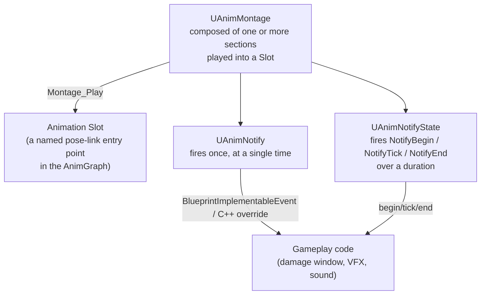

# Montages and anim notifies

`UAnimMontage` is how you play a one-off animation — an attack, a reload, a hit react — outside the
AnimGraph's normal state-driven flow, and anim notifies are how that animation talks back to gameplay
code at specific moments in its timeline. Between the two, they're the mechanism behind almost every
"animation drives gameplay" feature: the sword swing that deals damage on frame 12, the footstep sound at
the heel-strike, the root-motion dash that moves the character exactly as far as the clip says it should.

## Why this matters

Without montages, playing a one-shot animation on top of (or instead of) whatever the state machine is
doing means fighting the state machine — adding states and transitions for things that are really
"interrupt whatever's happening, play this, then resume." Without notifies, gameplay code has no reliable
way to know *when*, during an animation that's already playing, to spawn a hit trace or a sound — polling
the animation's playback position every tick is both wasteful and imprecise. Montages and notifies exist
specifically to avoid both of those.

## Mental model



A montage isn't a single clip — it's a container of sections (each with its own animation data and its
own transitions to other sections), played into a named Slot that the AnimGraph exposes for exactly this
purpose. The AnimGraph doesn't need a special node per montage; it just has a slot node that shows
whatever montage is currently playing, blended with the rest of the graph's output.

## The mechanics

### Playing and stopping a montage

`Montage_Play` and `Montage_Stop` are `UAnimInstance` member functions — call them on the anim instance
(or through `USkeletalMeshComponent::PlayAnimation`-style convenience wrappers on `ACharacter`), not on
the montage asset itself, since a montage asset has no per-character playback state of its own.

```cpp title="Playing a montage and reacting to sections/end"
void AMyCharacter::PlayAttackMontage()
{
    UAnimInstance* AnimInstance = GetMesh()->GetAnimInstance();
    if (!AnimInstance || !AttackMontage)
    {
        return;
    }

    const float Duration = AnimInstance->Montage_Play(AttackMontage, 1.f);
    if (Duration > 0.f)
    {
        FOnMontageEnded EndDelegate;
        EndDelegate.BindUObject(this, &AMyCharacter::OnAttackMontageEnded);
        AnimInstance->Montage_SetEndDelegate(EndDelegate, AttackMontage);
    }
}

void AMyCharacter::OnAttackMontageEnded(UAnimMontage* Montage, bool bInterrupted)
{
    bIsAttacking = false;
}
```

```cpp title="Stopping a montage early, with a blend-out time"
void AMyCharacter::CancelAttack()
{
    if (UAnimInstance* AnimInstance = GetMesh()->GetAnimInstance())
    {
        AnimInstance->Montage_Stop(0.25f, AttackMontage);
    }
}
```

### Sections

A section is a named span of a montage's timeline with its own next-section link — by default a section
plays into the next one in sequence, but you can jump explicitly with `Montage_JumpToSection`, which is
how combo systems chain "Attack1 → Attack2 → Attack3" or branch based on player input received mid-swing.
Sections are also the unit `Montage_Play`'s `StartingSection`-style overloads and Blueprint's "Play
Montage" node let you target directly, so a single montage asset can serve several distinct attacks
instead of needing one montage per attack.

### Anim notifies vs. anim notify states

- **`UAnimNotify`** fires once, at a single point on the timeline — override `Notify()` in a C++
  subclass, or use `Received_Notify` for the Blueprint-implementable version. Good for instantaneous
  events: spawn a muzzle flash, play a footstep sound, apply damage at the exact frame the weapon connects.
- **`UAnimNotifyState`** spans a duration and fires three separate calls: `NotifyBegin`, `NotifyTick`
  (once per frame while active), and `NotifyEnd`. Good for anything that needs an on/off window rather
  than an instant — enabling a weapon-trace collision channel for the swing's active frames, or applying
  a temporary movement-speed modifier for a dodge roll's duration.

```cpp title="A simple gameplay-hook notify"
UCLASS()
class MYGAME_API UAnimNotify_MeleeHit : public UAnimNotify
{
    GENERATED_BODY()

public:
    virtual void Notify(USkeletalMeshComponent* MeshComp, UAnimSequenceBase* Animation, const FAnimNotifyEventReference& EventReference) override
    {
        if (AMyCharacter* Character = Cast<AMyCharacter>(MeshComp->GetOwner()))
        {
            Character->ApplyMeleeDamageTrace();
        }
    }
};
```

Both notify types are attached to a specific `UAnimSequenceBase` (a plain sequence or a montage) on a
notify track in the Animation/Montage editor, not to the AnimGraph — they fire regardless of which
AnimGraph node is playing that asset, which is what makes them a reliable hook independent of how the
graph is structured.

### Root motion from montages

A montage authored with root motion enabled drives the character's actual world-space movement from the
animation's root bone translation, instead of the movement component computing it — used for attacks
that lunge forward, heavy hits that knock the character back a fixed distance, or climbs where the exact
displacement has to match the animation frame-for-frame. `FRepRootMotionMontage` is the replicated
payload that keeps root motion from a montage in sync for networked characters, carrying the montage
reference, playback position, and the authoritative root motion source state.

:::warning A montage plays into a Slot the AnimGraph must actually expose
`Montage_Play` succeeds even if the target slot isn't wired into the currently-active AnimGraph state —
the montage will be "playing" by every query, but you'll see no visual change, because nothing in the
graph is sampling that slot right now. Make sure the slot node sits somewhere reachable from whatever
state machine state is active when you expect the montage to show.
:::

:::caution NotifyTick runs every frame the notify state is active, for every character playing it
Heavy per-tick logic (traces, allocations) in `NotifyTick` scales with concurrent players of that
animation. If the work doesn't need per-frame precision, do it once in `NotifyBegin` / `NotifyEnd` instead.
:::

:::note
Not confirmed against 5.7 in the sources consulted for the exact `EMontageBlendMode` (`Standard` vs.
`Inertialization`) selection guidance — verify the tradeoffs against your engine version before choosing
inertial blending for a specific montage.
:::

## See also

- [Animation Blueprints](./animation-blueprints.md) — how a montage's Slot fits into the AnimGraph it
  plays through.
- [State machines and blend spaces](./state-machines-and-blend-spaces.md) — the state-driven side of
  animation playback that montages interrupt.
- [Damage and hit handling](../06-collision-and-physics/damage-and-hit-handling.md) — the gameplay side
  of a notify-driven hit trace.
- [Epic — Montage API reference](https://dev.epicgames.com/documentation/unreal-engine/BlueprintAPI/Montage)
- [Epic — Using anim notifies](https://dev.epicgames.com/documentation/unreal-engine/using-and-creating-anim-notifies-in-unreal-engine)

