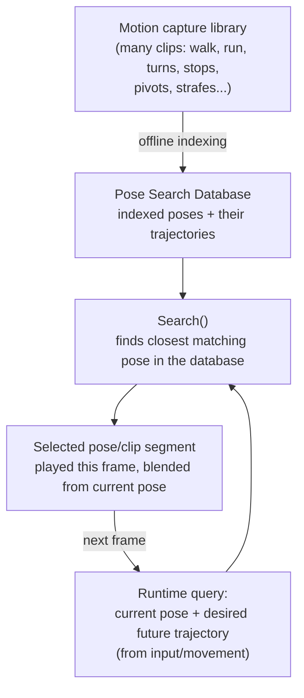

# Motion Matching (Pose Search)

Motion Matching flips the animation-authoring problem around: instead of hand-building a state machine
that decides which clip to play next, you throw a large pool of motion capture at a database and let a
runtime search pick, every frame, whichever pose in that pool best matches where the character is and
where it's headed. It's the highest-fidelity locomotion approach UE ships out of the box, and it's also
the one with the steepest data and tuning cost — knowing when that trade is worth it matters as much as
knowing how the system works.

## Why this matters

A hand-authored locomotion state machine (see
[State machines and blend spaces](./state-machines-and-blend-spaces.md)) scales linearly in complexity
with the number of distinct movement situations you want to support well — every new direction, speed, or
transition style is another state, another blend space, another set of transition rules to tune. Motion
Matching instead scales with the size and quality of your captured motion library: add more varied
motion capture and the system has more real poses to choose from, without you hand-wiring new states.
That's a better trade once your locomotion requirements are broad enough (many speeds, many turn angles,
frequent direction changes) that a state machine would need dozens of blend spaces to match it.

## Mental model

The database (built from a `UPoseSearchDatabase` asset) is an offline-indexed pool of poses drawn from
your source animations, each tagged with the trajectory that preceded and followed it in the source clip.
At runtime, the Motion Matching node builds a query from the character's current pose plus a
trajectory — where the player intends to go over the next short window, typically fed by a
`Motion Trajectory` component reading input and movement — and searches the database for the closest
match. The result is a segment of a real animation, not a synthesized blend, which is why Motion Matching
output tends to look more natural than a blend-space cross-fade for complex movement.

## The mechanics

### The database and what gets indexed

A `UPoseSearchDatabase` references one or more source animation assets and indexes their poses according
to a schema — the set of features (bone positions/velocities, trajectory samples) the search compares.
The schema is what makes two poses "similar" in a way that's meaningful for movement, rather than just
comparing raw bone transforms; get the schema wrong (too few trajectory samples, missing a relevant bone)
and the search will pick technically-close poses that still look wrong in motion.

### Trajectory-driven pose selection

Motion Matching's query isn't just "what pose am I in now" — it's paired with a desired trajectory, a
short prediction of where the character is going (informed by current input and/or movement prediction).
`IPoseSearchProvider::Search` takes exactly this shape: an `FSearchPlayingAsset` (what's currently
playing, so the search can prefer continuity over jarring cuts) and an `FSearchFutureAsset` (the desired
future) alongside the animation graph context, and returns the best matching result. Blueprint exposes the
equivalent through `GetMotionMatchingSearchResult` on the Motion Matching node, marked
`BlueprintThreadSafe` since, like the rest of the AnimGraph, it can run off the game thread.

### When it beats a hand-built state machine

Motion Matching pays off when the space of movement you need to support is broad and continuous —
many speeds, many turn angles, frequent starts/stops/pivots/strafes — because a state machine covering
that same space well would need a correspondingly large tree of blend spaces and transitions, each of
which still has to be hand-tuned for blend quality at the seams. It's a worse trade for a small, well
-defined movement set (a simple idle/walk/run/jump character) where a blend space and a small state
machine already look good with far less setup and no runtime search cost.

### The data and authoring cost

The tradeoff is real, not just theoretical:

- **Capture volume.** Motion Matching quality is bounded by how much and how varied your source motion
  capture is — gaps in the captured movement space (a turn angle nobody captured) show up as visibly
  worse matches at runtime, not just missing content.
- **Schema tuning.** Choosing which bones/trajectory features feed the search is itself a design task;
  a schema that's too coarse picks bad matches, one that's too fine can make near-identical poses compete
  in ways that cause flicker between database entries.
- **Runtime cost.** The search runs every frame (or on a configurable interval) against a potentially
  large database — this is real per-character CPU work, unlike a state machine transition check, and it
  scales with database size and the number of animated characters using Motion Matching simultaneously.
- **Iteration loop.** Because the output depends on the whole database's content and schema rather than a
  single hand-authored graph, tuning "this one transition looks bad" often means re-capturing or
  re-indexing motion rather than editing one transition rule.

:::note
Not confirmed against 5.7 in the sources consulted for exact default schema feature sets or the
`bUseMultiThreadedAnimationUpdate` interaction specifics with the Motion Matching node — verify against
your engine version before assuming a particular default configuration.
:::

:::warning[A sparse database produces confident-looking bad matches]
The search always returns *a* best match, even if nothing in the database is actually close to the
query — it doesn't fail loudly, it just plays whatever scored highest, which can look like a plausible
pose that's subtly wrong (a walk pose during what should be a run). Treat visible seams or "almost right"
motion as a database coverage gap first, before assuming the schema or trajectory prediction is at fault.
:::

:::caution[Don't adopt Motion Matching just because it's the newest option]
For a locomotion set that a blend space and small state machine already handle well, Motion Matching adds
capture, schema, and runtime-search overhead for a quality gain that may not be visible to players. Reach
for it when the movement space is genuinely broad enough that hand-authored blending is the bottleneck,
not by default.
:::

## See also

- [State machines and blend spaces](./state-machines-and-blend-spaces.md) — the hand-authored alternative
  Motion Matching is usually compared against.
- [Animation Blueprints](./animation-blueprints.md) — the AnimGraph context the Motion Matching node runs
  inside of, including its thread-safety assumptions.
- [IK and retargeting](./ik-and-retargeting.md) — how a Motion Matching database's source clips still need
  to be authored against (or retargeted to) your character's skeleton.
- [Epic — Motion Matching overview](https://dev.epicgames.com/documentation/unreal-engine/motion-matching-in-unreal-engine)
- [Epic — Pose Search / Motion Matching API reference](https://dev.epicgames.com/documentation/unreal-engine/API/Plugins/PoseSearch)

