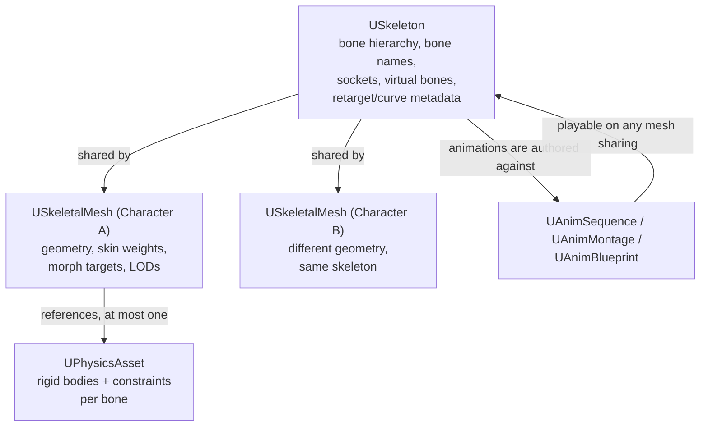

# Skeletons and skeletal meshes

Every animation system in Unreal — AnimGraph, Control Rig, IK Retargeter, Motion Matching — is built on
three assets that most tutorials wave past: `USkeleton`, `USkeletalMesh`, and `UPhysicsAsset`. Confusing
what each one owns is why "why won't my animation play on this mesh" and "why is ragdoll ignoring my new
bone" are two of the most common animation questions — the answer is almost always that one of these
three doesn't agree with the others.

## Why this matters

A character isn't one asset, it's a small graph of assets that reference each other, and the reference
direction is not symmetric. Get it backwards and you'll spend an hour debugging a "missing bone" error
that's really an asset-sharing error. Understanding the ownership also explains why retargeting an
animation from one character to a wildly different one is hard by default and why Epic built a dedicated
IK Retargeter (see [IK and retargeting](./ik-and-retargeting.md)) instead of just letting you drop any
animation on any mesh.

## Mental model



A `USkeleton` is the contract: the bone hierarchy (names, parent/child relationships, reference pose),
plus metadata layered on top of that hierarchy — sockets, virtual bones, retarget sources, and curve
names. It owns no geometry. A `USkeletalMesh` is geometry — vertices, skin weights, LODs, morph targets —
bound to a skeleton via the bone names. A `UPhysicsAsset` is a physical representation of a subset of
that skeleton's bones as rigid bodies connected by constraints, used for ragdoll, physical animation, and
per-bone collision.

The one-directional dependency is the important part: a `USkeletalMesh` points at exactly one
`USkeleton`, and any number of skeletal meshes can point at the *same* `USkeleton`. That's what makes an
animation asset reusable — `UAnimSequence`, `UAnimMontage`, and `UAnimBlueprint` are all authored against
a `USkeleton`, not a `USkeletalMesh`, so any mesh sharing that skeleton can play them without
retargeting. A `UPhysicsAsset` is authored against a specific `USkeletalMesh`'s proportions, which is why
physics assets don't share as cleanly across meshes as animations do — see
[Chaos physics basics](../06-collision-and-physics/chaos-physics-basics.md) for what those rigid bodies
and constraints do at runtime.

## The mechanics

### Bone hierarchy

The skeleton is a tree, not a flat list: every bone has exactly one parent (except the root), and a
child bone's transform is relative to its parent. Moving a parent bone moves everything under it — that
propagation is what makes "attach a prop to the hand bone" work without extra code, and it's also why
reparenting a bone in the Skeleton Editor is a structural, backward-incompatible change for every
animation authored against the old hierarchy.

### Sockets

An `USkeletonSocket` (created in the Skeleton Editor, or the equivalent per-mesh socket on
`USkeletalMesh`) is a named attach point with its own offset transform relative to a bone. Sockets exist
because attaching directly to a bone gives you no room for an offset — a weapon needs to sit rotated and
translated away from the hand bone's own origin, and the socket stores that offset once instead of
requiring every attachment call to repeat it.

```cpp title="Attaching a weapon actor to a hand socket"
void AMyCharacter::EquipWeapon(AWeaponActor* Weapon)
{
    if (!Weapon)
    {
        return;
    }

    const FAttachmentTransformRules AttachRules(EAttachmentRule::SnapToTarget, /*bWeldSimulatedBodies=*/true);
    Weapon->AttachToComponent(GetMesh(), AttachRules, TEXT("WeaponSocket_R"));
}
```

### Virtual bones

A virtual bone is a skeleton-level alias that points from one real bone to another, skipping everything
in between. It behaves like a bone for animation and IK purposes but adds no geometry and no new joint to
animate — it's a convenience for cases like "I want a bone that goes straight from the root to the head"
without hand-authoring an in-between chain. Virtual bones live on the `USkeleton`, so every mesh sharing
that skeleton gets them for free.

### Why sharing a skeleton is the reuse mechanism

Because `UAnimSequence`, `UAnimMontage`, and `UAnimBlueprint` all reference a `USkeleton` rather than a
`USkeletalMesh`, a single animation library serves every character built on that skeleton — swap the mesh
under an `USkeletalMeshComponent` and the same walk cycle, the same montages, and the same Animation
Blueprint keep working unmodified, as long as the new mesh binds to the same skeleton. This is the whole
reason UE projects standardize on one shared skeleton per body type (one for bipeds, a different one for
quadrupeds, and so on) instead of letting each character have its own.

:::note
Not confirmed against 5.7 in the sources consulted for the exact editor menu paths of the Bone Count
Reduction Tool and related 5.8 Skeletal Editor changes — verify against your engine version if you rely
on those specific tools.
:::

:::warning Retargeting isn't automatic just because you share a skeleton
Sharing a `USkeleton` guarantees an animation *plays* on any mesh bound to it, but it does not guarantee
the result looks right if the meshes have very different bone-length proportions (a child character vs.
an adult, for instance). For meaningfully different proportions, use the IK Rig / IK Retargeter workflow
— see [IK and retargeting](./ik-and-retargeting.md) — rather than forcing both meshes onto one skeleton
just to reuse animations.
:::

:::caution A UPhysicsAsset targets specific bone proportions
A physics asset's rigid body sizes and constraint limits are fit to one skeletal mesh's proportions.
Reusing a physics asset built for a large character on a small one (even if they share a skeleton) tends
to produce collision volumes that don't match the visible mesh — regenerate or hand-tune the physics
asset per mesh rather than assuming it travels with the skeleton.
:::

## See also

- [IK and retargeting](./ik-and-retargeting.md) — how animations move between skeletons with different
  proportions.
- [Animation Blueprints](./animation-blueprints.md) — where `USkeleton`-authored animations get played
  and blended at runtime.
- [Chaos physics basics](../06-collision-and-physics/chaos-physics-basics.md) — what a `UPhysicsAsset`'s
  rigid bodies and constraints do once simulated.
- [Epic — Skeletal mesh animation system](https://dev.epicgames.com/documentation/unreal-engine/skeletal-mesh-animation-system-in-unreal-engine)
- [Epic — USkeletalMesh API reference](https://dev.epicgames.com/documentation/unreal-engine/API/Runtime/Engine/Engine/USkeletalMesh)
