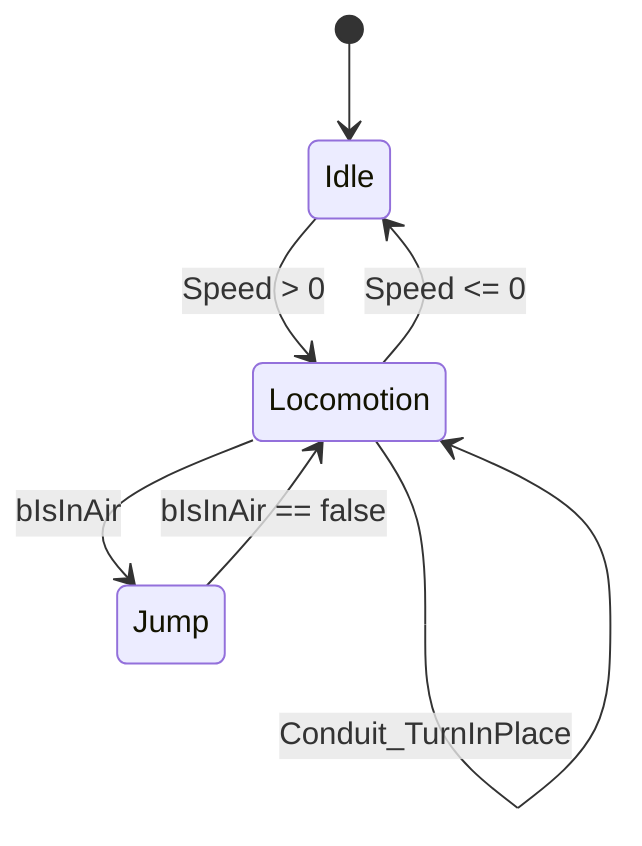

# State machines and blend spaces

State machines and blend spaces are the two workhorse node types inside an AnimGraph — one picks
*which* animation logic runs based on discrete conditions, the other blends *between* animations
continuously based on a numeric input. Reaching for the wrong one is how you end up with a "walk to run"
transition that pops instead of a locomotion blend that jitters between states that should have been one
blend space.

## Why this matters

A state machine models discrete gameplay modes — idle, walking, jumping, in a montage slot — where the
transitions between modes are conditional and often one-directional. A blend space models a continuous
range within one mode — walk speed from 0 to max, or aim offset across pitch and yaw — where you want
smooth interpolation, not a sequence of if/else transitions. Both compile into ordinary AnimGraph nodes
with pose link inputs and outputs (see [Animation Blueprints](./animation-blueprints.md)), and both are
things you'll nest: a blend space is commonly the pose sitting *inside* a state machine's "Locomotion"
state.

## Mental model



Inside `Locomotion` in the diagram above sits a blend space, not a single animation — the state machine
decides *when* you're in the locomotion mode, the blend space decides *which blend* of walk/jog/sprint
poses to output while you're there. Neither one knows about the other's internals; the state machine
just treats "play the Locomotion blend space" as its state's pose, same as it would treat a single
`UAnimSequence`.

## The mechanics

### States, transitions, and transition rules

A state (`FAnimationState`) holds a root pose (often a blend space, sometimes a single animation or a
nested state machine), plus its outgoing transitions in priority order. A transition rule
(`FAnimationTransitionRule`) is the boolean expression evaluated to decide whether to take a transition —
authored as a small graph of its own (usually just reading a bool or comparing a float variable) that
must evaluate every frame the state is active. Transitions also carry blend time and blend type
(exposed on the transition itself), which is what makes a state change look like a crossfade instead of a
cut.

Each state can additionally fire `StartNotify`, `FullyBlendedNotify`, and `EndNotify` — Animation Blueprint
notifies tied to state weight crossing zero or one, useful for triggering EventGraph logic exactly when a
state visually starts or finishes blending in, independent of anim notifies on the animation itself (see
[Montages and notifies](./montages-and-notifies.md) for the asset-level notify system).

### Conduits

A conduit is a state-machine node with no pose of its own — it exists purely to route transitions,
typically to share one rule across several states' entry or exit paths instead of duplicating that rule
on every edge. Use one when several states need to funnel through the same guard condition (for example,
"can't leave any combat state while `bIsStunned`") rather than repeating the check on every transition out
of every combat state.

### Blend spaces (1D and 2D)

A `UBlendSpace` blends multiple animation samples based on one or two input axes — a 1D blend space (also
called a Blend Space 1D in older docs, unified under `UBlendSpace` in current engine versions) maps a
single float, like speed, to a position along a line of samples; a full blend space maps two floats, like
speed and direction, to a position in a 2D grid of samples, interpolating between whichever samples
surround that point. Samples don't have to be evenly spaced — you place them at the actual speed or angle
value they were captured at, and the blend space triangulates between them at runtime.

Relevant `UBlendSpace` knobs worth knowing about deliberately rather than discovering by accident:

- `bLoop` — default looping behavior for samples played through this blend space (asset players can
  override it).
- `InterpolationParam` — per-axis input smoothing, so a noisy or fast-changing input (like analog stick
  speed) doesn't cause the sampled pose to snap around.
- `TargetWeightInterpolationSpeedPerSec` — caps how fast a sample's blend weight is allowed to change,
  independent of how fast the input itself changes.

### Layered blend per bone

`FAnimNode_LayeredBoneBlend` blends a base pose with one or more additional poses, but only over a
specified subset of bones rather than the whole skeleton — the classic use is blending an upper-body
"aim" or "reload" pose over a full-body locomotion pose so the legs keep walking while the arms play
something else. The bone subset comes from either a `LayerSetup` (branch filter, listing which bones and
their children are affected) or a `BlendMasks` (a `UBlendProfile` giving per-bone weights for finer
control than an all-or-nothing branch filter).

```cpp title="Reading state-machine-relevant state from C++ (see AnimInstance in C++ for the full pattern)"
void UMyAnimInstance::NativeUpdateAnimation(float DeltaSeconds)
{
    Super::NativeUpdateAnimation(DeltaSeconds);

    if (const ACharacter* Character = OwningCharacter.Get())
    {
        Speed = Character->GetVelocity().Size2D();
        bIsInAir = Character->GetCharacterMovement()->IsFalling();
    }
}
```

The AnimGraph's transition rules read `Speed` and `bIsInAir` as plain variables — the state machine has
no idea a `UCharacterMovementComponent` exists; that decoupling is exactly what
[AnimInstance in C++](./anim-instance-in-cpp.md) is about.

:::warning[A transition rule that never returns false is a transition that never fires the other way]
Bidirectional transitions rely on `TransitionReturnVal` — the same rule graph evaluated one way for entry
and the negated way for exit. If your rule graph short-circuits to always-true (a common copy-paste bug
when duplicating a transition), the state machine will thrash between two states every frame instead of
settling.
:::

:::caution[Don't fake a continuous blend with several discrete states]
Adding a "Walk," "Jog," and "Sprint" state with hard transitions between them for what is really one
speed-driven range is more transitions to maintain and a worse visual result than one blend space with
walk/jog/sprint samples placed at their real speeds. Reach for a state machine only where the modes are
genuinely discrete (idle vs. jumping vs. in a montage slot), not for a continuum.
:::

## See also

- [Animation Blueprints](./animation-blueprints.md) — how the AnimGraph these nodes live in fits into the
  Animation Blueprint's update/evaluate pipeline.
- [AnimInstance in C++](./anim-instance-in-cpp.md) — where the variables transition rules and blend
  spaces read get populated.
- [Montages and notifies](./montages-and-notifies.md) — the asset-level notify system, distinct from
  state-entry/exit notifies.
- [Epic — State Machines](https://dev.epicgames.com/documentation/unreal-engine/state-machines-in-unreal-engine)
- [Epic — UBlendSpace API reference](https://dev.epicgames.com/documentation/unreal-engine/API/Runtime/Engine/Animation/UBlendSpace)
