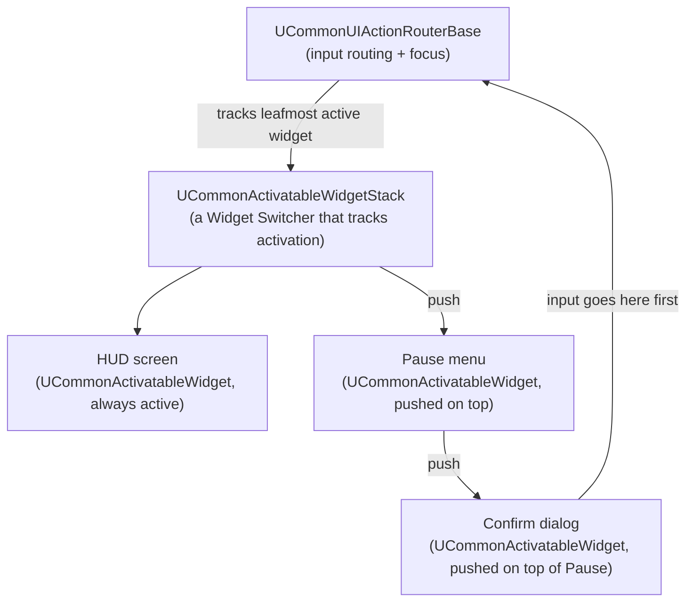

# CommonUI

CommonUI is Epic's plugin for controller-friendly, platform-portable UI, built on top of UMG rather than
replacing it. It exists because plain UMG's focus and input model was designed around mouse/keyboard
first, and every project that ships on console ends up re-solving the same set of problems — which
widget stack is "on top" of which, who gets an input event first, where focus lands after a menu closes —
badly and by hand, unless it reaches for CommonUI instead.

## Why this matters

Plain UMG gives you widgets and input events, but not an opinion about **stacking** (which screen is
frontmost and should consume input), **routing** (which widget of several overlapping ones should handle
a given key), or **focus** (where the "selected" outline goes when a gamepad user presses a d-pad
direction with no mouse involved at all). Every UMG-only project that ships a pause menu over a HUD over
a dialogue box ends up building an ad hoc version of exactly what CommonUI already solves — a stack of
"is this screen active" widgets, manual input consumption flags, and manual `SetFocus` calls after every
transition. Skipping CommonUI on a controller-supported project means reinventing it under time pressure.

## Mental model



The core unit is `UCommonActivatableWidget` — a `UUserWidget` subclass that knows whether it's
"activated" (visible and eligible to receive input/focus) or deactivated. You don't juggle visibility
flags by hand: you push and pop activatable widgets onto a `UCommonActivatableWidgetStack` (a specialized
widget switcher), and the **leafmost** (topmost, most-recently-pushed) activatable widget is the one that
owns focus and sees input first. `UCommonUIActionRouterBase` is the subsystem doing that tracking and
routing across the whole player — it's what "leafmost activatable widget" means in the release notes and
in `CommonUI.DumpActivatableTree`, the console command for inspecting the current stack when routing
looks wrong.

## The mechanics

### Activatable widgets and stacks

A `UCommonActivatableWidget` overrides activation/deactivation hooks instead of you managing
`SetVisibility` and input flags yourself:

```cpp title="MyPauseMenu.h"
UCLASS()
class MYGAME_API UMyPauseMenu : public UCommonActivatableWidget
{
    GENERATED_BODY()

protected:
    virtual void NativeOnActivated() override;
    virtual void NativeOnDeactivated() override;

    // UCommonActivatableWidget: controls whether Back/gamepad-B pops this widget.
    virtual TOptional<FUIInputConfig> GetDesiredInputConfig() const override;
};
```

Pushing one onto a stack widget (placed in a parent HUD widget's designer canvas, typed as
`UCommonActivatableWidgetStack`) replaces manual `AddToViewport`/`RemoveFromParent` bookkeeping:

```cpp title="Pushing a pause menu onto a stack"
if (UCommonActivatableWidgetStack* MenuStack = GetMenuStack())
{
    MenuStack->AddWidget<UMyPauseMenu>(PauseMenuClass);
}
```

Popping is symmetric — `DeactivateWidget()` on the widget itself, or letting the stack's own back/cancel
handling do it — and the stack keeps the widget beneath it (the HUD) present but non-leafmost rather than
you tracking two widgets' states independently.

### Input routing and action bindings

CommonUI widgets bind to **input actions** (Enhanced Input-integrated as of the unified input work in
5.8) through `UCommonButtonBase`/`UCommonActionWidget`-style bindings rather than raw key events, so the
same button reacts to a gamepad face button, a keyboard key, and an on-screen icon without three separate
code paths:

```cpp title="Binding an enhanced input action to a CommonUI button"
ConfirmButton->SetTriggeringEnhancedInputAction(ConfirmAction); // requires Enhanced Input enabled in CommonUI settings
```

Because only the leafmost activatable widget (and whatever it explicitly forwards to) receives input,
a dialog pushed on top of a pause menu doesn't require the pause menu to manually ignore input while the
dialog is up — the router already isn't giving it any.

### Gamepad-friendly focus navigation

CommonUI widgets participate in Slate's navigation system (`FNavigationRoutingParams`, the same mechanism
`SWidget` navigation uses underneath) so that d-pad/stick input moves focus between buttons the way arrow
keys move focus in a native desktop app — something plain UMG leaves entirely unconfigured unless you set
up `Explicit` navigation rules per widget by hand. When a new activatable widget becomes leafmost,
CommonUI is also responsible for putting focus *somewhere* sane on it automatically, instead of a
controller player having no visible selection at all.

`UCommonUILibrary::RequestRefreshFocusIfLeafmostDescendant` (and the underlying
`GetLeafmostActivatableWidget()`/`IsWidgetInLeafmostNodeHierarchy()` queries) exists specifically for the
common failure case: a widget finishes building asynchronously (a list populated after a data fetch) and
needs to claim focus only if it's still actually the frontmost thing when it's ready.

```csharp title="MyGame.Build.cs — enabling CommonUI"
PublicDependencyModuleNames.AddRange(new string[]
{
    "Core",
    "CoreUObject",
    "Engine",
    "UMG",
    "CommonUI",
    "CommonInput"
});
```

CommonUI is a plugin, not a base-engine module — it must be enabled in the project's `.uplugin`/plugin
list before `CommonUI`/`CommonInput` module dependencies will resolve.

## Gotchas

:::warning Plain UMG has no concept of "which screen is on top"
If you're stacking a HUD, a pause menu, and a confirmation dialog with plain `UUserWidget` and manual
`AddToViewport`/`SetVisibility` calls, you are responsible for every bit of input-consumption and focus
bookkeeping CommonUI would otherwise give you — and it's very easy to end up with input leaking through
to a widget underneath the one the player thinks they're interacting with.
:::

:::caution A widget stack is not just a Widget Switcher
`UCommonActivatableWidgetStack` looks like a specialized `UWidgetSwitcher`, but pushing/popping also drives
activation state and focus/input routing through `UCommonUIActionRouterBase`. Swapping children directly
on the underlying switcher instead of using `AddWidget`/`RemoveWidget` leaves the router's idea of what's
leafmost out of sync with what's actually visible.
:::

:::note
The Enhanced Input / CommonUI "unified input system" integration referenced above (triggering actions
directly on `UCommonButtonBase`) is described in the 5.8 release notes; if you're on an earlier 5.7
release, verify whether `SetTriggeringEnhancedInputAction` and the associated CommonUI input settings are
present in your specific engine build.
:::

## See also

- [UMG fundamentals](./umg-fundamentals.md) — the `UUserWidget` base CommonUI's activatable widgets
  build on.
- [HUD and viewport](./hud-and-viewport.md) — where a CommonUI-driven HUD sits relative to `AHUD`.
- [Enhanced Input](../05-input-and-movement/enhanced-input.md) — the input action system CommonUI
  bindings route through.
- [Epic — CommonUI overview](https://dev.epicgames.com/documentation/unreal-engine/common-ui-plugin-for-advanced-user-interfaces-in-unreal-engine)
- [Epic — API: CommonUI plugin classes](https://dev.epicgames.com/documentation/unreal-engine/API/Plugins/CommonUI)
