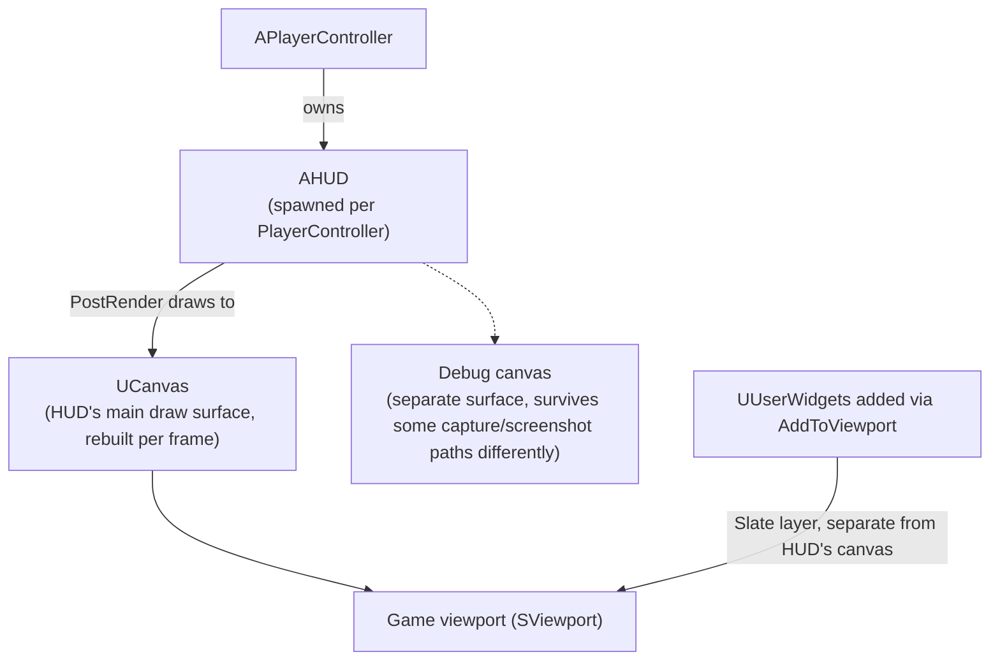

# HUD and viewport

`AHUD` is the older, canvas-based counterpart to UMG: a per-player actor whose job is drawing directly
onto a canvas every frame, mostly for debug overlays and simple always-on displays. Most gameplay UI in a
modern UE5 project is UMG widgets, not `AHUD` drawing — but `AHUD` still owns the viewport-level debug
draw path, and understanding how it, the viewport, and widgets relate explains why some overlays show up
in screenshots and others don't, and why "world space" and "screen space" positioning are never
interchangeable.

## Why this matters

`AHUD` predates UMG and is still what `GameMode` spawns one of per player by default (via
`APlayerController::HUDClass` / the game mode's `HUDClass`) — it's not a deprecated relic, it's the
canvas surface behind console debug commands (`stat`, `showdebug`) and behind any project that draws
directly rather than through widgets (retro-style pixel HUDs, certain debug visualizations, some
performance-sensitive always-on displays). Confusing `AHUD`'s canvas drawing with UMG widget drawing —
or confusing player-screen space with world space — is why debug overlays sometimes vanish in a build, or
why a "UI marker" drawn in the wrong space drifts as the camera moves.

## Mental model



`AHUD` and UMG widgets both ultimately render into the same game viewport, but through different paths:
`AHUD::DrawHUD()` (and the `PostRender` hook it calls actors through, `PostRenderFor`) draws immediate-mode
primitives onto a `UCanvas` that's rebuilt every frame, while UMG widgets are a persistent Slate widget
tree composited into the viewport separately. Neither one "contains" the other — they're layered together
by the viewport, which is why an `AHUD` debug string and a UMG health bar can coexist on screen without
either being aware of the other.

## The mechanics

### The canvas draw path

`AHUD::DrawHUD()` is the per-frame entry point; overriding it (or, more often, calling drawing functions
from Blueprint's HUD event) is how you get pixels onto the canvas without any widget involved:

```cpp title="MyDebugHUD.h"
UCLASS()
class MYGAME_API AMyDebugHUD : public AHUD
{
    GENERATED_BODY()

public:
    virtual void DrawHUD() override;
};
```

```cpp title="MyDebugHUD.cpp"
void AMyDebugHUD::DrawHUD()
{
    Super::DrawHUD();

    DrawText(
        FString::Printf(TEXT("FPS: %.0f"), 1.f / GetWorld()->GetDeltaSeconds()),
        FLinearColor::Green,
        /*ScreenX=*/20.f, /*ScreenY=*/20.f,
        /*Font=*/nullptr,
        /*Scale=*/1.f,
        /*bScalePosition=*/false
    );

    DrawTextureSimple(WarningIconTexture, 20.f, 60.f, /*Scale=*/1.f, /*bScalePosition=*/false);
}
```

`DrawText`, `DrawTexture`, `DrawTextureSimple`, and the rect/material draw equivalents are all
`BlueprintCallable` functions on `AHUD`, in the `HUD` category — usable from a Blueprint HUD class exactly
as from C++. All of them take screen-space coordinates measured from the viewport's top-left, in pixels,
not world units.

`AHUD` also exposes `DrawActorOverlays()`, which calls `PostRenderFor(PlayerController, Canvas,
CameraPosition, CameraDir)` on any actor added via `AddPostRenderedActor` — the hook actors use to draw
their own canvas overlay (a name tag, a health bar drawn above a character) without the HUD needing to
know about them individually.

### Viewport and Z-order

The game viewport is the single Slate surface everything ultimately composites into. `AHUD`'s canvas
draws happen every frame as an immediate pass; UMG widgets sit in the viewport's persistent Slate tree,
ordered among themselves by the `ZOrder` passed to `AddToViewport` (see
[UMG fundamentals](./umg-fundamentals.md)). There's no single Z-order that unifies HUD canvas drawing and
widget Z-order — the canvas pass and the widget tree are composited as separate layers, so you can't
reliably interleave a canvas-drawn debug element between two UMG widgets by choosing numbers carefully.
If you need something drawn between UI layers, it needs to be UMG (or Slate) on both sides.

### Player-screen space vs. world space

Everything `AHUD` draws through `DrawText`/`DrawTexture` is **player-screen space**: 2D pixel coordinates
relative to that player's viewport, unaffected by camera movement. Placing something so it tracks a 3D
object — a floating health bar above an NPC's head — requires projecting a world location into screen
space yourself, typically with `UGameplayStatics::ProjectWorldToScreen` or the player controller's
`ProjectWorldLocationToScreen`, and redoing that projection every frame the camera or the target moves.
UMG has the same distinction: a `UWidgetComponent` set to **World Space** render mode renders a widget as
a 3D object positioned by its own actor transform, entirely separate from the player-screen-space
`AddToViewport` path.

### HUD vs. widgets owned by the PlayerController

`APlayerController` is what actually owns the player's HUD reference (`GetHUD()`) and is the usual place
that creates and owns top-level UMG widgets (a persistent HUD widget, a pause menu) — `AHUD` and
`UUserWidget` are siblings from the controller's point of view, not one wrapping the other. A common
setup: the `PlayerController` spawns its `AHUD` (or accepts the one `AGameModeBase::HUDClass` spawned for
it) for canvas-level debug drawing, and separately creates and adds its primary UMG widgets on
`BeginPlay`. Neither one needs a reference to the other unless your project specifically wires HUD-drawn
elements to read state from a widget or vice versa.

## Gotchas

:::warning DrawHUD() coordinates are pixels, not Slate/DPI-scaled units
`AHUD`'s screen-space draw calls are raw pixel coordinates. If your project supports DPI scaling or
multiple resolutions and you hardcode pixel offsets, positioning drifts across resolutions in a way UMG's
anchor/percentage-based layout doesn't suffer from. This is one more reason most projects keep `AHUD` to
debug drawing and put real UI in UMG.
:::

:::caution AHUD's canvas and the debug canvas are not the same surface
`AHUD` maintains a separate debug canvas alongside its main canvas; console debug tools (`showdebug`,
some `stat` displays) draw to the debug canvas, not the one your `DrawHUD()` override draws to. Don't
assume a `DrawHUD()` override is the only thing responsible for what appears on screen when debug tools
are active.
:::

:::note
The debug-canvas/main-canvas split, and precisely which built-in debug tools use which, were not fully
confirmed against 5.7 in the sources consulted — if you're relying on draw order between engine debug
output and your own `DrawHUD()` calls, verify against your engine version rather than assuming a fixed
relationship.
:::

## See also

- [UMG fundamentals](./umg-fundamentals.md) — `AddToViewport`, `ZOrder`, and the widget tree HUD canvas
  drawing sits alongside.
- [CommonUI](./common-ui.md) — the activatable-widget layer most projects use for actual menu/HUD screens
  instead of raw `AHUD` drawing.
- [Player controller and player state](../03-gameplay-framework/player-controller-and-player-state.md) —
  the object that owns `GetHUD()` and typically creates top-level widgets.
- [Epic — API: AHUD](https://dev.epicgames.com/documentation/unreal-engine/API/Runtime/Engine/AHUD)
- [Epic — User Interfaces and HUDs](https://dev.epicgames.com/documentation/unreal-engine/user-interfaces-and-huds-in-unreal-engine)

