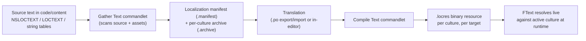

# Localization and text

Every piece of text a player reads has to survive translation into other languages without a code change,
and Unreal's answer to that is `FText` plus a gather/compile localization pipeline that turns source
strings into per-culture translations at build or cook time. This doc assumes you already know why
`FText` (not `FString`) is the type for player-facing text — see
[FString, FName, and FText](../02-cpp-in-unreal/strings-and-text.md) — and covers the pipeline that
actually gets an `FText` translated: where source strings are declared, how they're gathered, and how
`FText::Format` builds a sentence out of pieces without breaking that pipeline.

## Why this matters

An `FText` is only as localizable as its origin lets it be. `FText::FromString(SomeFString)` produces
runtime-only text with nothing for the localization pipeline to find or translate — it displays fine and
quietly ships in English forever. `NSLOCTEXT`/`LOCTEXT` and string tables are the two mechanisms that give
a piece of text a stable identity (a namespace and key) the gather step can find, extract into a manifest,
and hand to translators. Skipping this — building UI text as raw string concatenation instead of
`FText::Format` — is the single most common way a project discovers, late and expensively, that half its
UI can't actually be translated.

## Mental model



Localization in Unreal is a pipeline, not a runtime feature you flip on: source text gets **gathered**
into a manifest (what needs translating) and per-culture archives (what's been translated so far),
translators fill in archives, then a **compile** step bakes translated archives into binary `.locres`
files the runtime loads for the active culture. `FText` is the type that defers its display string
resolution until runtime specifically so this pipeline can swap the underlying string per culture without
any code change.

## The mechanics

### Giving text a stable identity: NSLOCTEXT and LOCTEXT

`NSLOCTEXT(Namespace, Key, SourceString)` creates an `FText` tagged with a namespace and key the gather
step uses as its stable identity — the same namespace/key pair is what a translation is attached to,
regardless of how the English source string later gets edited:

```cpp title="Declaring localizable text"
FText PickupPrompt = NSLOCTEXT("MyGame.Interaction", "PickupPrompt", "Press {0} to pick up {1}");
```

`LOCTEXT(Key, SourceString)` is the same idea without repeating the namespace on every call — it reads an
implicit namespace from a `#define LOCTEXT_NAMESPACE "MyGame.Interaction"` earlier in the file, and you're
expected to `#undef LOCTEXT_NAMESPACE` at the end of that file:

```cpp title="Using an implicit namespace for a whole file"
#define LOCTEXT_NAMESPACE "MyGame.Interaction"

FText PickupPrompt = LOCTEXT("PickupPrompt", "Press {0} to pick up {1}");

#undef LOCTEXT_NAMESPACE
```

Both macros produce an `FText`; the difference is purely how much boilerplate you repeat per string.
Neither one translates anything by itself — they just give the gather step something stable to find.

### String tables: text that doesn't live in code

A string table (`UStringTable` asset, or a `.csv`/`.json` import) centralizes text as
namespace/key/source-string rows in an asset rather than scattered across source files — useful for large
blocks of narrative or dialogue text that non-programmers edit directly, and for text that needs to be
referenced from both Blueprint and C++ without duplicating the literal in both places:

```cpp title="Referencing a string table entry"
FText QuestTitle = FText::FromStringTable(TEXT("/Game/Localization/ST_QuestText"), TEXT("Quest_001_Title"));
```

String tables are gathered the same way as `NSLOCTEXT`/`LOCTEXT` calls — the pipeline doesn't care whether
a piece of text originated in code or in a string table asset, only that it has a stable namespace/key.

### The gather and compile pipeline

The Localization Dashboard (Project Settings → Localization, or the equivalent editor tool) is the usual
front end for two commandlets: a **gather** step that scans source code and content for
`NSLOCTEXT`/`LOCTEXT`/string-table text and produces a localization **manifest** (all source strings found)
plus per-culture **archives** (translations collected so far), and a **compile** step —
`UGenerateTextLocalizationResourceCommandlet` — that bakes a culture's archive into a `.locres` binary
resource the runtime actually loads. Archives are typically exported to `.po` files for translators (or a
translation service) and re-imported once translated; nothing in the pipeline requires translators to
touch Unreal directly.

```ini title="Config/DefaultGame.ini — culture/localization target basics"
[Internationalization]
+LocalizationPaths=%GAMEDIR%Content/Localization/Game

[/Script/Engine.GameEngine]
+ActiveGameNameRedirects=(OldGameName="TP_Blank",NewGameName="/Script/MyGame")
```

:::note
Not confirmed against 5.7 in the sources consulted: the exact current `[Internationalization]` config
keys and default culture fallback rules. Verify the specific ini section names and localization target
setup against the Localization Dashboard in your engine version rather than hand-writing config from
memory.
:::

### FText::Format — building a sentence without breaking translation

Concatenating translated fragments with `+` or `Printf` breaks translation the moment a target language
reorders words differently than English — `FText::Format` instead treats the format string itself as the
translatable unit, with numbered or named placeholders translators can reorder freely:

```cpp title="Composing text safely across languages"
FText Prompt = FText::Format(
    NSLOCTEXT("MyGame.Interaction", "PickupPrompt", "Press {0} to pick up {1}"),
    KeyBindingText,
    ItemDisplayName
);
```

Because `{0}`/`{1}` (or named arguments via `FFormatNamedArguments`) can appear in any order inside the
translated string, a language that puts the object before the verb can reorder them in the archive without
touching code. Building the same sentence as `KeyBindingText + FText::FromString(TEXT(" to pick up ")) +
ItemDisplayName` hard-codes English word order into the binary and can't be fixed by a translator at all.

## Gotchas

:::warning FString for player-facing text is a localization bug, not a style nit
`FString`/`FString::Printf` have no namespace, no key, and nothing for the gather step to find — text
built this way is invisible to the entire localization pipeline. It compiles, displays correctly in the
dev culture, and stays permanently untranslated until someone notices in QA, often close to a ship date.
:::

:::caution Editing a NSLOCTEXT/LOCTEXT source string doesn't retranslate it — but changing the key does
The archive matches translations to text by namespace/key, not by the current source string. Editing the
English source string in place updates what's displayed in the dev culture without invalidating existing
translations tied to that key (they'll silently be stale until someone notices and re-gathers/re-reviews).
Changing the *key* instead orphans the old translation entirely and requires a fresh one.
:::

:::caution Don't build FText::Format arguments from a raw FString when a proper FText source exists
Wrapping a translated fragment via `FText::FromString` after you've already flattened it to a plain string
elsewhere throws away that fragment's own localization identity. Keep `FText` all the way from source to
the final `FText::Format` call rather than converting to `FString` and back.
:::

## See also

- [FString, FName, and FText](../02-cpp-in-unreal/strings-and-text.md) — the type-level comparison this
  doc builds on; read that first if `FText` vs `FString` itself is unfamiliar.
- [UMG fundamentals](./umg-fundamentals.md) — where `FText` shows up constantly, on every text-bearing
  widget property.
- [Epic — Text Localization](https://dev.epicgames.com/documentation/unreal-engine/localizing-content-in-unreal-engine)
- [Epic — API: FText](https://dev.epicgames.com/documentation/unreal-engine/API/Runtime/Core/FText)
