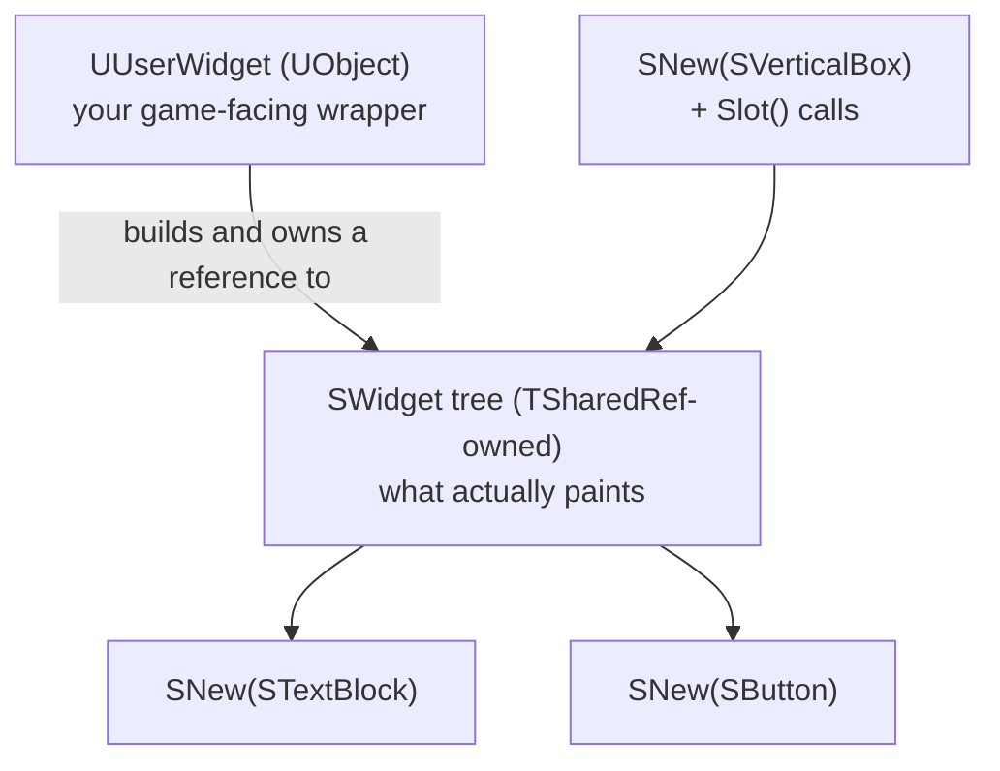

# Slate and widgets in C++

Slate is the immediate-feel, C++-only UI framework that UMG is built on top of. You will rarely write raw
Slate for a game HUD, but every editor panel, details customization, and toolbar button in Unreal is
Slate, and understanding it clears up what UMG is actually doing under the hood — including why UMG
widgets are `TSharedRef`-managed and why their layout comes from slots.

## Why this matters

UMG exists because writing gameplay UI directly in Slate is slow to iterate on — no visual designer, no
data binding shortcuts, recompile-to-see-a-change. But Slate isn't a legacy layer you can ignore: it's
what every `UUserWidget` compiles down to, it's the only option for anything you build inside the editor
(a custom asset editor, a details panel customization, a toolbar extension), and knowing its ownership
model (`TSharedRef`, not `UObject`) explains lifetime bugs that look nothing like normal Unreal memory
management.

## Mental model



`SWidget` is the Slate equivalent of `UWidget`: the base class for every visual element. Unlike
`UObject`, `SWidget`s are not garbage-collected — they're reference-counted through `TSharedRef`/
`TSharedPtr`, which is why Slate code reads differently from the rest of Unreal C++
(see [Smart pointers and ownership](../02-cpp-in-unreal/smart-pointers-and-ownership.md) for the
`TSharedRef`/`TSharedPtr` model itself). A Slate widget tree is built once, declaratively, in a single
nested expression — there's no separate "layout pass" the way there is with a Designer canvas; the
nesting of the C++ expression *is* the widget hierarchy.

## The mechanics

### SNew and the declarative syntax

`SNew(WidgetType)` constructs a widget and returns a `TSharedRef<WidgetType>`. Chained `.ArgumentName()`
calls after `SNew` set named arguments the widget declares (its "Slate arguments"), and for
container widgets, nested `SNew` calls inside `+ SVerticalBox::Slot()` (or the container's own slot
macro) build children directly into the parent's layout:

```cpp title="Building a Slate widget tree declaratively"
TSharedRef<SVerticalBox> Root =
    SNew(SVerticalBox)
    + SVerticalBox::Slot()
    .AutoHeight()
    .Padding(8.f)
    [
        SNew(STextBlock)
        .Text(FText::FromString(TEXT("Connection status")))
    ]
    + SVerticalBox::Slot()
    .FillHeight(1.f)
    [
        SNew(SButton)
        .Text(FText::FromString(TEXT("Retry")))
        .OnClicked_Lambda([this]() -> FReply
        {
            RetryConnection();
            return FReply::Handled();
        })
    ];
```

Each `+ SVerticalBox::Slot()` is a slot object, same concept as a UMG `UVerticalBoxSlot` — `.AutoHeight()`
versus `.FillHeight(...)` control whether that child sizes to content or shares remaining space, exactly
like a UMG box slot's `Size` property. The square-bracket `[ ... ]` syntax is the "widget content"
operator: it's how a slot's child widget is nested inside the parent expression.

### SAssignNew: keep a handle to a widget you just built

`SNew` alone doesn't give you a variable to reference that widget later. `SAssignNew(OutVar, WidgetType)`
does both — constructs the widget and assigns the resulting `TSharedRef` into a member you declared ahead
of time — which is the normal way to keep a pointer to a widget buried inside a larger declarative tree:

```cpp title="Keeping a reference into a larger tree"
TSharedPtr<SEditableTextBox> SearchBox;

ChildSlot
[
    SNew(SBorder)
    [
        SAssignNew(SearchBox, SEditableTextBox)
        .HintText(FText::FromString(TEXT("Search...")))
        .OnTextChanged(this, &SMyPanel::HandleSearchTextChanged)
    ]
];

// Later, elsewhere in the same class:
SearchBox->SetText(FText::GetEmpty());
```

### Ownership: TSharedRef, not UObject

Slate widgets live and die by reference count, not by the garbage collector — a `TSharedRef<SWidget>`
guarantees non-null and keeps the widget alive as long as the reference exists; a
`TSharedPtr<SWidget>` is the nullable equivalent for a widget you might not have yet. This is why raw
Slate code binds delegates with `SharedThis(this)` or captures `TWeakPtr` rather than raw `this` pointers
in lambdas that might outlive the owning object — there's no GC pass cleaning up a dangling reference for
you the way there is for a `UObject`.

```cpp title="Weak self-reference to avoid a dangling capture"
.OnClicked_Lambda([WeakThis = TWeakPtr<SMyPanel>(SharedThis(this))]() -> FReply
{
    if (TSharedPtr<SMyPanel> Pinned = WeakThis.Pin())
    {
        Pinned->HandleClicked();
    }
    return FReply::Handled();
})
```

### When raw Slate is the right call

Slate is correct for **editor tooling**: custom asset editors, `IDetailCustomization` panels, toolbar
extensions, and anything that has to live inside `SDockTab`s in the main editor frame. None of that has a
UMG equivalent — UMG is a runtime/game concept, and the editor's own UI is Slate all the way down.

Slate is the wrong call for a **game HUD or menu**. You'd be giving up the Widget Designer, Blueprint
event bindings, and UMG's animation system, in exchange for nothing a game screen actually needs — raw
Slate doesn't make a health bar faster to update, it just makes it slower to build and impossible for a
designer to touch without recompiling.

```csharp title="MyGame.Build.cs — Slate in a runtime or editor module"
PublicDependencyModuleNames.AddRange(new string[]
{
    "Core",
    "CoreUObject",
    "Engine",
    "Slate",
    "SlateCore"
});
```

`UMG` itself depends on `Slate`/`SlateCore`; a module that only uses `UUserWidget`-level UMG doesn't need
`Slate`/`SlateCore` listed directly, but a module that constructs `SWidget`s by hand does.

## Gotchas

:::warning Don't capture raw `this` in an OnClicked/OnTextChanged lambda that could outlive the widget
Slate delegates fire asynchronously relative to widget destruction in some cases (deferred ticks, timers).
A raw `this` capture that fires after the owning object is destroyed is a use-after-free with no GC
safety net. Use `SharedThis(this)` (pinned) or a `TWeakPtr` capture, not a bare `this`.
:::

:::caution SNew vs SAssignNew is not a style choice
If you need to call a method on the widget after construction — `SetText`, `SetEnabled`, `RequestFocus`
— you need the handle `SAssignNew` gives you. `SNew` alone is fine only when the widget is fully
configured by its Slate arguments and never touched again.
:::

:::note
Not confirmed against 5.7 in the sources consulted: the exact list of which built-in slot arguments
(`AutoHeight`, `FillHeight`, etc.) exist on every container type. Slot arguments differ per container —
check the specific `SXSlot` class you're using rather than assuming one container's slot API matches
another's.
:::

## See also

- [UMG fundamentals](./umg-fundamentals.md) — the `UUserWidget` layer built on top of this.
- [Smart pointers and ownership](../02-cpp-in-unreal/smart-pointers-and-ownership.md) — the
  `TSharedRef`/`TSharedPtr`/`TWeakPtr` model Slate's ownership relies on.
- [Delegates and events](../02-cpp-in-unreal/delegates-and-events.md) — the delegate types behind
  `OnClicked`, `OnTextChanged`, and similar Slate event bindings.
- [Epic — Slate UI Framework](https://dev.epicgames.com/documentation/unreal-engine/slate-ui-framework-in-unreal-engine)
- [Epic — API: SWidget](https://dev.epicgames.com/documentation/unreal-engine/API/Runtime/SlateCore/Widgets/SWidget)
