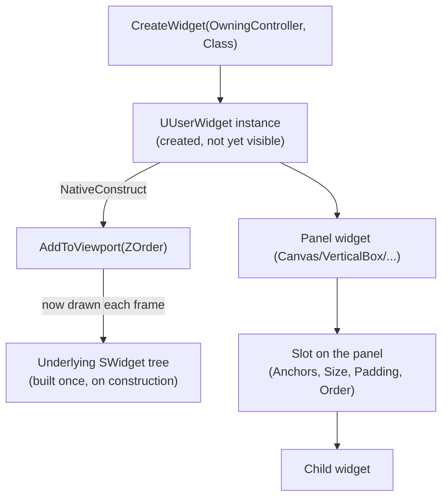

# UMG fundamentals

UMG (Unreal Motion Graphics) is the widget system almost every UE5 project uses for menus, HUD overlays,
inventory screens, and dialogue boxes. Every UMG widget is a `UUserWidget`, and every `UUserWidget` is
built from a tree of layout and content widgets whose slot properties — not transforms — control where
things end up on screen. Skip understanding the hierarchy and the lifecycle hooks, and you get widgets
that render in the wrong place, tick when they shouldn't, or leak because nobody removed them from the
viewport.

## Why this matters

UMG widgets aren't actors: they don't have a `Transform`, they don't tick by default the way a
`UActorComponent` does, and their existence in memory is separate from their existence on screen. A
widget you `CreateWidget`'d but never `AddToViewport`'d exists and consumes memory but draws nothing. A
widget you added to the viewport but never removed keeps rendering (and, if you didn't gate it, keeps
ticking) even after the code that created it thinks it's done. Nearly every "UI is misbehaving" bug in a
UE5 project traces back to one of these three things: hierarchy/slot confusion, a lifecycle hook doing
the wrong work at the wrong time, or a widget instance nobody released.

## Mental model



A `UUserWidget` is a UObject wrapper around a Slate widget tree (see
[Slate and widgets in C++](./slate-and-widgets-in-cpp.md) for what's underneath). The wrapper is what you
create, tick, and destroy from gameplay code; the Slate tree underneath is what Unreal actually paints
each frame. The tree is a hierarchy of **panel** widgets (things that arrange children: `UCanvasPanel`,
`UVerticalBox`, `UHorizontalBox`, `UOverlay`, `UGridPanel`, `UScrollBox`) and **content** widgets
(`UTextBlock`, `UImage`, `UButton`, `UProgressBar`, and so on) that panels arrange. A widget's position and
size on screen come from the **slot** the panel assigns it, not from any transform on the widget itself —
a `UImage` has no independent notion of where it is; its `UCanvasPanelSlot` or `UVerticalBoxSlot` does.

## The mechanics

### Panels, slots, and where layout actually lives

Every child added to a panel gets a slot object specific to that panel type, and the slot — not the
child — carries layout data:

| Panel | Slot type | Key slot properties |
|---|---|---|
| `UCanvasPanel` | `UCanvasPanelSlot` | `Anchors`, `Offsets`, `Alignment`, `ZOrder` |
| `UVerticalBox` / `UHorizontalBox` | `UVerticalBoxSlot` / `UHorizontalBoxSlot` | `Size` (`FSlateChildSize`: `Fill`/`Auto`), `Padding`, `HorizontalAlignment`/`VerticalAlignment` |
| `UOverlay` | `UOverlaySlot` | `Padding`, `HorizontalAlignment`, `VerticalAlignment` (stacks children on top of each other) |
| `UUniformGridPanel` | `UUniformGridSlot` | `Row`, `Column` (all cells share the size of the largest) |

`UCanvasPanel` is the one panel that gives you free-form, anchor-based positioning — it's the right
default for a root widget where you want a HUD element pinned to a corner regardless of resolution.
Box and overlay panels flow their children instead, which is usually what you want for anything that
needs to reflow when content changes size (a stat list, a chat log, a stack of buttons).

```cpp title="Building layout from C++ instead of the Designer"
UCanvasPanel* Root = NewObject<UCanvasPanel>(this);
WidgetTree->RootWidget = Root;

UTextBlock* HealthText = NewObject<UTextBlock>(this);
UCanvasPanelSlot* HealthSlot = Root->AddChildToCanvas(HealthText);
HealthSlot->SetAnchors(FAnchors(0.f, 0.f)); // top-left
HealthSlot->SetPosition(FVector2D(24.f, 24.f));
HealthSlot->SetAutoSize(true);
```

Most projects build layout in the Widget Designer instead — this is what the Designer is doing under the
hood, and it's the escape hatch for widgets you must assemble procedurally (a dynamically sized
inventory grid, for instance).

### Creating and showing a widget

A `UUserWidget` instance is inert until you put it on screen. `CreateWidget` allocates the widget and runs
its construction (`Initialize`, then Blueprint's "Construct" event / `NativeConstruct` in C++);
`AddToViewport` is the separate step that actually inserts it into the game viewport's Slate tree so it
renders:

```cpp title="Showing a widget from a PlayerController"
if (UUserWidget* Widget = CreateWidget<UMainMenuWidget>(this, MainMenuWidgetClass))
{
    Widget->AddToViewport(/*ZOrder=*/10);
}
```

`CreateWidget`'s first argument is an owning `UWorld`-having object — typically the local
`APlayerController` — so the widget can resolve its world and be torn down if that owner goes away.
`AddToViewport`'s `ZOrder` argument controls paint order among widgets added to the same viewport: higher
draws on top, which matters the moment you have more than one widget on screen at once (a HUD plus a
pause menu, say).

To remove a widget, call `RemoveFromParent()` on it — there's no reference-counted "hide," you either
have the widget in the viewport tree or you don't. Just changing its `Visibility` (see below) still
leaves it ticking and present in the tree; `RemoveFromParent()` is what actually detaches it.

### Widget lifecycle

| Hook | When it fires | Typical use |
|---|---|---|
| `NativeConstruct` | After the widget (and its Slate tree) is built, whether or not it's yet in the viewport | Bind delegates, cache references, set initial text |
| `NativeTick` | Every frame the widget is ticking (gated by `Visibility` and the widget's tick settings) | Per-frame UI updates — a health bar, a timer — kept cheap |
| `NativeDestruct` | When the widget is being torn down (owner destroyed, or explicitly released) | Unbind delegates you bound in `NativeConstruct` |

```cpp title="MyHealthWidget.h"
UCLASS()
class MYGAME_API UMyHealthWidget : public UUserWidget
{
    GENERATED_BODY()

protected:
    virtual void NativeConstruct() override;
    virtual void NativeTick(const FGeometry& MyGeometry, float InDeltaTime) override;
    virtual void NativeDestruct() override;

    UPROPERTY(meta = (BindWidget))
    TObjectPtr<class UProgressBar> HealthBar;

    UPROPERTY(meta = (BindWidgetOptional))
    TObjectPtr<class UTextBlock> HealthText;
};
```

```cpp title="MyHealthWidget.cpp"
void UMyHealthWidget::NativeConstruct()
{
    Super::NativeConstruct();

    if (APawn* OwningPawn = GetOwningPlayerPawn())
    {
        // Bind to a health-changed delegate exposed by the pawn/component.
    }
}

void UMyHealthWidget::NativeTick(const FGeometry& MyGeometry, float InDeltaTime)
{
    Super::NativeTick(MyGeometry, InDeltaTime);
    // Keep this cheap — it runs every visible frame regardless of whether health changed.
}

void UMyHealthWidget::NativeDestruct()
{
    // Unbind anything bound in NativeConstruct before Super tears the widget down.
    Super::NativeDestruct();
}
```

`Visibility` (an `ESlateVisibility` of `Visible`, `HitTestInvisible`, `SelfHitTestInvisible`, `Collapsed`,
or `Hidden`) is what actually gates whether a widget paints and receives input — `Collapsed` and `Hidden`
both stop rendering, but only `Collapsed` also removes the widget from layout (siblings reflow into the
space); `Hidden` leaves the space reserved.

### BindWidget: splitting C++ and the Designer

`meta = (BindWidget)` on a `UPROPERTY` inside a `UUserWidget` subclass tells the widget compiler "a
Blueprint child of this class must contain a widget with exactly this variable name and a compatible
type" — the C++ class defines the contract, the Widget Blueprint (built in the Designer) satisfies it by
name. This is the standard split: C++ owns behavior and lifecycle, designers own layout and visuals,
without either side needing to touch the other's territory.

- `BindWidget` — compilation of the Blueprint fails if no matching named widget exists.
- `BindWidgetOptional` — the pointer is left null if no match exists; you must null-check before use.

```cpp title="Referencing a designer-placed button"
UPROPERTY(meta = (BindWidget))
TObjectPtr<class UButton> ConfirmButton;

void UMyDialogWidget::NativeConstruct()
{
    Super::NativeConstruct();
    if (ConfirmButton)
    {
        ConfirmButton->OnClicked.AddDynamic(this, &UMyDialogWidget::HandleConfirmClicked);
    }
}
```

## Gotchas

:::warning AddToViewport does not mean "created" — CreateWidget does not mean "visible"
Forgetting `AddToViewport` gives you a widget that exists and does nothing observable; forgetting to
eventually call `RemoveFromParent()` gives you a widget that keeps ticking and drawing on top of whatever
comes after it. Track both ends of that lifetime, not just the creation call.
:::

:::caution BindWidget names must match exactly, and only the Designer side can break the contract silently
Renaming a widget in the Designer without updating the C++ property name (or vice versa) turns a
`BindWidget` into a compile-time Blueprint error, but a `BindWidgetOptional` just silently goes null — the
widget still compiles, and the null-pointer bug shows up at runtime instead.
:::

:::note
`NativeTick` runs for every widget in the active tree whose visibility permits ticking; UMG does not
automatically batch or throttle it. For anything expensive, gate the work with your own timer or a
dirty flag instead of doing it unconditionally in `NativeTick`.
:::

## See also

- [Slate and widgets in C++](./slate-and-widgets-in-cpp.md) — the Slate layer every `UUserWidget` is
  built on top of.
- [CommonUI](./common-ui.md) — what plain UMG doesn't give you for controller-driven navigation.
- [HUD and viewport](./hud-and-viewport.md) — how widgets relate to `AHUD` and the game viewport.
- [Exposing C++ to Blueprint](../04-blueprint-interop/exposing-cpp-to-blueprint.md) — the same
  `UPROPERTY`/`UFUNCTION` rules that make `BindWidget` and widget events work from Blueprint.
- [Epic — Unreal Motion Graphics UMG UI Designer](https://dev.epicgames.com/documentation/unreal-engine/umg-ui-designer-for-unreal-engine)
- [Epic — API: UUserWidget](https://dev.epicgames.com/documentation/unreal-engine/API/Runtime/UMG/Blueprint/UUserWidget)
