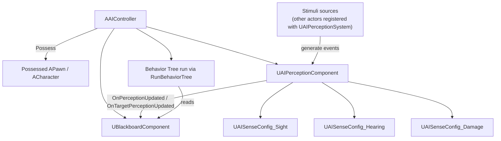

# AI controller and perception

`AAIController` is the non-player analog of `APlayerController` — it possesses a pawn and is the thing
that actually issues `MoveTo` calls and runs the Behavior Tree. `UAIPerceptionComponent` is how that
controller learns about the world instead of cheating by reading actor state directly. Wire the two
together wrong — perception on the pawn instead of the controller, or a stimuli source that was never
registered — and the AI is blind while every debug draw claims it should be seeing you.

## Why this matters

Without `AAIController`, a pawn is inert — nothing possesses it, nothing runs its Behavior Tree, nothing
issues movement. Without `UAIPerceptionComponent`, "does the AI know about the player" has to be
answered with ad hoc distance and trace checks scattered through gameplay code, with no unified way to
express "was seen," "was heard," or "was recently damaged by," and no built-in forgetting/aging of
stale stimuli. The controller-perception pairing is what makes an AI pawn a controlled, sensing agent
rather than a script bolted onto a mesh.

## Mental model



Perception lives on the controller, not the pawn, because perception is a property of who's doing the
sensing (the AI), not what's being sensed physically. Stimuli sources (typically every relevant actor,
via `UAIPerceptionSystem::RegisterSource` or a `UAIPerceptionStimuliSourceComponent` on that actor) feed
events into the perception system; the component filters those events through its configured senses and
raises a delegate your controller (or a bound task) uses to update the blackboard, which is what the
Behavior Tree actually reasons over.

## The mechanics

### AAIController and possession

`AAIController::Possess(APawn*)` (usually triggered automatically for AI-controlled pawns via
`AIControllerClass` on the pawn, or explicitly by a spawner) hands control to the controller, which
gets `OnPossess` — the conventional place to start the Behavior Tree and grab the pawn's blackboard
reference:

```cpp title="MyAIController.h"
UCLASS()
class MYGAME_API AMyAIController : public AAIController
{
    GENERATED_BODY()

public:
    AMyAIController();

    virtual void OnPossess(APawn* InPawn) override;

protected:
    UPROPERTY(EditDefaultsOnly, Category = "AI")
    TObjectPtr<UBehaviorTree> BehaviorTreeAsset;

    UPROPERTY(VisibleAnywhere, Category = "AI")
    TObjectPtr<UAIPerceptionComponent> PerceptionComponent;

    UPROPERTY()
    TObjectPtr<UAISenseConfig_Sight> SightConfig;

    UFUNCTION()
    void OnTargetPerceptionUpdated(AActor* Actor, FAIStimulus Stimulus);
};
```

```cpp title="MyAIController.cpp"
AMyAIController::AMyAIController()
{
    PerceptionComponent = CreateDefaultSubobject<UAIPerceptionComponent>(TEXT("PerceptionComponent"));

    SightConfig = CreateDefaultSubobject<UAISenseConfig_Sight>(TEXT("SightConfig"));
    SightConfig->SightRadius = 1500.f;
    SightConfig->LoseSightRadius = 1800.f;
    SightConfig->PeripheralVisionAngleDegrees = 80.f;
    SightConfig->DetectionByAffiliation.bDetectEnemies = true;
    SightConfig->DetectionByAffiliation.bDetectNeutrals = true;

    PerceptionComponent->ConfigureSense(*SightConfig);
    PerceptionComponent->SetDominantSense(SightConfig->GetSenseImplementation());
}

void AMyAIController::OnPossess(APawn* InPawn)
{
    Super::OnPossess(InPawn);

    if (BehaviorTreeAsset)
    {
        RunBehaviorTree(BehaviorTreeAsset);
    }

    PerceptionComponent->OnTargetPerceptionUpdated.AddDynamic(this, &AMyAIController::OnTargetPerceptionUpdated);
}
```

`RunBehaviorTree(UBehaviorTree*)` both starts the tree and initializes the controller's
`UBlackboardComponent` from the tree's linked `UBlackboardData` asset — you don't create the blackboard
component yourself for the common case.

### UAIPerceptionComponent and sense configs

Each sense you want (`UAISenseConfig_Sight`, `UAISenseConfig_Hearing`, `UAISenseConfig_Damage`, and
others) is created once and registered via `ConfigureSense`. Every config exposes tuning specific to
that sense:

- **Sight** — `SightRadius`, `LoseSightRadius` (hysteresis so a target doesn't flicker in/out at the
  boundary), `PeripheralVisionAngleDegrees`, `DetectionByAffiliation` (friendly/neutral/enemy filters).
- **Hearing** — `HearingRange`, plus affiliation filtering; hearing events are reported explicitly by
  gameplay code (footsteps, gunfire) via `UAISense_Hearing::ReportNoiseEvent`, not derived automatically
  from actor movement.
- **Damage** — no range at all; it's an event feed. Gameplay code calls
  `UAISense_Damage::ReportDamageEvent` (static, world-context) whenever damage occurs, and every AI with
  a Damage sense configured receives a stimulus for it regardless of distance.

```cpp title="Reporting a noise event so hearing-configured AI can react"
UAISense_Hearing::ReportNoiseEvent(GetWorld(), GetActorLocation(), /*Loudness=*/1.f, this, /*MaxRange=*/0.f, NAME_None);
```

```cpp title="Reporting damage so Damage-sense AI can react"
UAISense_Damage::ReportDamageEvent(GetWorld(), DamagedActor, InstigatorActor, DamageAmount, EventLocation, HitLocation);
```

### The perception-updated delegate and blackboard wiring

`UAIPerceptionComponent` exposes two delegates: `OnPerceptionUpdated` (fires with every actor whose
stimuli changed this update) and `OnTargetPerceptionUpdated` (fires once per actor/stimulus pair — the
more common one to bind for "did I just see/hear/get hit by this specific actor"). The conventional
pattern is to translate that delegate into blackboard writes, which is what lets the Behavior Tree react
without knowing anything about perception internals:

```cpp title="Translating a perception event into blackboard state"
void AMyAIController::OnTargetPerceptionUpdated(AActor* Actor, FAIStimulus Stimulus)
{
    UBlackboardComponent* BB = GetBlackboardComponent();
    if (!BB || !Actor)
    {
        return;
    }

    if (Stimulus.WasSuccessfullySensed())
    {
        BB->SetValueAsObject(TEXT("TargetActor"), Actor);
        BB->SetValueAsBool(TEXT("HasTarget"), true);
    }
    else
    {
        // Stimulus expired or the target moved out of sense range.
        BB->SetValueAsBool(TEXT("HasTarget"), false);
    }
}
```

`FAIStimulus::WasSuccessfullySensed()` distinguishes "this is a fresh positive detection" from "this
sense just lost the target" — both fire the same delegate, and treating them identically is a common
source of an AI that "forgets" a target it's still actively looking at, or never lets go of one it lost.

## See also

- [Behavior trees and the blackboard](./behavior-trees-and-blackboard.md) — the blackboard keys this
  delegate writes to are exactly what decorators and services read.
- [Navigation and the navmesh](./navigation-and-navmesh.md) — `MoveTo` on this controller resolves
  against the navmesh described there.
- [State tree](./state-tree.md) — perception wiring into a blackboard applies equally when a StateTree
  drives the AI instead of a Behavior Tree.
- [Epic — AI Perception](https://dev.epicgames.com/documentation/unreal-engine/ai-perception-in-unreal-engine)
- [Epic — AAIController](https://dev.epicgames.com/documentation/unreal-engine/API/Runtime/AIModule/AAIController)
