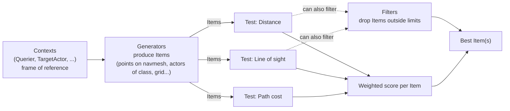

# Environment query system

A Behavior Tree decorator can ask "is there a target?" but it can't cheaply ask "which of these fifty
points around me is the best place to take cover from that target?" — that's a search problem, and the
Environment Query System (EQS) exists specifically to answer it: generate a set of candidate items,
score and filter them against multiple weighted tests, and hand back the best one. Reach for a
hand-rolled loop over `GetAllActorsOfClass` instead, and you've rebuilt EQS badly and without its
editor-side visualization.

## Why this matters

Spatial reasoning — "best cover point," "closest reachable pickup," "safest retreat direction" — needs
to consider many candidates and weigh several criteria against each other (distance, line of sight,
cost to path there). Doing that inline in a task or decorator means hand-writing generation, scoring,
and normalization every time, and losing the in-editor test visualization that makes EQS debuggable. A
query is authored once as a `UEnvQuery` asset and reused across as many Behavior Trees or C++ call
sites as need that same reasoning.

## Mental model



An EQS query never "runs a loop you write" — it declaratively generates a candidate set (Items), then
applies each Test in the order you configured to filter out invalid items and add a weighted score to
the survivors. A Context (usually the querier itself, or a target actor from a blackboard key) gives
Generators and Tests a frame of reference — "distance to what," "line of sight from what."

## The mechanics

### Generators

A `UEnvQueryGenerator` produces the initial item set — points on a grid around a context, points on the
navmesh, all actors of a given class within a radius, points along a path. `ItemType`
(`TSubclassOf<UEnvQueryItemType>`) declares what kind of item the generator produces (point vs. actor),
which in turn constrains which Tests are valid for that query option — a Test written against actor
items can't run against a generator that only produces points.

### Tests

Each `UEnvQueryTest` has a **purpose** (`EEnvTestPurpose`): filter only, score only, or both. Filtering
tests drop items outside `FloatValueMin`/`FloatValueMax` bounds (or a boolean match). Scoring tests
normalize the raw value against a clamp range, apply a `ScoringEquation` shape (linear, square,
inverse-linear, and so on), then multiply by `ScoringFactor` — that factor is your per-test weight, and
it's the main knob for "make line-of-sight matter more than distance."

`Cost` (`EEnvTestCost`) on a test is a hint to the query optimizer, not a gameplay cost — it lets
`bAutoSortTests` on the generator reorder tests to run cheap filters before expensive ones (e.g. a
cheap distance filter before an expensive line-of-sight trace), which matters because a filtering test
that runs early can eliminate items before an expensive test ever touches them.

### Running a query

The overwhelmingly common path is a Behavior Tree task:

```cpp title="A BT task node configured to run an EQS query"
// UBTTask_RunEQSQuery is built-in — you set the UEnvQuery asset, the run mode
// (single best item / all matching / random-among-best), and which Blackboard
// key receives the result, entirely from the node's editor details panel.
```

From C++, `UEnvQueryManager` is the entry point when you need a query outside a Behavior Tree — a
utility AI scorer, a spawn-point picker, a one-off "find me a spot" call:

```cpp title="Running an EQS query directly from C++"
void AEnemySpawner::FindSpawnPoint()
{
    if (!SpawnPointQuery)
    {
        return;
    }

    FEnvQueryRequest Request(SpawnPointQuery, this);
    Request.SetFloatParam(TEXT("SearchRadius"), 1500.f);

    Request.Execute(EEnvQueryRunMode::SingleResult, this, &AEnemySpawner::OnSpawnPointQueryFinished);
}

void AEnemySpawner::OnSpawnPointQueryFinished(TSharedPtr<FEnvQueryResult> Result)
{
    if (!Result.IsValid() || Result->IsFailed())
    {
        return;
    }

    const FVector SpawnLocation = Result->GetItemAsLocation(0);
    // ... spawn at SpawnLocation
}
```

```cpp title="AEnemySpawner.h — the relevant members"
UPROPERTY(EditDefaultsOnly, Category = "AI")
TObjectPtr<UEnvQuery> SpawnPointQuery;
```

### Cost profile

EQS is not free, and it's not meant to run every tick. A single query evaluates every generated item
against every configured test — a hundred candidate points times three tests is three hundred
evaluations, some of which (line-of-sight traces, navmesh path cost) are themselves expensive. Queries
default to running asynchronously across frames (`bAutoSortTests`, plus the query manager's own
time-slicing) specifically because a synchronous full-cost query on a large item set would spike a
frame. Keep generator item counts as small as the gameplay need allows, put cheap filtering tests
first, and don't run an expensive query every tick from a Service — a BT task triggered on a state
change, or an interval-gated Service, is the usual pattern.

:::warning FEnvQueryRequest::Execute is asynchronous
`Execute` queues the query; the callback fires later, not on the same call stack. Don't assume the
result is available immediately after calling `Execute`, and don't call it from code that expects a
synchronous return — that's what `RunInstantQuery` (synchronous, no time-slicing) exists for, and it
should be reserved for cases where you've confirmed the query is cheap enough to justify blocking.
:::

:::note
Not confirmed against 5.7 in the sources consulted — verify the exact synchronous helper name
(`UEnvQueryManager::RunInstantQuery` vs. an equivalent) against your engine version before shipping code
that depends on it.
:::

## See also

- [Navigation and the navmesh](./navigation-and-navmesh.md) — many generators (points on navmesh, path
  generators) sample the navmesh directly, and their cost is bounded by the same tile data.
- [Behavior trees and the blackboard](./behavior-trees-and-blackboard.md) — `UBTTask_RunEQSQuery` is
  how most projects invoke EQS, writing the winning item to a blackboard key.
- [Epic — Environment Query System](https://dev.epicgames.com/documentation/unreal-engine/environment-query-system-in-unreal-engine)
- [Epic — EQS Test Reference](https://dev.epicgames.com/documentation/unreal-engine/environment-query-system-tests-in-unreal-engine)

