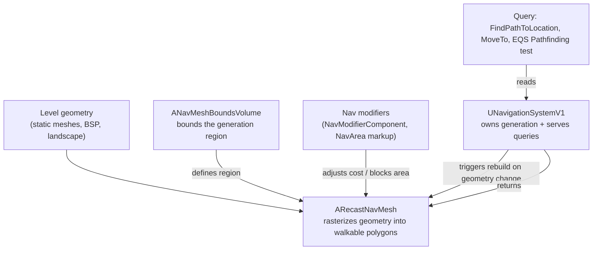

# Navigation and the navmesh

Every AI move-to call, every EQS pathfinding test, every `MoveTo` on an `AAIController` ultimately
resolves against a navmesh that Recast built from your level geometry. If that navmesh doesn't exist,
doesn't cover the area you expect, or doesn't match the pawn's collision shape, pathfinding fails
silently or agents get stuck — not with a crash, just a `MoveTo` that returns `EPathFollowingRequestResult::Failed`
and nobody knows why until they turn on the navigation debug display.

## Why this matters

Pathfinding in Unreal isn't a per-AI computation over the raw level geometry — it's a query against a
prebuilt spatial index, `ARecastNavMesh`, that approximates walkable surfaces as a mesh of navigable
polygons. That index has to be generated (once, or continuously), bounded to a volume, and built for
specific agent dimensions. Skipping any of those steps means agents that can't find paths, paths that
cut through geometry they shouldn't, or navigation that update lags behind a level that changes at
runtime.

## Mental model



The navmesh is not the level — it's a derived, agent-shaped approximation of the level, owned and
rebuilt by `UNavigationSystemV1`. You place the bounds, mark up special areas, and the system generates
(and, in dynamic mode, regenerates) the polygons behind the scenes; your code and Behavior Trees only
ever talk to `UNavigationSystemV1` or the higher-level move functions built on it, never to the raw
mesh data.

## The mechanics

### ANavMeshBoundsVolume

Nothing gets generated outside an `ANavMeshBoundsVolume`. Drop one in the level, scale its brush to
cover every area AI needs to path through, and the navigation system rasterizes only inside that
volume. A level with no bounds volume has no navmesh at all — `MoveTo` calls fail everywhere, which is
the single most common "why isn't my AI moving" bug in a fresh project.

:::caution[Bounds volumes don't overlap-merge visually]
Multiple `ANavMeshBoundsVolume` actors can coexist and their generated regions simply union — there's no
need for one giant volume. Keep them tight around actual play space; an oversized volume costs
generation time and memory for empty space no agent will ever stand in.
:::

### Static vs. dynamic generation

`ARecastNavMesh` has a `RuntimeGeneration` setting (`ERuntimeGenerationType`):

- **Static** — the navmesh is baked at editor time and shipped with the level. Cheapest at runtime,
  but any geometry that moves or spawns after the bake (destructible walls, spawned buildings) will not
  affect it.
- **Dynamic** — the navmesh rebuilds incrementally at runtime as geometry that affects navigation
  changes (an actor with a nav-relevant collision component moves, is added, or is destroyed). This is
  what most projects with any runtime level change need, and it's the default for projects generated
  from recent templates.

:::note
There is also a "Dynamic Modifiers Only" mode that rebuilds for nav modifier changes but not full
geometry changes — treat that as an optimization, not the default, unless you've confirmed it covers
your gameplay.
:::

Dynamic generation isn't free: every actor that can invalidate the mesh (moving platform, spawned
prop) triggers an async rebuild of the affected tile. If you have many independently moving
nav-relevant actors, tile rebuild cost adds up — this is the navigation system's own cost profile, and
it's worth watching in `stat AI` / navigation debug tools on a busy level.

### Nav modifiers and nav areas

Not every walkable surface should cost the same to path across, and not every volume should be
walkable at all. `UNavAreaBase` subclasses (e.g. `UNavArea_Default`, `UNavArea_Obstacle`, or your own)
carry a `DefaultCost` — pathfinding is a cost-minimization search, so a higher-cost area is still
traversable but avoided when a cheaper route exists, while an obstacle-flagged area is excluded
entirely.

You apply areas to the mesh two ways:

- **`UNavModifierComponent`** on an actor — marks the actor's collision as a nav modifier without
  needing a dedicated volume actor.
- **Nav modifier volumes** (`ANavModifierVolume`) — a placeable volume that stamps an area class over
  everything inside it, independent of any single actor's collision.

```cpp title="MySlowTerrainArea.h — a custom nav area with elevated cost"
UCLASS()
class MYGAME_API UNavArea_SlowTerrain : public UNavArea
{
    GENERATED_BODY()

public:
    UNavArea_SlowTerrain()
    {
        DefaultCost = 3.0f; // 3x as expensive to cross as UNavArea_Default
    }
};
```

```cpp title="Tagging an actor as a nav modifier in C++"
AMudPatch::AMudPatch()
{
    NavModifier = CreateDefaultSubobject<UNavModifierComponent>(TEXT("NavModifier"));
    NavModifier->AreaClass = UNavArea_SlowTerrain::StaticClass();
}
```

### Querying the navmesh: UNavigationSystemV1

`UNavigationSystemV1` is the subsystem every navigation query and rebuild routes through. The calls
you'll reach for most:

```cpp title="Common UNavigationSystemV1 queries"
if (UNavigationSystemV1* NavSys = UNavigationSystemV1::GetCurrent(GetWorld()))
{
    FNavLocation RandomPoint;
    NavSys->GetRandomReachablePointInRadius(Origin, SearchRadius, RandomPoint);

    FPathFindingQuery Query;
    const FPathFindingResult Result = NavSys->FindPathSync(Query);

    // Ask the navmesh what it thinks is nearby (used heavily by EQS generators):
    NavSys->GetNavDataForProps(NavAgentProperties);
}
```

Most gameplay code doesn't call this directly — `AAIController::MoveTo` and EQS pathfinding tests call
into it for you — but knowing it's there is what lets you debug "no path found" by checking whether the
navmesh even exists at that location (`Show > Navigation` in the editor viewport, or `stat nav`).

### Agent radius, height, and why they must match your capsule

The navmesh isn't generated once and shared blindly — it's generated per **nav agent** (`FNavAgentPropertiesBase`
via `ARecastNavMesh`'s `AgentRadius` / `AgentHeight`, `AgentMaxSlope`, `AgentMaxStepHeight`), and each AI
character declares which agent config it uses through `UCharacterMovementComponent::NavAgentProps`
(defaulted from the character's capsule at spawn). If your pawn's capsule is 34 units radius but the
navmesh was generated for a 42-unit agent, the mesh will be conservatively wider than your pawn needs —
harmless in isolation, but it means your pawn can't path through gaps the mesh rejected for a wider
agent. The reverse — a navmesh generated too small for your capsule — lets the AI plan a path that its
own collision then can't physically walk, so it clips or gets stuck against geometry the path said was
clear.

:::warning[Capsule and navmesh agent radius must agree]
If you resize a character's capsule after the navmesh was baked (or you support multiple agent sizes —
a crouching state, a large enemy type), you need a matching navigation agent entry (`Project Settings >
Navigation Mesh > Supported Agents`) and, for static generation, a rebake. A mismatch doesn't error —
it just produces paths that don't fit the collision that will actually walk them.
:::

## See also

- [Behavior trees and the blackboard](./behavior-trees-and-blackboard.md) — where `MoveTo` tasks live.
- [Environment query system](./environment-query-system.md) — EQS generators frequently sample the
  navmesh directly (e.g. points-on-navmesh generators).
- [AI controller and perception](./ai-controller-and-perception.md) — `AAIController::MoveToLocation`
  is the usual entry point into navigation from gameplay code.
- [Character movement component](../05-input-and-movement/character-movement-component.md) — where
  `NavAgentProps` and the capsule that defines them live.
- [Epic — Navigation System in Unreal Engine](https://dev.epicgames.com/documentation/unreal-engine/navigation-system-in-unreal-engine)
- [Epic — Nav Mesh Areas](https://dev.epicgames.com/documentation/unreal-engine/navigation-mesh-areas-in-unreal-engine)

