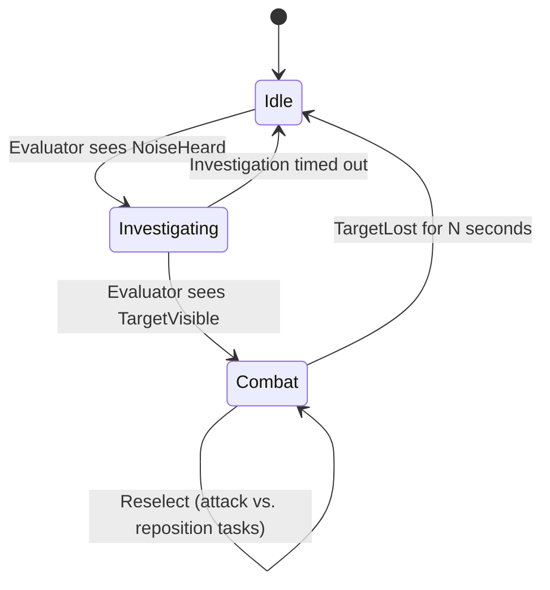

# StateTree

StateTree is Epic's newer general-purpose execution graph — a hierarchical state machine that borrows
the priority-selection idea from Behavior Trees but represents actual states and transitions instead of
an implicit "whichever branch wins this tick" structure. It isn't AI-specific (Mass AI Behavior builds
on it, and it's used for pure gameplay logic too), which is exactly why it doesn't automatically replace
Behavior Tree for every AI use case — picking between them by default instead of by fit is how you end
up fighting the wrong tool.

## Why this matters

A Behavior Tree re-evaluates from the root every relevant tick and expresses "what changed" through
decorator aborts — powerful, but the actual state your AI is "in" is implicit, reconstructed from which
leaf happens to be running. StateTree makes state explicit: you're always in exactly one active state
(or an active hierarchy of states), transitions are first-class conditions between named states, and
selection only re-runs the transition logic rather than the whole tree. That difference shows up
directly in debuggability — "what state is this AI in" is a real answer with StateTree, and an
inference with Behavior Tree.

## Mental model



Each state in that diagram owns its own Tasks (what to actually do while in this state — run to a
noise location, chase and attack) and its transitions are evaluated continuously by Evaluators and
Conditions that read external data (perception, blackboard-equivalent StateTree parameters) without
themselves being part of "doing" anything. Selection walks down from the root state, and at every level
can re-enter, stay in, or transition out of the current state based on those conditions — structurally
similar to a Behavior Tree's Selector-picks-highest-priority-child model, but the "currently active"
concept is a real state path, not an artifact of last tick's traversal.

## The mechanics

### States, tasks, transitions, evaluators

- **States** are named nodes in a tree, each with its own set of active Tasks and child states — a
  state can be a leaf that just runs tasks, or a parent whose active child is itself selected by
  transitions.
- **Tasks** (`FStateTreeTaskBase` derivatives) do the actual work while a state is active — analogous
  to a Behavior Tree task, including support for latent, multi-tick tasks (`EStateTreeRunStatus::Running`).
- **Transitions** are conditions attached to a state (or evaluated globally) that, when true, move
  execution to a different state — this replaces the decorator-abort mechanism with an explicit,
  named edge instead of an implicit interrupt.
- **Evaluators** (`FStateTreeEvaluatorBase`) run every tick regardless of which state is active, purely
  to compute or refresh data (distance to target, time since last seen) that transitions and tasks then
  read — the StateTree analog of a Behavior Tree Service, except evaluators are tree-wide rather than
  scoped to one subtree's active branch.

### The selection model

StateTree selection is a top-down pass: starting at the root, it checks whether the current state
should be exited (its transitions), and if so, walks to find the next state to enter — potentially
several levels deep if states are nested. Unlike a Behavior Tree's full re-traversal from the root every
tick, StateTree's steady-state cost while nothing changes is just re-checking the active state's own
transition conditions, not re-selecting through the whole hierarchy — part of why Epic positions it as
the more performance-friendly option for large agent counts (it's the selection layer Mass AI Behavior
uses).

### Running a StateTree from AI code

For AI actors driven by `AAIController`, StateTree usually runs through a component built for that
purpose rather than being embedded by hand:

```cpp title="MyAIController.h — running a StateTree instead of a Behavior Tree"
UPROPERTY(VisibleAnywhere, Category = "AI")
TObjectPtr<UStateTreeComponent> StateTreeComponent;
```

```cpp title="MyAIController.cpp"
AMyAIController::AMyAIController()
{
    StateTreeComponent = CreateDefaultSubobject<UStateTreeComponent>(TEXT("StateTreeComponent"));
}
```

You can also embed a StateTree as a single task inside an existing Behavior Tree
(`UBTTask_RunStateTree`, or `UBTTask_RunDynamicStateTree` for a tree selected at runtime) — a common
migration path is converting one troublesome subtree to StateTree without rewriting the whole AI.

:::note
Not confirmed against 5.7 in the sources consulted — verify `UStateTreeComponent`'s exact
initialization API (asset assignment, start/stop calls) against your engine version; the constructor
above shows the ownership pattern, not the full component contract.
:::

## When to pick StateTree over a Behavior Tree

An honest comparison, not a marketing one:

| | Behavior Tree | StateTree |
|---|---|---|
| Best fit | Reactive, priority-driven AI (attack the highest-priority threat available) | AI or gameplay logic with genuinely distinct phases/modes (patrol → investigate → combat → flee) |
| Debuggability | "Currently running leaf" is your best proxy for state | Explicit named active state, visible directly |
| Performance at scale | Re-traverses meaningful parts of the tree each relevant tick | Cheaper steady-state; used as Mass AI Behavior's selection layer for large populations |
| Ecosystem maturity | Mature — most existing AI tutorials, plugins, and shipped-game examples use it | Newer; fewer third-party examples, still gaining built-in task/condition coverage |
| Reuse outside AI | AI-specific | General-purpose — used for non-AI gameplay logic too |
| Team familiarity | Most UE engineers already know it | Steeper first-adoption cost if your team has years of BT muscle memory |

:::caution Don't switch for novelty
StateTree is not strictly better — it's a different shape for a different kind of logic. An AI that's
fundamentally "always chase the best target you can find" is a Behavior Tree problem (priority
selection over dynamic conditions); an AI that's fundamentally "I am in one of these five modes with
clear entry/exit conditions" is a StateTree problem. Porting a working Behavior Tree to StateTree purely
because it's newer costs you rewrite risk and a maturity downgrade in tooling/examples for no guaranteed
gain.
:::

## See also

- [Behavior trees and the blackboard](./behavior-trees-and-blackboard.md) — the model StateTree is
  most often compared against, including the abort mechanism StateTree replaces with transitions.
- [AI controller and perception](./ai-controller-and-perception.md) — perception wiring feeds
  Evaluators and transition Conditions the same way it feeds a Behavior Tree's blackboard.
- [Environment query system](./environment-query-system.md) — EQS queries can be invoked from a
  StateTree task the same way `UBTTask_RunEQSQuery` invokes one from a Behavior Tree.
- [Epic — StateTree Overview](https://dev.epicgames.com/documentation/unreal-engine/state-tree-in-unreal-engine)
- [Epic — Mass AI Behavior](https://dev.epicgames.com/documentation/unreal-engine/API/Plugins/MassAIBehavior)
