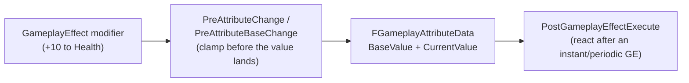

# Attributes and attribute sets

## Why this matters

Every number GAS reasons about — health, mana, armor, movement speed — is an attribute, and every
attribute lives on an `UAttributeSet`. Get the base/current value split wrong, or skip the clamping
hooks, and you get the classic GAS bug reports: health that goes negative, mana that regenerates past
its max, or a heal that "sticks" after the buff that granted it expires. None of this is enforced by the
compiler; it's enforced by you, in two specific virtual functions.

## Mental model



An `UAttributeSet` is a plain `UObject` (not a component) that a `UAbilitySystemComponent` owns and
registers. It groups related `FGameplayAttributeData` fields — one per attribute — and centralizes the
rules for how those fields may change. Nothing outside the attribute set should mutate an attribute's
value directly except through the ASC/GameplayEffect pipeline; the attribute set's own callbacks are
where you enforce that.

## Base value vs current value

`FGameplayAttributeData` (from `AttributeSet.h`) stores two floats, not one:

- **`GetBaseValue()` / `SetBaseValue()`** — the "permanent" value: what the attribute would be with no
  temporary modifiers applied. Instant Gameplay Effects (a heal, a one-time stat increase) change this.
- **`GetCurrentValue()` / `SetCurrentValue()`** — the value with all active modifiers folded in
  (buffs, debuffs, equipment). Duration and Infinite Gameplay Effects change this without touching the
  base value, so when the effect expires, the current value falls back toward the base automatically.

```cpp title="MyAttributeSet.h"
UCLASS()
class MYGAME_API UMyAttributeSet : public UAttributeSet
{
    GENERATED_BODY()

public:
    UPROPERTY(BlueprintReadOnly, Category = "Attributes", ReplicatedUsing = OnRep_Health)
    FGameplayAttributeData Health;
    ATTRIBUTE_ACCESSORS(UMyAttributeSet, Health)

    UPROPERTY(BlueprintReadOnly, Category = "Attributes", ReplicatedUsing = OnRep_MaxHealth)
    FGameplayAttributeData MaxHealth;
    ATTRIBUTE_ACCESSORS(UMyAttributeSet, MaxHealth)

    virtual void PreAttributeChange(const FGameplayAttribute& Attribute, float& NewValue) override;
    virtual void PostGameplayEffectExecute(const FGameplayEffectModCallbackData& Data) override;

protected:
    UFUNCTION()
    void OnRep_Health(const FGameplayAttributeData& OldHealth);

    UFUNCTION()
    void OnRep_MaxHealth(const FGameplayAttributeData& OldMaxHealth);
};
```

`ATTRIBUTE_ACCESSORS` is the standard macro (from `AttributeSet.h`) that expands into the
`GetHealthAttribute()`, `GetHealth()`, `SetHealth()`, and `InitHealth()` boilerplate every attribute
needs — write it once per attribute rather than hand-rolling four functions.

## PreAttributeChange vs PostGameplayEffectExecute

These two hooks look similar and do different jobs; mixing them up is the most common attribute-set bug.

- **`PreAttributeChange(const FGameplayAttribute& Attribute, float& NewValue)`** fires for *any* change to
  `CurrentValue` — from a duration/infinite modifier, from `SetCurrentValue`, from anywhere. Use it to
  clamp the incoming value before it's stored. It has no knowledge of *why* the value is changing, only
  that it is.
- **`PostGameplayEffectExecute(const FGameplayEffectModCallbackData& Data)`** fires only after an
  *instant* or *periodic* Gameplay Effect has executed a modifier against `BaseValue`. This is where you
  react to the change having already happened — clamp `BaseValue` into range, trigger death when Health
  reaches zero, or fire a Gameplay Cue.

```cpp title="MyAttributeSet.cpp"
void UMyAttributeSet::PreAttributeChange(const FGameplayAttribute& Attribute, float& NewValue)
{
    Super::PreAttributeChange(Attribute, NewValue);

    if (Attribute == GetHealthAttribute())
    {
        NewValue = FMath::Clamp(NewValue, 0.f, GetMaxHealth());
    }
}

void UMyAttributeSet::PostGameplayEffectExecute(const FGameplayEffectModCallbackData& Data)
{
    Super::PostGameplayEffectExecute(Data);

    if (Data.EvaluatedData.Attribute == GetHealthAttribute())
    {
        SetHealth(FMath::Clamp(GetHealth(), 0.f, GetMaxHealth()));

        if (GetHealth() <= 0.f)
        {
            // Route to a death-handling ability/event rather than killing the actor here directly.
            Data.Target.GetAvatarActor()->Destroy();
        }
    }
}
```

Clamping in *both* places is intentional, not redundant: `PreAttributeChange` catches temporary
modifiers pushing `CurrentValue` out of range (a large shield buff spiking effective health above max),
while `PostGameplayEffectExecute` catches permanent changes to `BaseValue` from instant effects (a heal
that would otherwise overshoot `MaxHealth`).

## Registering attributes for replication

Attribute sets replicate through the owning actor, same as any other `UObject` with replicated
properties — declare `GetLifetimeReplicatedProps` and mark each attribute `ReplicatedUsing`:

```cpp title="MyAttributeSet.cpp — replication"
void UMyAttributeSet::GetLifetimeReplicatedProps(TArray<FLifetimeProperty>& OutLifetimeProps) const
{
    Super::GetLifetimeReplicatedProps(OutLifetimeProps);

    DOREPLIFETIME_CONDITION_NOTIFY(UMyAttributeSet, Health, COND_None, REPNOTIFY_Always);
    DOREPLIFETIME_CONDITION_NOTIFY(UMyAttributeSet, MaxHealth, COND_None, REPNOTIFY_Always);
}

void UMyAttributeSet::OnRep_Health(const FGameplayAttributeData& OldHealth)
{
    GAMEPLAYATTRIBUTE_REPNOTIFY(UMyAttributeSet, Health, OldHealth);
}
```

`GAMEPLAYATTRIBUTE_REPNOTIFY` tells the ASC's internal attribute aggregation about the replicated change
so client-side prediction can reconcile correctly — skipping it is a common source of "works on server,
desyncs on client" bugs.

## Gotchas

:::warning Never call SetHealth (or any attribute setter) from outside the attribute set/GameplayEffect pipeline
Setting an attribute directly from gameplay code bypasses `PreAttributeChange` clamping, doesn't go
through the ASC's aggregation, and won't replicate correctly. Route every attribute change through a
`UGameplayEffect`, even a trivial "instant, +N" one for programmer-triggered changes.
:::

:::caution PostGameplayEffectExecute does not fire for duration/infinite modifiers
It only fires for instant and periodic executions against `BaseValue`. If you need to react to a
duration-based buff changing `CurrentValue`, hook `PreAttributeChange` or bind to the ASC's
`GetGameplayAttributeValueChangeDelegate` instead — don't expect `PostGameplayEffectExecute` to catch it.
:::

## See also

- [Gameplay effects](./gameplay-effects.md) — what actually drives an attribute change.
- [GAS project setup](./gas-project-setup.md) — where the attribute set's owning ASC lives.
- [GAS C++ patterns](./gas-cpp-patterns.md) — the accessor macros and base-class patterns used above.
- [Epic — FGameplayAttributeData](https://dev.epicgames.com/documentation/unreal-engine/API/Plugins/GameplayAbilities/FGameplayAttributeData)

