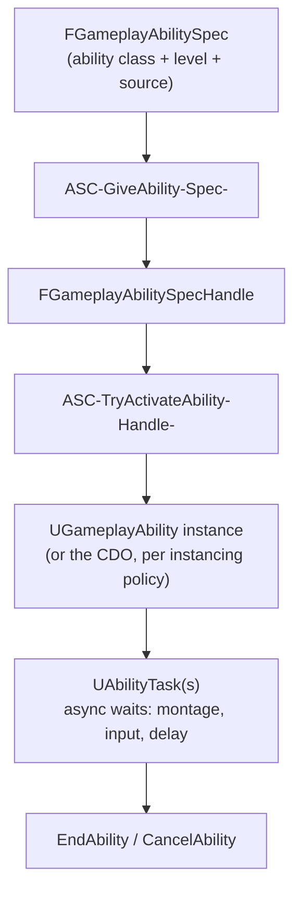

# Gameplay abilities

## Why this matters

`UGameplayAbility` is the unit of "a thing an actor can do" in GAS — a jump, a fireball, a dodge roll.
Abilities aren't called directly like normal functions; they're granted, then activated through the
`UAbilitySystemComponent`, and that indirection is what buys tag-gated activation, cooldowns, costs,
cancellation, and replication for free. Skip understanding the grant/activate split and instancing
policy, and abilities either silently refuse to activate or, worse, run duplicated logic on client and
server in ways that only show up under real network conditions.

## Mental model



Granting an ability creates an `FGameplayAbilitySpec` (which class, what level, who granted it) and
returns an `FGameplayAbilitySpecHandle` — a stable reference you keep around instead of a raw pointer,
because the underlying instance can change or not exist yet. Activation is a separate step, gated by tag
requirements, cooldown, and cost, and it's the ASC — not your gameplay code — that decides whether
activation is even attempted.

## Granting and activating

```cpp title="Granting an ability, typically in PossessedBy or a loadout system"
FGameplayAbilitySpec AbilitySpec(UFireballAbility::StaticClass(), /*Level=*/1, INDEX_NONE, this);
FGameplayAbilitySpecHandle Handle = AbilitySystemComponent->GiveAbility(AbilitySpec);
```

```cpp title="Activating by class or by tag"
AbilitySystemComponent->TryActivateAbilityByClass(UFireballAbility::StaticClass());

// Or, more commonly in input handling code, by a tag the ability declares:
FGameplayTagContainer AbilityTags;
AbilityTags.AddTag(FGameplayTag::RequestGameplayTag(FName("Ability.Fireball")));
AbilitySystemComponent->TryActivateAbilitiesByTag(AbilityTags);
```

`GiveAbility` must run on the server (or in single-player, wherever authority lives) — clients don't
grant themselves abilities. Activation, by contrast, can be requested from the client and replicated
through the ASC's prediction machinery, depending on the ability's net execution policy.

## Instancing policy

`UGameplayAbility` has an `InstancingPolicy` (`EGameplayAbilityInstancingPolicy`) that decides whether
activating the ability creates a new object or reuses a shared one:

| Policy | Behavior | When to use |
|---|---|---|
| `InstancedPerActor` | One instance per owning actor, reused across activations | Default choice; lets the ability hold per-activation state (a target actor, a charge count) safely |
| `InstancedPerExecution` | A fresh instance every activation | An ability that can run multiple overlapping instances concurrently on the same actor |
| `NonInstanced` | No instance at all — runs on the class default object | Cheapest option; only viable for fully stateless abilities with no `UAbilityTask` usage |

`NonInstanced` abilities cannot use `UAbilityTask`s (they need an owning `UObject` instance to bind
delegates to) and cannot hold member-variable state between calls — most real abilities beyond a trivial
instant effect end up `InstancedPerActor`.

```cpp title="FireballAbility.h"
UCLASS()
class MYGAME_API UFireballAbility : public UGameplayAbility
{
    GENERATED_BODY()

public:
    UFireballAbility()
    {
        InstancingPolicy = EGameplayAbilityInstancingPolicy::InstancedPerActor;
        NetExecutionPolicy = EGameplayAbilityNetExecutionPolicy::LocalPredicted;
    }

    virtual void ActivateAbility(const FGameplayAbilitySpecHandle Handle,
                                  const FGameplayAbilityActorInfo* ActorInfo,
                                  const FGameplayAbilityActivationInfo ActivationInfo,
                                  const FGameplayEventData* TriggerEventData) override;

    virtual bool CanActivateAbility(const FGameplayAbilitySpecHandle Handle,
                                     const FGameplayAbilityActorInfo* ActorInfo,
                                     const FGameplayTagContainer* SourceTags = nullptr,
                                     const FGameplayTagContainer* TargetTags = nullptr,
                                     FGameplayTagContainer* OptionalRelevantTags = nullptr) const override;
};
```

`NetExecutionPolicy` (`EGameplayAbilityNetExecutionPolicy`) controls where activation logic runs:
`LocalPredicted` (client predicts immediately, server confirms/corrects), `LocalOnly` (client only, never
replicated — UI-only abilities), `ServerInitiated` (server runs it, tells clients), and `ServerOnly`
(never runs on the owning client at all). `LocalPredicted` is the common choice for anything the player
needs to feel instant.

## Ability tasks

Real abilities are rarely a single synchronous function — waiting for an animation montage to hit a
notify, waiting for target confirmation, or waiting N seconds before applying a delayed effect all need
asynchronous waits without blocking the game thread. `UAbilityTask` (from the `GameplayTasks` module)
exists for exactly this: a task is created, bound to delegates, and activated inside `ActivateAbility`.

```cpp title="FireballAbility.cpp — activation using an ability task"
void UFireballAbility::ActivateAbility(const FGameplayAbilitySpecHandle Handle,
                                        const FGameplayAbilityActorInfo* ActorInfo,
                                        const FGameplayAbilityActivationInfo ActivationInfo,
                                        const FGameplayEventData* TriggerEventData)
{
    if (!CommitAbility(Handle, ActorInfo, ActivationInfo))
    {
        EndAbility(Handle, ActorInfo, ActivationInfo, /*bReplicateEndAbility=*/true, /*bWasCancelled=*/true);
        return;
    }

    UAbilityTask_WaitDelay* WaitTask = UAbilityTask_WaitDelay::WaitDelay(this, 0.5f);
    WaitTask->OnFinish.AddDynamic(this, &UFireballAbility::OnCastTimeElapsed);
    WaitTask->ReadyForActivation();
}

void UFireballAbility::OnCastTimeElapsed()
{
    // Apply the actual GameplayEffect here, then end the ability.
    EndAbility(CurrentSpecHandle, CurrentActorInfo, CurrentActivationInfo,
               /*bReplicateEndAbility=*/true, /*bWasCancelled=*/false);
}
```

`CommitAbility` is what actually deducts cost and starts cooldown — calling it separately from
`CanActivateAbility` lets you check affordability without committing, useful for UI graying-out.

## Cancellation

An ability ends one of three ways: it calls `EndAbility` itself (success or early exit),
`CancelAbility` is called on it externally (another ability blocks it via tag, or a stun interrupts it),
or the owning actor is destroyed. `SetCanBeCanceled(bool)` lets an ability opt out of external
cancellation for critical sections — but this only applies to instanced abilities, since `NonInstanced`
abilities have no per-activation state to protect.

## Gotchas

:::warning[CanActivateAbility must be pure — no side effects]
It's called speculatively, sometimes multiple times, including for UI queries that never actually
activate the ability. Any state mutation belongs in `ActivateAbility` after `CommitAbility` succeeds.
:::

:::caution[Forgetting to call EndAbility leaks the activation]
An ability that never calls `EndAbility` stays "active" forever from the ASC's point of view, keeps
blocking any tags it set as blocking, and — for `InstancedPerActor` abilities — permanently occupies that
instance's activation state. Every code path through `ActivateAbility`, including early-exit failure
paths, must reach `EndAbility` or `CancelAbility`.
:::

## See also

- [Gameplay effects](./gameplay-effects.md) — what an ability applies to change attributes and grant tags.
- [Gameplay tags](./gameplay-tags.md) — how tag requirements gate `CanActivateAbility`.
- [GAS replication and prediction](./gas-replication-and-prediction.md) — what `NetExecutionPolicy` actually buys you.
- [Epic — Ability Blueprint API reference](https://dev.epicgames.com/documentation/unreal-engine/BlueprintAPI/Ability)

