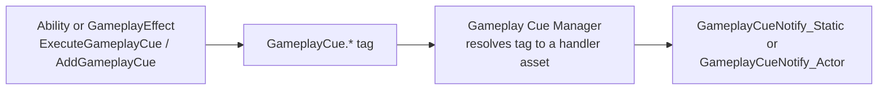

# Gameplay cues

## Why this matters

Gameplay Cues are how GAS keeps "what happened, mechanically" separate from "what it looks and sounds
like." Without them, the natural place to spawn a hit-flash particle or play a cast sound is inside the
ability or effect that caused it — which means every gameplay author also has to touch VFX code, and
every VFX tweak risks touching gameplay logic. A Gameplay Cue is triggered by a tag, not called directly,
so an artist can rework impact effects entirely without a gameplay programmer in the loop, and the same
cue can be triggered from C++, Blueprint, or a Gameplay Effect asset without caring which one did it.

## Mental model



The trigger never references a specific class — it only names a tag under the `GameplayCue.` root. The
Gameplay Cue Manager owns the mapping from tag to handler, so adding, removing, or reskinning a cue's
implementation is a data change, not a code change.

## Notify types: Static vs Actor

- **`UGameplayCueNotify_Static`** — a stateless handler with no spawned actor; its `OnExecute` runs a
  burst of logic (spawn a Niagara system, play a sound) and returns. Use this for one-shot cosmetics that
  don't need to persist or track state — most impact effects.
- **`AGameplayCueNotify_Actor`** — a real, spawned actor that can persist for the cue's `WhileActive`
  duration, useful for a looping effect (a burning aura, a channeling beam) that needs to track and clean
  up an ongoing visual over time. Costs more than Static — only reach for it when the cue genuinely needs
  actor lifetime.

## Execute vs Add/Remove

Gameplay Cues distinguish momentary and durational events:

- **Execute** — fire-and-forget, for an instant event (a hit landing, a cast completing). Calls the
  handler's execute path once; nothing persists afterward.
- **Add / Remove** (paired with **WhileActive**) — for a cue tied to a durational or infinite Gameplay
  Effect: Add fires when the effect is applied, WhileActive covers the period the effect remains active
  (used by `AGameplayCueNotify_Actor` to drive a looping visual), and Remove fires when the effect ends.

```cpp title="Executing a one-shot cue from an ability"
FGameplayCueParameters CueParams;
CueParams.Location = GetAvatarActorFromActorInfo()->GetActorLocation();
CueParams.Instigator = GetAvatarActorFromActorInfo();

AbilitySystemComponent->ExecuteGameplayCue(
    MyGameplayTags::GameplayCue_Fireball_Impact, CueParams);
```

```cpp title="A GameplayEffect that adds a cue for its duration"
UGE_BurningDebuff::UGE_BurningDebuff()
{
    DurationPolicy = EGameplayEffectDurationType::HasDuration;
    GameplayCues.Add(MyGameplayTags::GameplayCue_Burning); // Add on apply, Remove on expiry
}
```

```cpp title="MyGameplayCue_FireballImpact.h — a Static notify"
UCLASS()
class MYGAME_API UMyGameplayCue_FireballImpact : public UGameplayCueNotify_Static
{
    GENERATED_BODY()

public:
    virtual bool OnExecute_Implementation(AActor* Target, const FGameplayCueParameters& Parameters) const override;

protected:
    UPROPERTY(EditDefaultsOnly, Category = "Cue")
    TObjectPtr<UNiagaraSystem> ImpactEffect;

    UPROPERTY(EditDefaultsOnly, Category = "Cue")
    TObjectPtr<USoundBase> ImpactSound;
};
```

## The cosmetic-only rule

Gameplay Cues must never change gameplay state — no attribute writes, no ability grants, no tag changes
that anything else depends on. Their entire contract is "make the already-decided gameplay outcome
visible and audible." The reason is replication: Gameplay Cues are, by design, allowed to be locally
predicted and locally suppressed (e.g., not relevant to a distant client), so any gameplay effect hiding
inside one will run inconsistently between server and clients, or not at all for players who can't see
the cue.

## Gotchas

:::warning[Do not put gameplay logic in a GameplayCueNotify]
If a design need seems to require it ("the cue also needs to apply a slow effect"), that's a sign the
slow effect belongs in the Gameplay Effect or ability that triggered the cue, not in the cue itself. Keep
the cue's `OnExecute`/`OnActive`/`OnRemove` strictly presentational.
:::

:::caution[Static vs Actor is a real cost decision, not a style choice]
Defaulting every cue to `GameplayCueNotify_Actor` "just in case it needs to persist later" spawns and
replicates an actor for effects that don't need one. Start with `GameplayCueNotify_Static` and only
promote to `Actor` when a cue genuinely needs to track state across `WhileActive`.
:::

:::caution[Cue tags follow the same hierarchy discipline as any other gameplay tag]
A `GameplayCue.` tag with no matching registered notify silently does nothing — there's no compile-time
link between the tag used to trigger a cue and the notify asset registered to handle it. Verify new cue
tags actually resolve to a handler in the Gameplay Cue Manager, especially after a tag rename.
:::

## See also

- [Gameplay tags](./gameplay-tags.md) — the tag hierarchy that routes cues to handlers.
- [Gameplay effects](./gameplay-effects.md) — how durational effects add/remove cues automatically.
- [Gameplay abilities](./gameplay-abilities.md) — executing one-shot cues directly from ability logic.
- [Epic — Gameplay Cue Notify Blueprint API](https://dev.epicgames.com/documentation/unreal-engine/BlueprintAPI/GameplayCueNotify)

