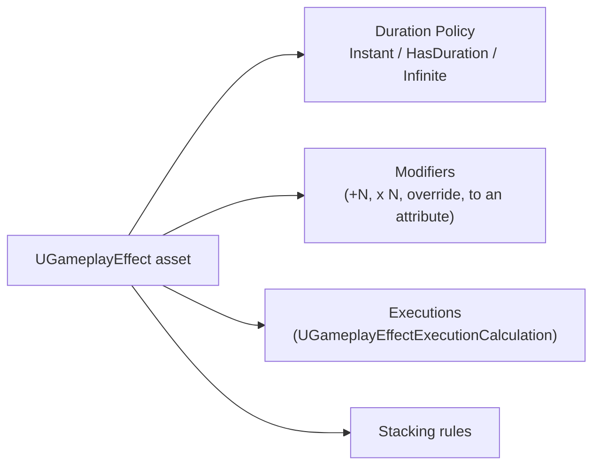

# Gameplay effects

## Why this matters

`UGameplayEffect` is how GAS expresses "something changed an attribute or a tag state" as data instead of
code — a heal, a damage-over-time, a stun, an armor buff are all the same class with different settings.
Almost every visible bug in a GAS game — damage that doesn't scale with stats, a buff that never expires,
a DOT that stacks wrong — traces back to a Gameplay Effect's duration policy, modifier type, or stacking
rule being misconfigured, not to broken C++. Understanding the handful of knobs here is most of what
debugging GAS combat actually is.

## Mental model



A Gameplay Effect is a bundle of independent settings, not a sequential pipeline — duration policy,
modifiers, executions, and stacking are configured together on one asset but each answers a different
question: *when* does it apply, *what* does it change, *how* is the amount computed, and *what happens*
if the same effect is applied again while already active.

## Duration policy: instant, duration, infinite

- **Instant** — applies once, permanently changes `BaseValue`, then is gone. No period to react to
  later; a one-shot heal or direct damage effect is Instant.
- **HasDuration** — applies modifiers to `CurrentValue` for a fixed time, then automatically removes
  itself and reverts them. A timed buff or debuff.
- **Infinite** — applies modifiers to `CurrentValue` indefinitely until something explicitly removes it
  (`RemoveActiveGameplayEffect` or a tag-based removal rule). A stance, an equipped-item bonus, a status
  that only clears when cured.

```cpp title="Defining an instant damage effect in C++"
UCLASS()
class MYGAME_API UGE_FireballDamage : public UGameplayEffect
{
    GENERATED_BODY()

public:
    UGE_FireballDamage()
    {
        DurationPolicy = EGameplayEffectDurationType::Instant;
    }
};
```

Most projects author the bulk of their Gameplay Effects as Blueprint assets deriving from a thin C++ base
(see [GAS C++ patterns](./gas-cpp-patterns.md)) rather than hand-writing modifiers in C++ — the
constructor above exists to lock in policy and any programmer-owned defaults, while designers configure
magnitudes in the editor.

## Modifiers and how magnitude is computed

A modifier targets one attribute with one operation — Add, Multiply, Divide, or Override — and the
*magnitude* of that operation can come from several sources
(`EGameplayEffectMagnitudeCalculation`): a flat scalar, a curve keyed on the effect's level, an attribute
capture from source or target (`AttributeBased`), or a fully custom calculation.

For anything beyond "flat number" or "scales with one other attribute linearly," you write a
**Modifier Magnitude Calculation (MMC)** — a `UGameplayModMagnitudeCalculation` subclass that computes a
single float from arbitrary captured attributes and effect context:

```cpp title="MMC_FireballDamage.h"
UCLASS()
class MYGAME_API UMMC_FireballDamage : public UGameplayModMagnitudeCalculation
{
    GENERATED_BODY()

public:
    UMMC_FireballDamage();

    virtual float CalculateBaseMagnitude_Implementation(const FGameplayEffectSpec& Spec) const override;

private:
    FGameplayEffectAttributeCaptureDefinition SpellPowerDef;
};
```

```cpp title="MMC_FireballDamage.cpp"
UMMC_FireballDamage::UMMC_FireballDamage()
{
    SpellPowerDef = FGameplayEffectAttributeCaptureDefinition(
        UMyAttributeSet::GetSpellPowerAttribute(),
        EGameplayEffectAttributeCaptureSource::Source,
        /*bSnapshot=*/true);

    RelevantAttributesToCapture.Add(SpellPowerDef);
}

float UMMC_FireballDamage::CalculateBaseMagnitude_Implementation(const FGameplayEffectSpec& Spec) const
{
    float SpellPower = 0.f;
    GetCapturedAttributeMagnitude(SpellPowerDef, Spec, Spec.CapturedRelevantAttributes, SpellPower);
    return SpellPower * 1.5f;
}
```

## Executions

An MMC computes one number for one modifier. A **Gameplay Effect Execution Calculation**
(`UGameplayEffectExecutionCalculation`) is the heavier tool: it can capture multiple attributes from both
source and target, and write to *several* attributes in one pass — the standard choice for a damage
formula that reads attack power and armor and writes to both health and a threat/aggro attribute in one
step. Use an MMC when you need one custom number; use an execution when the effect needs to touch more
than one attribute or read from both source and target simultaneously.

## Periodic effects

A `HasDuration` or `Infinite` effect can also tick — `Period` set to a nonzero value re-executes the
effect's modifiers/execution every interval, which is how damage-over-time and health regeneration are
built. `PeriodicInhibitionPolicy` controls what happens to the tick schedule while the effect is
inhibited (e.g., blocked by an immunity effect) mid-duration.

## Stacking

When the same Gameplay Effect is applied to a target that already has it active, `StackingType`
(`EGameplayEffectStackingType`) decides what happens: `None` (each application is independent, all
coexist), `AggregateBySource` (stacks per applying source, e.g. multiple casters' DOTs stack
separately), or `AggregateByTarget` (one stack shared regardless of source). `StackLimitCount` caps how
high it can go, and `EGameplayEffectStackingPeriodPolicy` decides whether a new stack resets the periodic
tick timer or lets the existing one keep running.

```cpp title="A simple stacking DOT"
UGE_PoisonDOT::UGE_PoisonDOT()
{
    DurationPolicy = EGameplayEffectDurationType::HasDuration;
    Period = 1.0f;
    StackingType = EGameplayEffectStackingType::AggregateByTarget;
    StackLimitCount = 5;
}
```

## Gotchas

:::warning[Instant effects cannot modify CurrentValue-only state]
Instant effects write to `BaseValue` directly — there's no "current" for them to expire out of. If you
need a temporary change that reverts automatically, it must be `HasDuration` or `Infinite`, not `Instant`
with a manual timer bolted on.
:::

:::caution[Snapshot vs non-snapshot attribute capture changes behavior under buffs]
`bSnapshot = true` on an `FGameplayEffectAttributeCaptureDefinition` captures the attribute's value at
*application* time; `false` re-reads it live every time the effect executes (relevant for periodic
effects). A DOT that should scale with the caster's *current* spell power, not their power when the DOT
was first applied, needs `bSnapshot = false`.
:::

:::caution[Stacking policy defaults can silently produce unlimited stacks]
Without an explicit `StackLimitCount`, a stackable effect applied repeatedly (e.g., by a fast-ticking
aura) can accumulate without bound. Always set a limit deliberately, even a generous one.
:::

## See also

- [Attributes and attribute sets](./attributes-and-attribute-sets.md) — what modifiers actually change.
- [Gameplay abilities](./gameplay-abilities.md) — what applies effects in the first place.
- [Gameplay tags](./gameplay-tags.md) — how effects grant and require tags.
- [Epic — GameplayAbilities plugin API index](https://dev.epicgames.com/documentation/unreal-engine/API/Plugins/GameplayAbilities)

