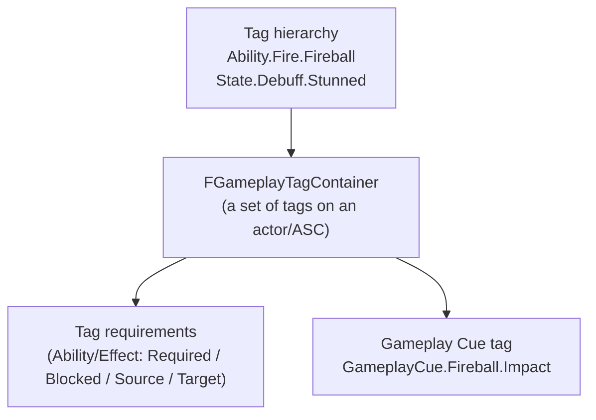

# Gameplay tags

## Why this matters

Gameplay tags are the glue that lets abilities, effects, animation, AI, and UI all agree on "this actor
is stunned" or "this ability is a fire spell" without any of those systems including each other's
headers. GAS leans on tags more than almost any other UE5 system: ability activation requirements, effect
application blocking, Gameplay Cue routing, and stacking policy all key off tag containers. A GAS
codebase with an undisciplined tag hierarchy — inconsistent naming, tags created ad hoc in Blueprint,
no central registry — becomes impossible to reason about, because "what actually has this tag and why"
stops being answerable by reading code.

## Mental model



A single `FGameplayTag` is a dot-separated hierarchical name (`State.Debuff.Stunned`) that supports
partial matching — a query for `State.Debuff` matches anything under it, including
`State.Debuff.Stunned`. An `FGameplayTagContainer` is just a set of tags; the ASC keeps one for the
tags an actor currently "has" (granted by active effects, or added directly), and abilities/effects each
carry their own containers describing what tags they require, block, or grant.

## Declaring native tags

Hard-coding tag strings (`FGameplayTag::RequestGameplayTag(FName("State.Debuff.Stunned"))`) scattered
through a codebase is fragile — a typo compiles fine and fails silently at runtime. The standard fix is
**native gameplay tags**: declare them once in C++ so they're available as compile-time-checked symbols
and so `AddNativeGameplayTag` registers them with the tag manager during startup, before any
config-defined tags load.

```cpp title="MyGameplayTags.h"
#pragma once

#include "NativeGameplayTags.h"

namespace MyGameplayTags
{
    UE_DECLARE_GAMEPLAY_TAG_EXTERN(Ability_Fireball)
    UE_DECLARE_GAMEPLAY_TAG_EXTERN(State_Debuff_Stunned)
    UE_DECLARE_GAMEPLAY_TAG_EXTERN(GameplayCue_Fireball_Impact)
}
```

```cpp title="MyGameplayTags.cpp"
#include "MyGameplayTags.h"

namespace MyGameplayTags
{
    UE_DEFINE_GAMEPLAY_TAG(Ability_Fireball, "Ability.Fireball")
    UE_DEFINE_GAMEPLAY_TAG(State_Debuff_Stunned, "State.Debuff.Stunned")
    UE_DEFINE_GAMEPLAY_TAG(GameplayCue_Fireball_Impact, "GameplayCue.Fireball.Impact")
}
```

```cpp title="Using a native tag"
if (AbilitySystemComponent->HasMatchingGameplayTag(MyGameplayTags::State_Debuff_Stunned))
{
    // Blocked while stunned.
}
```

Tags used only from data (a designer-authored Gameplay Effect asset picking a tag from a dropdown) don't
need a native declaration — they just need to exist somewhere the tag manager can see them, which is
what config registration is for.

## Config registration

Tags can also be defined in `Config/DefaultGameplayTags.ini`, which is how most projects seed tags that
designers will reference from Blueprint/data assets without programmer involvement:

```ini title="Config/DefaultGameplayTags.ini"
[/Script/GameplayTags.GameplayTagsSettings]
GameplayTagList=(Tag="Ability.Fireball",DevComment="Player-castable fire projectile")
GameplayTagList=(Tag="State.Debuff.Stunned",DevComment="Blocks ability activation while active")
GameplayTagList=(Tag="GameplayCue.Fireball.Impact",DevComment="Impact VFX/SFX cue")
```

Native and config-registered tags coexist in the same hierarchy — a tag declared natively in C++ and one
typed into this `.ini` file both resolve to the same `FGameplayTag` if the string matches. Most
established GAS codebases declare the tags gameplay *code* needs to check natively, and let purely
cosmetic or designer-only tags (many Gameplay Cue leaves, for instance) live in config or be created
inline in the tag picker.

## Tag requirements on abilities and effects

`UGameplayAbility` exposes tag containers used by `CanActivateAbility` without you writing the check
yourself: `ActivationRequiredTags` (owner must have all of these), `ActivationBlockedTags` (owner must
have none of these), plus source/target tag requirements. `UGameplayEffect` has the equivalent through
its Gameplay Effect Components — `UTargetTagRequirementsGameplayEffectComponent` for whether the effect
can apply or execute based on the target's tags, and `UTargetTagsGameplayEffectComponent` for which tags
the effect grants to the target while active.

```cpp title="FireballAbility.h — declaring tag requirements"
UFireballAbility::UFireballAbility()
{
    FGameplayTagContainer BlockedTags;
    BlockedTags.AddTag(MyGameplayTags::State_Debuff_Stunned);
    SetAssetTags(FGameplayTagContainer(MyGameplayTags::Ability_Fireball));
    ActivationBlockedTags = BlockedTags;
}
```

With this in place, a stunned actor's `TryActivateAbility` for Fireball simply fails at
`CanActivateAbility` — no manual `if (IsStunned())` check needed anywhere in the ability's own logic.

## Tag queries

For requirements more complex than "has all of / has none of," `FGameplayTagQuery` supports boolean
expressions (AllOf, AnyOf, NoneOf, nested) built via `FGameplayTagQueryExpression`. Reach for a query
only when a plain required/blocked container genuinely can't express the condition — most ability and
effect tag gating never needs one.

## Gotchas

:::warning[Tag hierarchy naming is a one-way door]
Renaming a tag (`Status.Stunned` to `State.Debuff.Stunned`) breaks every Blueprint asset, config entry,
and data table row that references the old string, since tags are matched by name, not by a stable ID.
Settle on a naming convention (a root per category — `Ability.`, `State.`, `GameplayCue.`, `Event.`)
before content production starts, not after.
:::

:::caution[Partial tag matching means broad tags block more than you expect]
A container check against `State.Debuff` matches every tag under it. An ability blocked by a broad tag
like `State` (rather than the specific `State.Debuff.Stunned`) will also block on tags you didn't intend,
like `State.Buff.Shielded`. Write requirements against the most specific tag that expresses the intent.
:::

## See also

- [Gameplay abilities](./gameplay-abilities.md) — where `ActivationRequiredTags`/`ActivationBlockedTags` are checked.
- [Gameplay effects](./gameplay-effects.md) — how effects grant and require tags via Gameplay Effect Components.
- [Gameplay cues](./gameplay-cues.md) — tags as the routing key for cosmetic effects.
- [GAS C++ patterns](./gas-cpp-patterns.md) — organizing native tag declarations at project scale.
- [Epic — FGameplayTag API reference](https://dev.epicgames.com/documentation/unreal-engine/API/Runtime/GameplayTags/FGameplayTag)

