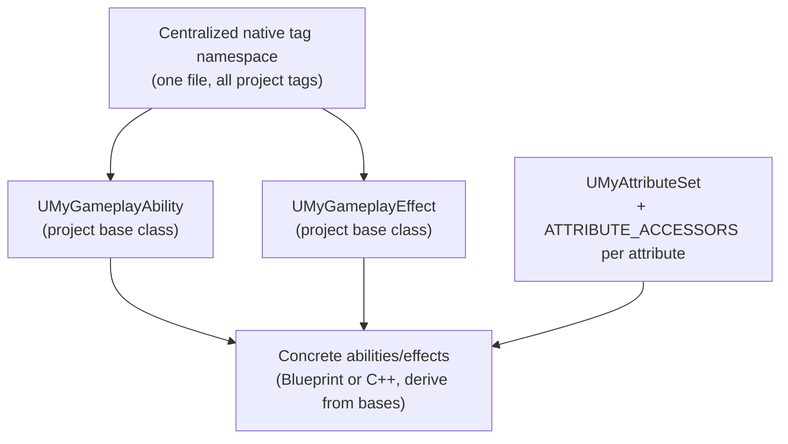

# GAS C++ patterns

## Why this matters

GAS gives you enough rope to build something unmaintainable: tag strings typed inline everywhere,
attribute accessors hand-rolled with subtle inconsistencies, ability and effect classes with no shared
base to enforce project conventions. None of this is enforced by the framework — it's enforced by the
patterns your codebase adopts early. A GAS project that skips this structure doesn't fail immediately; it
fails eighteen months in, when nobody can tell which of forty ability subclasses actually implements the
project's cooldown-display convention.

## Mental model



The pattern across all of these is the same: put the project-wide decision in exactly one place (a tag
namespace, a base class), and make every leaf ability/effect inherit or reference it instead of
re-deciding it. This is ordinary C++ hygiene — GAS just has more places where skipping it is tempting
because the editor lets designers create a new Blueprint ability without ever touching a base class.

## Native tag declaration, centralized

Scatter tag string literals across ability and effect classes and you get typos that compile fine and
fail silently at runtime. Declare every tag your C++ code checks in one header, using the project's tag
convention as the namespace structure:

```cpp title="MyGameplayTags.h — one file, every tag gameplay code checks"
#pragma once
#include "NativeGameplayTags.h"

namespace MyGameplayTags
{
    // Ability.*
    UE_DECLARE_GAMEPLAY_TAG_EXTERN(Ability_Fireball)
    UE_DECLARE_GAMEPLAY_TAG_EXTERN(Ability_Dodge)

    // State.*
    UE_DECLARE_GAMEPLAY_TAG_EXTERN(State_Debuff_Stunned)
    UE_DECLARE_GAMEPLAY_TAG_EXTERN(State_Cooldown_Fireball)
}
```

Designer-only, purely cosmetic tags (many `GameplayCue.` leaves) don't need a native entry — reserve
native declarations for tags gameplay *code* branches on, so the header stays a map of "what C++ actually
checks," not a duplicate of the entire project tag list.

## Ability and effect base classes

A thin project base class is where you enforce conventions once instead of per-leaf: a common cooldown
tag pattern, a standard `NetExecutionPolicy` default, a hook every ability logs through.

```cpp title="MyGameplayAbility.h — project base class"
UCLASS(Abstract)
class MYGAME_API UMyGameplayAbility : public UGameplayAbility
{
    GENERATED_BODY()

public:
    UMyGameplayAbility()
    {
        InstancingPolicy = EGameplayAbilityInstancingPolicy::InstancedPerActor;
        NetExecutionPolicy = EGameplayAbilityNetExecutionPolicy::LocalPredicted;
    }

protected:
    // Every project ability ends through this, so cleanup/logging happens exactly once.
    virtual void EndAbility(const FGameplayAbilitySpecHandle Handle,
                             const FGameplayAbilityActorInfo* ActorInfo,
                             const FGameplayAbilityActivationInfo ActivationInfo,
                             bool bReplicateEndAbility, bool bWasCancelled) override
    {
        UE_LOG(LogTemp, Verbose, TEXT("Ability %s ended (cancelled=%d)"), *GetName(), bWasCancelled);
        Super::EndAbility(Handle, ActorInfo, ActivationInfo, bReplicateEndAbility, bWasCancelled);
    }
};
```

```cpp title="MyGameplayEffect.h — project base class"
UCLASS(Abstract)
class MYGAME_API UMyGameplayEffect : public UGameplayEffect
{
    GENERATED_BODY()

public:
    UMyGameplayEffect()
    {
        // Project-wide default; leaf effects override only when they need to.
        DurationPolicy = EGameplayEffectDurationType::Instant;
    }
};
```

Concrete abilities and effects — whether authored in C++ or as Blueprint assets — derive from these
bases instead of the raw engine classes, so a project-wide policy change (say, switching the default
instancing policy) happens in one file.

## Attribute accessor macros

`AttributeSet.h` ships `ATTRIBUTE_ACCESSORS`, which expands to the getter/setter/init boilerplate every
attribute needs. Use it for every attribute without exception — hand-writing these is how one attribute
in forty ends up missing its `Init` function or using an inconsistent name:

```cpp title="MyAttributeSet.h"
#define ATTRIBUTE_ACCESSORS(ClassName, PropertyName) \
    GAMEPLAYATTRIBUTE_PROPERTY_GETTER(ClassName, PropertyName) \
    GAMEPLAYATTRIBUTE_VALUE_GETTER(PropertyName) \
    GAMEPLAYATTRIBUTE_VALUE_SETTER(PropertyName) \
    GAMEPLAYATTRIBUTE_VALUE_INITTER(PropertyName)

UCLASS()
class MYGAME_API UMyAttributeSet : public UAttributeSet
{
    GENERATED_BODY()

public:
    UPROPERTY(BlueprintReadOnly, ReplicatedUsing = OnRep_Health)
    FGameplayAttributeData Health;
    ATTRIBUTE_ACCESSORS(UMyAttributeSet, Health)

    UPROPERTY(BlueprintReadOnly, ReplicatedUsing = OnRep_Mana)
    FGameplayAttributeData Mana;
    ATTRIBUTE_ACCESSORS(UMyAttributeSet, Mana)
};
```

`ATTRIBUTE_ACCESSORS` itself is a standard macro provided in the engine's `AttributeSet.h` — the
expansion above is shown for clarity about what it actually generates; you include the header rather than
redefine the macro in project code.

## Avoiding designer-facing spaghetti

The editor makes it easy for a designer to create a new Blueprint ability or effect that skips every
project convention above — deriving straight from `UGameplayAbility` instead of the project base,
hard-coding a tag as a string in a Blueprint node instead of referencing a registered tag asset. Two
things keep this in check without blocking designers from working independently:

- **Mark the raw engine classes non-creatable where your project allows it**, or at minimum, document
  and enforce in review that new abilities/effects derive from the project base classes, not
  `UGameplayAbility`/`UGameplayEffect` directly.
- **Expose native tags to Blueprint as tag assets/pickers**, not as raw strings — a designer picking
  `Ability.Fireball` from a registered tag list can't typo it the way a free-text field allows.

## Gotchas

:::warning A missing project base class is a decision, not a shortcut
Skipping the base-class step because "we only have five abilities right now" means the sixth through
fortieth ability each individually decide instancing policy, net execution policy, and logging
convention — decide once, in one file, before the second ability ships.
:::

:::caution Don't let native tag declarations and config-registered tags drift into two sources of truth
If some tags live in `MyGameplayTags.h` and others only in `DefaultGameplayTags.ini` with no documented
rule for which goes where, newcomers guess wrong in both directions. State the rule explicitly: gameplay
code branches on it → native; purely data/designer-facing → config or in-editor tag creation.
:::

## See also

- [Gameplay tags](./gameplay-tags.md) — native declaration and config registration in full.
- [Attributes and attribute sets](./attributes-and-attribute-sets.md) — what `ATTRIBUTE_ACCESSORS` expands into and why it matters.
- [Gameplay abilities](./gameplay-abilities.md) — the base class settings (instancing, net execution policy) worth centralizing.
- [Coding standard and naming](../02-cpp-in-unreal/coding-standard-and-naming.md) — the project-wide naming rules this extends.
- [Epic — Gameplay Ability System for Unreal Engine](https://dev.epicgames.com/documentation/unreal-engine/gameplay-ability-system-for-unreal-engine)

