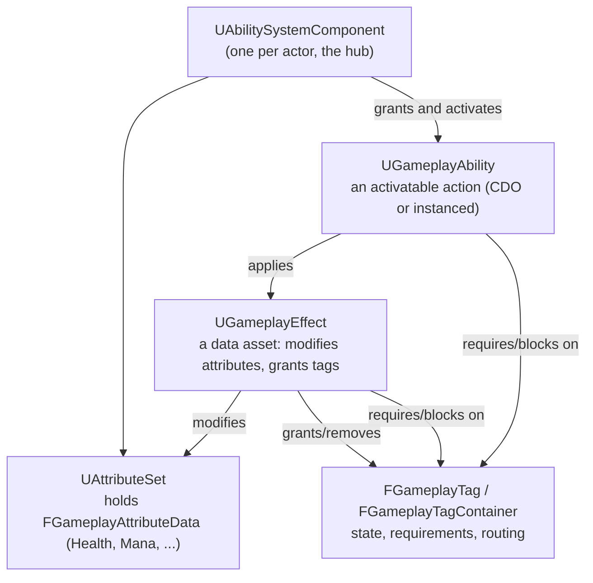

# Gameplay Ability System overview

## Why this matters

The Gameplay Ability System (GAS) is Epic's answer to "how do abilities, buffs, cooldowns, and damage
interact in a networked game" — the same problem every RPG, MOBA, and action game reinvents badly on its
own. Reaching for GAS by default, the way most projects reach for `ACharacter` by default, is the wrong
instinct: GAS is a large, opinionated framework with a real learning curve and real runtime cost, and a
project with three abilities and no multiplayer plans can implement them in an afternoon without it. Not
knowing where that line sits is how projects end up either fighting GAS for a single-player inventory
game or reinventing GAS badly, one `TMap<FName, float>` at a time, for a live-service RPG.

## Mental model

GAS is a plugin, not a language feature — it ships as `GameplayAbilities` in `Engine/Plugins/Runtime`,
and everything it gives you is built from ordinary `UActorComponent`, `UObject`, and struct types. The
framework has five moving parts that only make sense together:

Nothing here does anything by itself. An ability is inert until an `UAbilitySystemComponent` grants and
activates it; an effect is inert until an ability (or the ASC directly) applies it to a target's ASC; a
tag is inert until an ability or effect checks for it. The ASC is the hub every other piece talks through
— it's why the placement decision in
[GAS project setup](./gas-project-setup.md) matters as much as it does.

## What GAS actually buys you

- **Replication and prediction built in.** Attribute changes, effect application, and ability activation
  replicate through the ASC, and `UGameplayAbility` supports client-side prediction out of the box (see
  [Replication and prediction](./gas-replication-and-prediction.md)). This is the single biggest reason
  teams adopt GAS — rolling your own prediction for a dozen abilities is a multi-month project.
- **Data-driven balance.** `UGameplayEffect` instances are assets: designers tune damage, duration, and
  stacking without touching C++.
- **A shared vocabulary for interactions.** Gameplay tags let unrelated systems (abilities, AI, UI,
  animation) query "is this actor stunned" without any of them owning that concept.
- **Decoupled cosmetics.** Gameplay Cues separate "what happened" from "what it looks and sounds like,"
  so a designer can reskin an ability's VFX without touching gameplay code.

## What it costs

- **A steep, sustained learning curve.** Abilities, effects, tags, cues, and prediction keys each have
  their own mental model, and debugging a misbehaving ability means understanding several of them at
  once. There is no shortcut past this; budget real onboarding time for anyone joining a GAS codebase.
- **Runtime overhead per actor.** Every actor with an `UAbilitySystemComponent` carries attribute sets,
  active effect containers, and tag containers, replicated whether or not abilities are firing. For a
  game with hundreds of simple, identical NPCs, that's real bandwidth and CPU spent on infrastructure
  those NPCs barely use.
- **Indirection that resists debugging.** An attribute change can originate from a modifier, an
  execution, an MMC, or a periodic tick, applied by an effect that was itself granted by another effect.
  Tracing "why is my health 40 instead of 50" through that chain is slower than reading a single
  `TakeDamage` function.
- **It answers questions you may not have.** Stacking rules, execution calculations, and tag-gated
  activation exist to solve problems — simultaneous buffs, damage-type resistances, ability
  interruption — that a small or single-player game may never actually hit.

## The honest "do you need it" test

Ask these in order; the first "no" is your answer.

1. **Is this actor's behavior driven by a data-defined set of abilities/effects that designers will
   tune without programmer involvement?** If every "ability" is really a hand-written function with no
   reuse across characters, you don't need GAS.
2. **Does the game need networked multiplayer with server-authoritative combat?** Single-player and
   couch co-op games get none of GAS's prediction value and still pay its complexity cost.
3. **Do abilities interact with each other** — buffs that block other buffs, cooldowns, stacking DOTs,
   status effects that abilities check for? If abilities are independent and stateless, plain
   `UFUNCTION`s and a cooldown timer cover it.
4. **Will the number of distinct abilities/effects grow past what fits comfortably in a switch
   statement** (rule of thumb: more than a handful, growing over the project's life)? GAS earns its cost
   at scale, not at three abilities.

If you answered "yes" to at least the multiplayer question and one other, GAS is very likely worth it.
If you answered "no" to the multiplayer question and you're not sure about the rest, build a small,
explicit ability/effect system by hand first — you can migrate to GAS later once you know your actual
requirements, and a hand-rolled system that outgrows itself is a far easier rewrite than an
over-adopted GAS integration is to rip out.

## Gotchas

:::warning GAS is an all-or-nothing commitment per actor
Once an actor's gameplay is driven through its `UAbilitySystemComponent`, bypassing it for "just this one
simple case" (e.g., setting health directly instead of through an attribute set) breaks replication,
prediction, and any Gameplay Cue or tag logic tied to that value. Decide up front which actors are
GAS-driven and route every relevant state change through the ASC for those actors.
:::

:::caution "We'll add GAS later" is more expensive than it sounds
`UAbilitySystemComponent` placement (Character vs PlayerState), attribute set structure, and tag naming
conventions are foundational decisions — see
[GAS project setup](./gas-project-setup.md). Retrofitting GAS onto a shipped or deeply-built combat
system usually means rewriting that system, not wrapping it.
:::

## See also

- [GAS project setup](./gas-project-setup.md) — module wiring and the ASC placement decision.
- [Gameplay abilities](./gameplay-abilities.md) — what an ability actually is and how it runs.
- [Gameplay effects](./gameplay-effects.md) — how attribute changes and buffs are expressed as data.
- [Epic — Gameplay Ability System for Unreal Engine](https://dev.epicgames.com/documentation/unreal-engine/gameplay-ability-system-for-unreal-engine)

