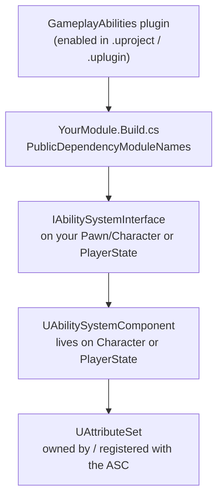

# GAS project setup

## Why this matters

GAS doesn't work until three things are true: the `GameplayAbilities` plugin is enabled, your module's
`Build.cs` links against it, and something in your actor hierarchy owns an `UAbilitySystemComponent`
(ASC). The first two are mechanical. The third — where the ASC lives — is a design decision you make
once, early, and one of the few in this whole system that is genuinely painful to reverse once other
systems (save games, UI, replication assumptions) start depending on it.

## Mental model



`IAbilitySystemInterface::GetAbilitySystemComponent()` is how the rest of the engine (and your own code)
finds an actor's ASC without caring where it actually lives. Every other GAS system — abilities, effects,
Gameplay Cues, the Blueprint library — goes through this interface rather than assuming a concrete class,
which is exactly what makes the Character-vs-PlayerState choice possible in the first place.

## Enabling the plugin and linking the module

Enable `GameplayAbilities` (and its usual companions, `GameplayTags` and `GameplayTasks`) in your
`.uproject` file or via Edit > Plugins, then add the modules to your game module's `Build.cs`:

```csharp title="MyGame.Build.cs"
using UnrealBuildTool;

public class MyGame : ModuleRules
{
    public MyGame(ReadOnlyTargetRules Target) : base(Target)
    {
        PCHUsage = PCHUsageMode.UseExplicitOrSharedPCHs;

        PublicDependencyModuleNames.AddRange(new string[]
        {
            "Core",
            "CoreUObject",
            "Engine",
            "InputCore",
            "GameplayAbilities",
            "GameplayTags",
            "GameplayTasks",
        });
    }
}
```

`GameplayAbilities` is the core module (`UAbilitySystemComponent`, `UGameplayAbility`, `UGameplayEffect`,
Gameplay Cues). `GameplayTags` is a separate, lower-level runtime module — you'll need it directly for
native tag declarations. `GameplayTasks` backs `UAbilityTask`, which most non-trivial abilities use for
asynchronous waits. See [Modules and plugins](../01-toolchain-and-build/modules-and-plugins.md) for how
module dependencies resolve in general.

## Where the ASC lives: Character vs PlayerState

The ASC has to live somewhere that implements `IAbilitySystemInterface`. In practice that's almost always
either the `APawn`/`ACharacter` or the `APlayerState`. Both are legitimate; they answer different
questions.

| | ASC on Character/Pawn | ASC on PlayerState |
|---|---|---|
| Survives possession loss (death, respawn into a new pawn) | No — a new pawn means a new ASC | Yes — PlayerState persists across pawn respawns |
| Relevant to AI-controlled, non-player actors | Natural fit | Awkward — AI actors have no meaningful PlayerState |
| Replication cost for spectators/nearby players | Only replicates while the pawn is relevant | PlayerState replicates to all clients by default, which is often *more* traffic, not less |
| Matches "abilities belong to the character" mental model | Yes | No — abilities belong to "the player," independent of embodiment |
| Typical fit | Single-life characters, AI-controlled NPCs and enemies, simple respawn-as-new-actor games | Games where the same persistent set of abilities/attributes must survive death and re-possession (most competitive multiplayer, MOBA-style games) |

```cpp title="MyPlayerState.h — ASC on PlayerState"
UCLASS()
class MYGAME_API AMyPlayerState : public APlayerState, public IAbilitySystemInterface
{
    GENERATED_BODY()

public:
    AMyPlayerState();

    virtual UAbilitySystemComponent* GetAbilitySystemComponent() const override { return AbilitySystemComponent; }

    UAttributeSet* GetAttributeSet() const { return AttributeSet; }

protected:
    UPROPERTY()
    TObjectPtr<UAbilitySystemComponent> AbilitySystemComponent;

    UPROPERTY()
    TObjectPtr<class UMyAttributeSet> AttributeSet;
};
```

```cpp title="MyPlayerState.cpp"
AMyPlayerState::AMyPlayerState()
{
    AbilitySystemComponent = CreateDefaultSubobject<UAbilitySystemComponent>(TEXT("AbilitySystemComponent"));
    AbilitySystemComponent->SetIsReplicated(true);

    AttributeSet = CreateDefaultSubobject<UMyAttributeSet>(TEXT("AttributeSet"));
}
```

```cpp title="MyCharacter.h — Character delegates to PlayerState's ASC"
UCLASS()
class MYGAME_API AMyCharacter : public ACharacter, public IAbilitySystemInterface
{
    GENERATED_BODY()

public:
    virtual UAbilitySystemComponent* GetAbilitySystemComponent() const override;
    virtual void PossessedBy(AController* NewController) override;
};
```

```cpp title="MyCharacter.cpp"
UAbilitySystemComponent* AMyCharacter::GetAbilitySystemComponent() const
{
    if (const AMyPlayerState* PS = GetPlayerState<AMyPlayerState>())
    {
        return PS->GetAbilitySystemComponent();
    }
    return nullptr;
}

void AMyCharacter::PossessedBy(AController* NewController)
{
    Super::PossessedBy(NewController);

    if (AMyPlayerState* PS = GetPlayerState<AMyPlayerState>())
    {
        PS->GetAbilitySystemComponent()->InitAbilityActorInfo(PS, this);
    }
}
```

The Character still implements `IAbilitySystemInterface`, but it forwards to the PlayerState's ASC rather
than owning one. This is the standard pattern for a PlayerState-hosted ASC — every caller that asks the
pawn for its ASC still gets the right answer.

Whichever actor owns the ASC, `InitAbilityActorInfo(OwnerActor, AvatarActor)` must run whenever the
"physical" actor changes (typically in `PossessedBy` and again on respawn) — it's what fills in
`FGameplayAbilityActorInfo`, the struct abilities use to reach the avatar, its mesh, and its movement
component without depending on a concrete class.

## Why this is hard to reverse

Once code exists that assumes "the ASC is on the Character," every ability, every `UAttributeSet`
accessor, and every piece of UI that reads attributes has that assumption baked in — sometimes as an
explicit cast, sometimes just as "the ASC is always valid the moment the pawn exists," which is true for
Character-hosted ASCs and false for PlayerState-hosted ones (a pawn can exist for a tick or two before
`PossessedBy` runs). Moving the ASC after the fact means auditing every call site that fetches it, not
just changing one class declaration.

## Gotchas

:::warning Decide before you write the first ability
The Character-vs-PlayerState choice has no clean default — Epic's own Lyra sample uses PlayerState for
player-controlled pawns and Character-hosted ASCs for simple AI. Decide based on whether your game needs
attributes/abilities to survive a respawn, and write it down; don't let it fall out accidentally from
"where I happened to add `CreateDefaultSubobject` first."
:::

:::caution InitAbilityActorInfo timing bugs are the most common GAS setup mistake
Abilities activated before `InitAbilityActorInfo` runs will have a null or stale `AvatarActor`. If you
see abilities silently failing to activate only on respawn, check that you're re-calling
`InitAbilityActorInfo` on the *new* pawn, not just once at `BeginPlay`.
:::

## See also

- [GAS overview](./gas-overview.md) — why the ASC is the hub of every other GAS piece.
- [Attributes and attribute sets](./attributes-and-attribute-sets.md) — what lives on the ASC alongside abilities.
- [Modules and plugins](../01-toolchain-and-build/modules-and-plugins.md) — how `Build.cs` dependencies resolve in general.
- [Epic — Gameplay Ability System for Unreal Engine](https://dev.epicgames.com/documentation/unreal-engine/gameplay-ability-system-for-unreal-engine)

