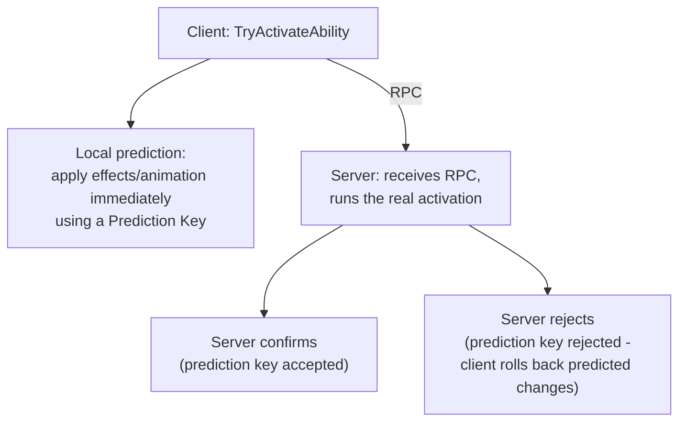

# GAS replication and prediction

## Why this matters

GAS's networking model is the reason most teams adopt it in the first place, and it's also the part with
the steepest learning curve. Getting replication mode and net execution policy wrong doesn't crash
anything — it just makes abilities feel laggy, or desync client and server state in ways that only show
up under real latency, which is a much harder bug to catch in local testing than a crash is.

## Mental model



The core idea: the client doesn't wait for a round trip to feel an ability's effect, but everything it
predicted is tagged with a **prediction key** so it can be cleanly undone if the server disagrees. This
is fundamentally different from naive client-side prediction — GAS tracks *which* changes were
speculative and reverts exactly those, rather than resetting all state to a last-known-good snapshot.

## Replication modes

`UAbilitySystemComponent::ReplicationMode` (`EGameplayEffectReplicationMode`) controls how much Gameplay
Effect state replicates to each client, and it's a per-ASC setting you choose based on how many clients
need to see that actor's full effect list:

| Mode | What replicates | Typical use |
|---|---|---|
| `Full` | Every active Gameplay Effect replicates to every relevant client, including ones the owning client doesn't need for prediction | Single-player, or any actor where every client needs full visibility into all effects (e.g., an important boss) |
| `Mixed` | Full active-effect detail to the owning client (for prediction and UI); minimal data to everyone else | The standard choice for player-controlled characters in multiplayer — the owner sees everything, other clients see only what they need |
| `Minimal` | Only replicated attribute values and Gameplay Cues, no per-effect detail, to any client | AI-controlled actors and NPCs — other clients never need to know *why* an enemy's health changed, only that it did |

Picking `Mixed` for player characters and `Minimal` for AI-controlled actors is the standard split; using
`Full` broadly is the easiest way to make a multiplayer game's GAS traffic much larger than it needs to
be, since every effect detail replicates to every client regardless of relevance.

```cpp title="Setting replication mode, typically in the ASC-owning actor's constructor"
AbilitySystemComponent->SetReplicationMode(EGameplayEffectReplicationMode::Mixed);
```

## What predicts and what doesn't

Prediction exists so an ability *feels* instant to the player who activated it. It only ever applies to
the locally-controlled client — it means nothing for AI or for other players watching. What predicts:

- Ability activation itself, for abilities with `NetExecutionPolicy = LocalPredicted`.
- Attribute changes from Gameplay Effects the ability applies, if those effects are applied through the
  predicting ability's context.
- Gameplay Cues triggered as part of the predicted activation (they're cosmetic, so mispredicting one
  briefly is low-cost and gets corrected on the next cue trigger).
- Montage playback started by the ability.

What does not predict, and always waits for the server:

- Anything with `NetExecutionPolicy = ServerOnly` or `ServerInitiated` — by definition, these never run
  predictively on the owning client.
- Any Gameplay Effect applied without going through a prediction key (e.g., effects applied directly by
  server-only game logic outside of an ability's predicted context).
- RPC-triggered gameplay that isn't routed through the ability system at all.
- Anything on a non-locally-controlled actor — you can't predict someone else's inputs.

## Prediction keys

`FPredictionKey` is the token that ties a client's speculative changes to the server call that will
confirm or reject them. You rarely construct one directly — `UGameplayAbility` and the ASC generate and
thread them through automatically for a `LocalPredicted` ability — but understanding what they do
explains the failure mode: if the server rejects an activation (failed cost check, blocked by a tag that
changed between client and server), every attribute change, Gameplay Cue, and montage the client
predicted under that key gets rolled back.

```cpp title="Checking whether the current ability activation is predicted"
if (GetCurrentActivationInfo().GetActivationPredictionKey().IsValidKey())
{
    // Running under a client prediction key; server confirmation/rejection is pending.
}
```

## Gotchas

:::warning[Full replication mode on many actors is a bandwidth trap]
It's tempting to leave every ASC on `Full` because it "just works" in testing with two clients. At real
player counts, every active effect on every `Full`-mode actor replicates in detail to every relevant
client — switch AI and non-owner-relevant actors to `Minimal` before this becomes a live performance
problem, not after.
:::

:::caution[A rejected prediction is a visible correction, not a silent one]
When a predicted activation gets rejected, the player sees whatever was predicted (animation started,
cue played) snap back. Minimize this by keeping `CanActivateAbility`/cost/cooldown checks consistent
between what the client can observe and what the server will actually enforce — don't let client and
server disagree about state that both should already know.
:::

:::note
Not confirmed against 5.7 in the sources consulted — verify against your engine version: the exact
low-level API surface for constructing and threading a custom `FPredictionKey` manually (outside of the
ability activation path GAS manages for you) is not covered in the sources used for this document.
:::

## See also

- [Gameplay abilities](./gameplay-abilities.md) — `NetExecutionPolicy` and where predicted activation is set.
- [Gameplay effects](./gameplay-effects.md) — the effects that ride along with a predicted activation.
- [GAS project setup](./gas-project-setup.md) — where the ASC lives, which affects who needs to see its replication.
- [Epic — Gameplay Ability System for Unreal Engine](https://dev.epicgames.com/documentation/unreal-engine/gameplay-ability-system-for-unreal-engine)

