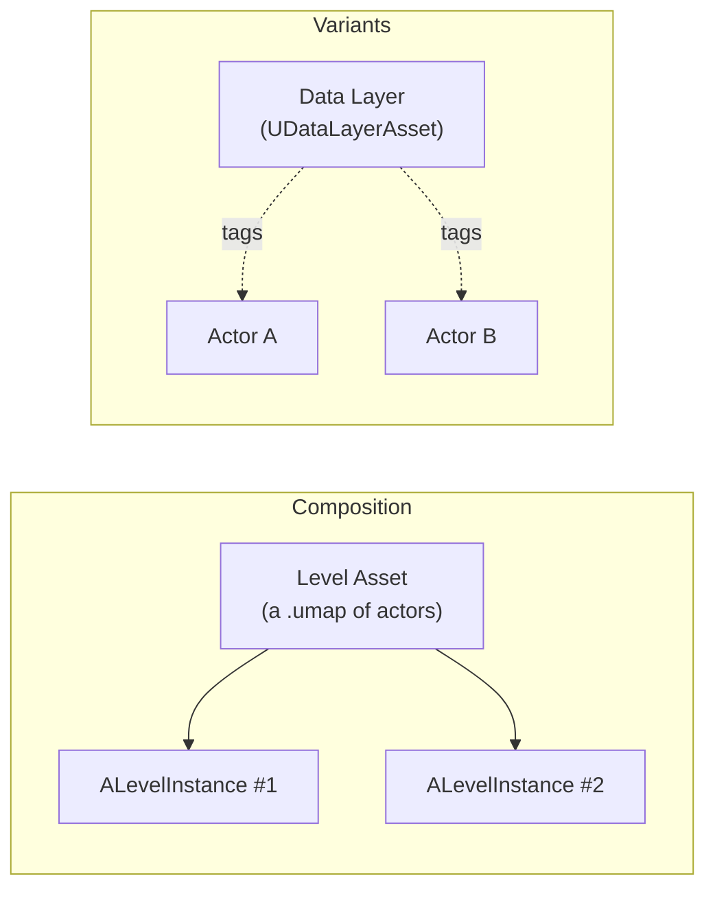

# Level Instances and Data Layers

## Why this matters

Two questions look similar and get answered with the wrong tool constantly: "how do I reuse this cluster
of actors in multiple places" and "how do I have a variant of the world that's sometimes loaded and
sometimes not." The first is Level Instances — composition, like a prefab. The second is Data Layers — a
tag on actors that controls load/visibility state. Reaching for a Data Layer to solve a reuse problem (or
duplicating a Level Instance to solve a variant problem) both work in the short term and both create a
mess once the map grows, because you end up hand-syncing copies instead of using the mechanism built for
the job.

## Mental model



A Level Instance embeds a level asset's actors as one placeable unit — edit the source level once, every
placed instance reflects the change, same idea as a prefab or a Blueprint class instance but for whole
chunks of the world. A Data Layer is orthogonal: it doesn't group actors spatially or hierarchically, it
tags actors (which can live anywhere, in any Level Instance or not) with a runtime state — unloaded,
loaded, or activated — so you can toggle a set of actors on or off without touching World Partition's
spatial grid at all.

## The mechanics

### Level Instances

`ALevelInstance` actors are managed by `ULevelInstanceSubsystem`. Placing one in the world references a
level asset; every placed instance shares that asset's actors until you explicitly enter edit mode on one
instance to change the source content for all of them. From C++, `AActor::IsInEditLevelInstance()` and
`IsInEditLevelInstanceHierarchy()` tell you whether an actor belongs to a Level Instance that's currently
being edited — useful when a gameplay system needs to ignore actors mid-edit rather than react to them as
if they were live.

```cpp title="Skipping actors that belong to a Level Instance being edited"
void AWorldQuerySystem::CollectRelevantActors(TArray<AActor*>& OutActors)
{
    for (AActor* Actor : GetWorld()->GetCurrentLevel()->Actors)
    {
        if (!IsValid(Actor) || Actor->IsInEditLevelInstanceHierarchy())
        {
            continue; // Don't react to content that's mid-edit in the editor.
        }
        OutActors.Add(Actor);
    }
}
```

### Packed Level Actors

A Level Instance still streams and renders as a hierarchy of individual actors — fine for a handful of
placements, expensive once you've scattered hundreds of the same rock cluster or building module across a
world. **Packed Level Actors** solve this by baking a Level Instance's static content down into a single
actor built from instanced meshes, so a hundred placements of the same packed asset cost roughly what a
hundred instanced meshes cost, not a hundred actor hierarchies. You author the source content the same
way as a normal Level Instance and convert it to a Packed Level Actor blueprint asset for placement; the
tradeoff is that packed content is static — it's meant for set dressing, not for actors that need
per-instance gameplay logic at runtime.

### Data Layers

Data Layers are assigned per-actor via the Actor Editor Context (the same widget that also tracks current
Level and Level Instance context — whatever Data Layer is "current" gets applied to newly placed actors
automatically). Two things about a Data Layer matter: its **type** (Editor — only affects editor
visibility, never ships; or Runtime — affects what's actually streamed in a packaged build) and its
**runtime state**, `EDataLayerRuntimeState`, which is one of `Unloaded`, `Loaded`, or `Activated`.
`Loaded` means the actors are in memory but not necessarily visible/active; `Activated` means fully live.

Runtime Data Layer state is queried and driven through `UDataLayerManager`, reachable from
`UWorldPartition::GetDataLayerManager()`:

```cpp title="Toggling a Data Layer at runtime"
void AGameplayEventActor::EnterStormSequence()
{
    if (UWorld* World = GetWorld())
    {
        if (UWorldPartition* Partition = World->GetWorldPartition())
        {
            if (UDataLayerManager* DataLayerManager = Partition->GetDataLayerManager())
            {
                // Signature varies slightly by engine point release — confirm the exact
                // overload (by FName vs by UDataLayerAsset*) against your project's engine version.
                DataLayerManager->SetDataLayerRuntimeState(StormDebrisLayerAsset, EDataLayerRuntimeState::Activated);
            }
        }
    }
}
```

:::note
The `UDataLayerManager` runtime-state setter above is the standard mechanism for driving Data Layers from
gameplay code, but the exact overload signature was not directly confirmed against 5.7 in the sources
consulted for this document — verify the parameter list in your engine version before shipping this call.
:::

## Gotchas

:::warning Editing a Level Instance edits every placement
Because all instances share the source level asset, going into edit mode on one placed instance and
moving a light or deleting an actor changes that content everywhere the asset is used. This is the point
of the feature, but it surprises people who expect per-instance content edits the way per-instance
transform, tint, or Data Layer assignment works.
:::

:::caution Data Layers don't replace sublevels for gameplay-critical toggles
`Unloaded` genuinely removes actors from memory, so don't rely on an `Activated` → `Unloaded` transition
happening within a single frame for anything time-critical; treat Data Layer transitions as asynchronous,
the same way you'd treat any other streaming operation.
:::

:::caution Packed Level Actors are a one-way bake for static content
Converting to a Packed Level Actor is meant for set dressing that doesn't need per-actor gameplay logic at
runtime. If you later need one placement to behave differently from another (a door that opens, a light
that's sometimes off), you're fighting the format — use a regular Level Instance or individual actors for
that content instead.
:::

## See also

- [World Partition](./world-partition.md) — the grid Level Instances and Data Layers both sit inside.
- [Procedural content generation](./procedural-content-generation.md) — another way to populate content
  that composes with Data Layers for runtime variation.
- [Streaming and budgets](./streaming-and-budgets.md) — how Data Layer state changes interact with
  streaming load.
- [Epic — Data Layers](https://dev.epicgames.com/documentation/unreal-engine/data-layers-in-unreal-engine)

