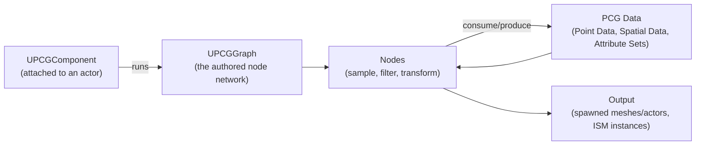

# Procedural content generation

## Why this matters

Hand-placing set dressing scales linearly with world size: a bigger World Partition map means more hours
painting foliage and stacking props. The PCG (Procedural Content Generation) framework scales instead with
rule authoring — you build a graph once (scatter rocks along a spline, avoid steep slopes, respect roads)
and it regenerates correctly no matter how the terrain around it changes. Skipping PCG for large-scale
dressing means either re-doing manual work every time the landscape changes, or writing one-off C++/editor
scripts to do what the framework already does with reusable nodes.

## Mental model



A PCG graph is a pipeline: nodes consume and produce **data**, not actors directly — most commonly **Point
Data**, a set of transforms plus per-point attributes (density, seed, arbitrary metadata). A node like
Surface Sampler turns a landscape or shape into points; a Density Filter thins that point set by a rule
(slope, painted layer weight); a spawner node turns surviving points into instanced meshes or actors at
the end of the chain. Nothing is baked until it runs — the same graph re-evaluates cleanly if the
landscape underneath it changes.

## The mechanics

### Attaching and running a graph

A `UPCGComponent` on an actor points at a `UPCGGraph` asset and runs it — either in the editor as you
author content, or at runtime. Generation isn't automatically continuous: the component has a generation
trigger setting (`EPCGComponentGenerationTrigger`) that controls whether it generates on load, on demand
from code, or continuously at runtime as its inputs change.

```cpp title="MyPCGSpawnerActor.h — an actor whose PCG graph runs at runtime"
UCLASS()
class MYGAME_API AMyPCGSpawnerActor : public AActor
{
    GENERATED_BODY()

public:
    AMyPCGSpawnerActor();

protected:
    UPROPERTY(VisibleAnywhere, Category = "PCG")
    TObjectPtr<class UPCGComponent> PCGComponent;
};
```

```cpp title="MyPCGSpawnerActor.cpp"
AMyPCGSpawnerActor::AMyPCGSpawnerActor()
{
    PCGComponent = CreateDefaultSubobject<UPCGComponent>(TEXT("PCGComponent"));
    // Assign the Graph asset and generation trigger in the Details panel, or from a
    // construction script / init function once the component is fully set up.
}
```

:::note
The exact `UPCGComponent` generation API (member names for regenerating on demand from C++, and the full
set of `EPCGComponentGenerationTrigger` values) was not fully confirmed against 5.7 in the sources
consulted here — check the component's header or the editor's exposed Blueprint nodes for the precise
call your version supports before wiring runtime regeneration from gameplay code.
:::

### Runtime generation sources

Runtime generation needs something to generate *around*, the same way World Partition needs a streaming
source. `UPCGGenSourceComponent` makes the actor it's attached to act as a PCG generation source;
`UPCGGenSourcePlayer` does this automatically for player controllers, so runtime-generated PCG content
around the player works without extra wiring in most projects. Editor-side, `UPCGGenSourceEditorCamera`
plays the same role for the viewport camera so you can preview runtime generation without playing the
game.

### Common node categories

| Category | Examples | Role |
|---|---|---|
| Sampling | Surface Sampler, Spline Sampler | Turn a surface, volume, or spline into Point Data |
| Filtering | Density Filter, attribute-based filters | Thin or select points by a rule |
| Transform | Transform Points, Attribute Remap | Modify point transforms or metadata in place |
| Spawning | Spawn actor, spawn static mesh (instanced) | Turn surviving points into visible content |

Filtering nodes are where most of the "rules" work happens — avoid steep slopes, keep a minimum distance
from roads, respect a Data Layer's actors as exclusion volumes. Because the graph re-runs against live
data, changing the landscape or moving the exclusion actors regenerates correct output without an artist
touching the graph again.

### PCG and World Partition scale

For world-scale use, PCG graphs are typically attached per World Partition cell or region rather than one
graph covering the whole map, so regeneration and streaming stay local — moving a spline in one region
doesn't force every PCG-driven cell in the world to recompute. This is also where PCG Biome-style setups
(layering multiple graphs for different biome rules) and Nanite-ready vegetation output matter: dense,
PCG-scattered foliage benefits from the same Nanite instancing story as hand-painted foliage.

## Gotchas

:::warning Runtime generation is not free just because it's "procedural"
A graph that regenerates every frame based on a moving actor can cost more than the manual placement it
replaced. Use the generation trigger deliberately — generate once on load for static dressing, and reserve
continuous runtime generation for content that genuinely needs to react to gameplay in real time.
:::

:::caution Point Data isn't actors — debug at the right layer
Because most of the graph operates on Point Data and only the final spawner node produces real
actors/instances, a bug earlier in the chain (wrong density, points in the wrong place) won't show up as
a visible symptom until spawning. Use the PCG Editor Mode's data preview per node rather than only judging
by final output.
:::

:::caution Seed changes ripple downstream
Point generation is seeded for determinism; changing a sampler's seed or the graph's structure upstream
can reshuffle every downstream point's random values, not just add new ones. Don't expect small graph
edits to leave unrelated output untouched.
:::

## See also

- [Landscape and foliage](./landscape-and-foliage.md) — the surfaces and mesh types PCG most commonly
  samples and spawns.
- [Level Instances and Data Layers](./level-instances-and-data-layers.md) — composing PCG-driven regions
  with Data Layer state.
- [World Partition](./world-partition.md) — the grid PCG-driven content streams through at world scale.
- [Epic — Procedural Content Generation Framework](https://dev.epicgames.com/documentation/unreal-engine/procedural-content-generation-framework-in-unreal-engine)
